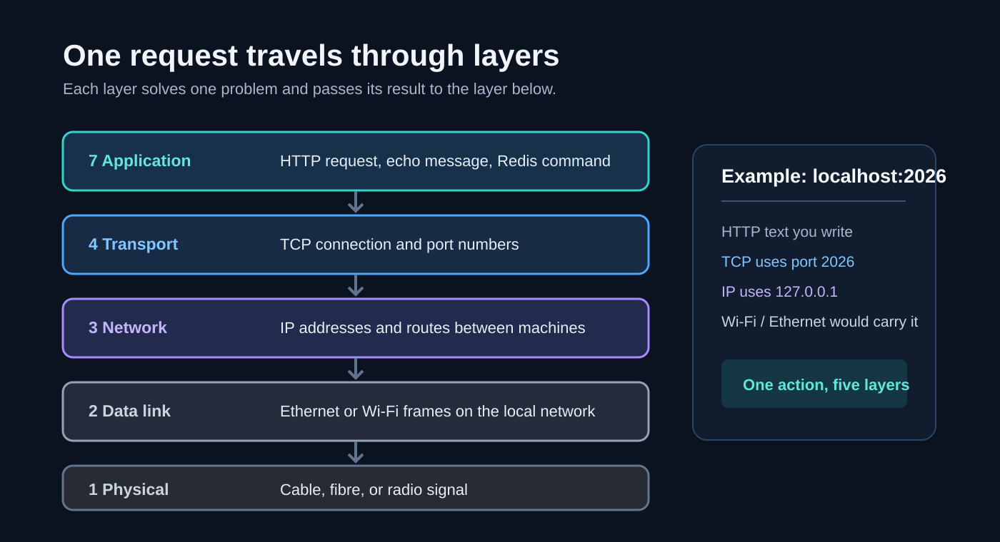
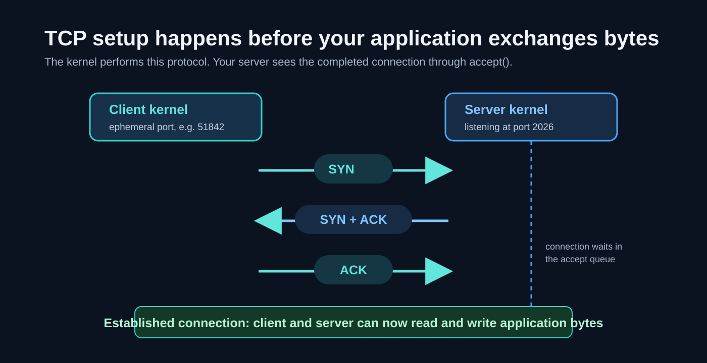
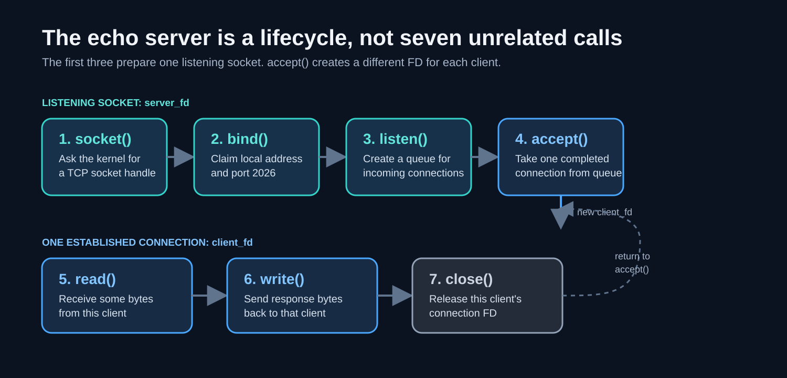
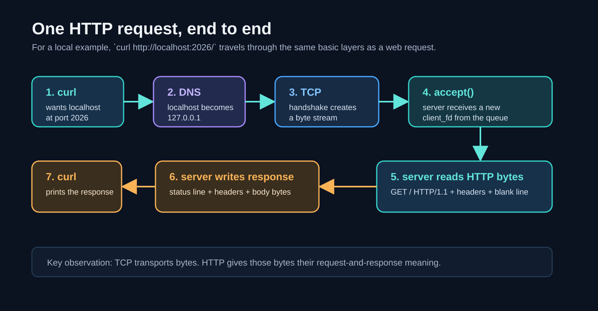

# Network Architecture - Session 1 Expanded Notes

These notes expand the 48-slide first session, **Computer Networks: Network programming, from the socket up**. They assume that this is your first computer-networks course.

The slides move quickly because they start from a real server program and then expose the ideas hidden beneath it. Read this document in order. Each section adds only the ideas needed for the next one.

## 1. The one big picture

When you open a web page, two programs communicate across a network. The diagram shows the layers involved and where familiar terms such as HTTP, TCP, IP, and Wi-Fi belong.



- A **client** starts a conversation because it wants something.
- A **server** waits at a known location and responds to clients.
- A **protocol** is the agreed format and sequence of the conversation. HTTP is a protocol. TCP is also a protocol, but it solves a lower-level problem.

The application does not need to know how radio waves or Ethernet frames work. It asks TCP to move bytes to an IP address and port. TCP asks IP to find the destination machine. That separation is the central reason networking can scale.

## 2. Prerequisite zero: data is bytes

A computer stores and sends **bits**, where each bit is either `0` or `1`.

- 8 bits = 1 **byte**.
- A byte can represent an integer from 0 through 255.
- Text is also bytes. For ordinary English text, ASCII/UTF-8 assigns numbers to characters. For example, the letter `A` is byte `65` in decimal, `0x41` in hexadecimal, and `01000001` in binary.

Humans usually find binary unpleasant to read, so networking tools often show **hexadecimal** (base 16): `0-9` followed by `A-F`. One hexadecimal digit describes four bits, also called a **nibble**. Therefore one byte becomes two hex digits:

```text
binary:  0100 0001
hex:       4    1     -> 0x41
ASCII:                    A
```

The important distinction is between the **data** and its **representation**. The byte `0x41` remains the same byte whether a tool prints it as `65`, `0x41`, `01000001`, or `A`.

## 3. Prerequisite one: processes, the kernel, and system calls

A program you run is a **process**. Your C server, a browser tab, and the operating system's services are all processes.

The **kernel** is the privileged part of the operating system. It controls hardware and shared resources such as network interfaces, memory, files, and TCP connections. Normal programs do not manipulate a network card directly. They request kernel services through **system calls**.

A socket system call usually returns a small integer called a **file descriptor** (FD). Think of an FD as a handle the kernel gives your process:

```text
3  -> listening socket
4  -> one connected client
5  -> a file you opened
```

Unix uses one common interface for many resources. In simple programs, `read(fd, ...)`, `write(fd, ...)`, and `close(fd)` can work on a file, a terminal, or a connected TCP socket. This is why sockets often feel like files.

## 4. Addressing: which machine, then which program?

To deliver data, the network needs two levels of addressing:

1. An **IP address** identifies a network interface on a machine. Example: `142.250.0.0` is an IPv4-style address. The exact address can change because large services use many machines.
2. A **port number** identifies the intended service on that machine. It is a 16-bit unsigned number, so its range is 0 to 65535.

Together they form a network endpoint:

```text
IP address + port = endpoint
127.0.0.1:2026
```

`127.0.0.1` is the IPv4 loopback address, commonly called `localhost`. It means "this same computer." Data sent to it does not leave your laptop.

Some conventional port numbers are:

| Port | Common service |
| --- | --- |
| 80 | HTTP |
| 443 | HTTPS, meaning HTTP protected by TLS |
| 22 | SSH |
| 25 | SMTP email transfer |
| 6379 | Redis |
| 8080, 3000 | Common development choices, not special standards |

On Unix-like systems, ports below 1024 have traditionally required privileged permission to bind. That is why a development server often uses port 3000, 8080, or the course's 2026. A production service may let a small, carefully protected front proxy own ports 80 and 443, then forward traffic to an unprivileged application process.

## 5. TCP before socket code

**IP** attempts to send packets to the destination machine. **TCP** runs above IP and offers an application a reliable, ordered stream of bytes between two endpoints.

TCP is useful because it handles many awkward details for us: it numbers data, detects loss, retransmits lost data, puts received data back in order, and controls the sender's rate. The application sees a connection and reads bytes in order.

Two critical facts:

1. TCP is a **byte stream**, not a message service. If a client calls `write()` twice, the server may read those bytes in one `read()`, two reads, or several reads. A program must define how messages begin and end.
2. A TCP connection has two endpoints. A connection can be identified by the four values `(client IP, client port, server IP, server port)`.

Before ordinary application data, a TCP client and the kernel complete a connection setup, often called the **three-way handshake**:



You do not write these packets in basic socket code. The kernel sends and receives them for you.

## 6. The smallest TCP server

The course's echo server does one job: it accepts one connection, reads bytes, writes those same bytes back, then closes that client connection. It repeats forever.

The seven calls appear in this order. Notice that `accept()` creates a new client FD while the listening FD remains available for later clients:



### 6.1 `socket()` - ask the kernel for a TCP socket

```c
int server_fd = socket(AF_INET, SOCK_STREAM, 0);
```

- `AF_INET` means the IPv4 address family.
- `SOCK_STREAM` asks for the stream-style socket used with TCP.
- `0` means "choose the usual protocol for that family and socket type," which is TCP here.
- The result, `server_fd`, is only a kernel handle. It does not yet have a port or accept clients.

### 6.2 Build the address structure

```c
struct sockaddr_in addr = {0};
addr.sin_family = AF_INET;
addr.sin_addr.s_addr = INADDR_ANY;
addr.sin_port = htons(2026);
```

This structure tells the kernel which local address the server wants to own.

- `AF_INET` again says IPv4.
- `INADDR_ANY` means "accept connections arriving on any local IPv4 interface." This is convenient for a lab. In production, binding to a specific address is sometimes safer.
- `2026` is the chosen server port.
- `htons` means **host to network short**. A port uses 16 bits unsigned integer. The host's native byte order might be different from the network's standard byte order which is big endian (most significant byte first). So htons converts the port number to the correct format.

### 6.3 Why `htons(2026)` exists

The integer 2026 is hexadecimal `0x07EA`. On a little-endian machine, it occupies memory in the byte order `EA 07`; TCP headers require `07 EA`. `htons` converts the 16-bit value when the host needs it. The paired conversions are:

```text
htons: host to network, 16-bit value
htonl: host to network, 32-bit value
ntohs: network to host, 16-bit value
ntohl: network to host, 32-bit value
```

Do not memorize a particular laptop's byte order. Memorize the rule: **convert multi-byte integer fields at the boundary between your program and a network protocol.**

### 6.4 `bind()` - claim a local endpoint

```c
bind(server_fd, (struct sockaddr *)&addr, sizeof(addr));
```

`bind` associates the socket with a local IP-address/port combination. It is the reason that `localhost:2026` reaches this server.

If no process has bound that port and a remote client attempts a TCP connection, the operating system usually rejects the attempt quickly with a TCP reset (RST). The client then reports **connection refused**. This is different from a slow timeout: a refusal normally means the machine was reached but no service was listening there.

### 6.5 `listen()` - turn it into a listening socket

```c
listen(server_fd, 1);
```

The socket becomes a **listening socket**. It does not carry the application conversation itself. Instead, it receives new connection attempts and asks the kernel to keep completed connections waiting in a queue until the program accepts them. Here completed connections refer to those connections where TCP three way handshake has been completed successfully and that a reliable connection has been set up. Kernel queues these connections until the server is ready to process them

The second number is the requested **backlog**, an upper bound related to the waiting queue. It is not "how many clients the server can serve forever." Operating-system rules and limits can affect the effective value. Passing `1` is fine for explaining the concept; real servers choose a much larger value and are still constrained by system limits.

### 6.6 `accept()` - take one connection from the queue

```c
int client_fd = accept(server_fd, NULL, NULL);
```

`accept` normally blocks, meaning the process sleeps until a client connects. It returns a **new FD** for that one client. Keep the distinction clear:

```text
server_fd  -> stays open, continues listening for future clients
client_fd  -> represents one established client connection
```

The kernel can complete the TCP handshake before `accept()` returns. Therefore, a client can appear connected while it waits for the process to take the connection from the queue. If the queue fills, different systems and conditions can produce different client-visible behavior, such as delay, timeout, or refusal. Never build application logic around one observed full-queue behavior.

### 6.7 `read()`, `write()`, and `close()`

```c
char buf[4096];
int n = read(client_fd, buf, sizeof(buf));
write(client_fd, buf, n);
close(client_fd);
```

- `read` asks for up to 4096 bytes. It returns how many bytes actually arrived. It can return fewer bytes than requested.
- `write` asks the kernel to send bytes. Robust production code must also handle a short write and errors.
- `close(client_fd)` closes this endpoint once the conversation ends.

The first example performs only one `read`, so it can echo only the bytes that happen to arrive first. The next slide improves it with:

```c
while ((n = read(client_fd, buf, sizeof(buf))) > 0) {
    write(client_fd, buf, n);
}
```

That loop continues until `read` returns `0`, which normally means the peer has closed its sending side cleanly. This is why the slide says one `read` is not a conversation.

## 7. Closing, FIN, RST, and SIGPIPE

A normal TCP shutdown uses FIN packets to say, "I will not send more bytes." A reset (RST) aborts the connection more abruptly.

If a peer has already gone away and the server writes to that socket, the write can fail. On Unix-like systems, this situation can also generate the `SIGPIPE` signal. Its default action terminates the process, which explains the slide's warning that a server can disappear without an ordinary error message.

Production software treats this as an expected network failure: it checks write results and configures signal handling appropriately. The exact API differs by operating system. The larger lesson is more important than one C fix: **a successful connection earlier does not guarantee the peer still exists when you write.**

The slides use `SO_LINGER {1, 0}` on a client to force an abortive close and demonstrate the failure. This is a teaching tool, not a default setting to copy into ordinary applications.

## 8. A client is the other half

The client does not need `bind`, `listen`, or `accept`. It knows the server destination and calls `connect`:

```text
socket -> choose destination -> connect -> write/read -> close
```

When a client calls `connect` without explicitly binding a local port, the kernel automatically selects a temporary **ephemeral port**. This is why return traffic knows where to go.

```text
client:  192.0.2.10:51842  ->  server: 203.0.113.8:443
server:  203.0.113.8:443   ->  client: 192.0.2.10:51842
```

`51842` is temporary and chosen by the operating system. A busy client can eventually exhaust its available ephemeral ports, especially because recently closed TCP connections can remain in `TIME_WAIT` for a while. This is one reason connection reuse matters.

## 9. DNS: names become IP addresses

People use names such as `google.com`; TCP needs an IP address. **DNS (Domain Name System)** performs that translation.

Conceptually:

```text
your program asks: "What address has example.com?"
resolver replies: "Here is an IP address, cached for this long."
```

The slide uses `gethostbyname("localhost")` to make the hidden work visible. It also correctly warns that it is old: modern C programs should use `getaddrinfo`, because it handles IPv4 and IPv6 and has a better interface.

Name resolution can involve several stages:

1. The operating system may check a local mapping such as `/etc/hosts` first.
2. It sends a query to the configured DNS resolver, traditionally often over UDP.
3. The resolver may use a cached answer or ask other DNS servers on the program's behalf.
4. The result remains cached for its **TTL** (time to live).

DNS can block. A program that resolves a name synchronously may pause before it starts the TCP connection. So one innocent-looking name lookup can hide a real network protocol and a cache.

## 10. Raw TCP tools: telnet, netcat, and OpenSSL

`telnet` and `nc` (netcat) can open a raw TCP connection and let you type bytes. They are useful because they remove the browser's hidden behavior.

```text
nc localhost 2026
```

connects to the course's echo server. Whatever you type is sent as bytes; the echo server returns those bytes.

For an unencrypted text protocol, telnet can also let you type the protocol directly. Do not use telnet for secure remote administration. It sends data in plaintext and has been replaced by SSH for that use.

Once TLS protects a connection, you cannot type application text immediately because the TLS handshake must happen first. `openssl s_client -connect host:443` is a diagnostic client that performs the TLS layer for you. After the handshake, you can inspect or send application data inside the protected connection.

## 11. Where the socket code fits in OSI

The full seven-layer OSI model is a useful teaching model. For this session, focus on these layers:

| Layer | In these slides |
| --- | --- |
| 7. Application | Echo protocol, HTTP, RPC |
| 4. Transport | TCP, ports, `SOCK_STREAM`, `htons` for a port |
| 3. Network | IP addresses, `127.0.0.1`, `INADDR_ANY` |
| 2. Data link | Ethernet/Wi-Fi frames and MAC addresses |
| 1. Physical | Cable, fibre, radio signals |

When your C program calls `write(client_fd, ...)`, it is writing application bytes. The operating system adds TCP and IP information below it. At the destination, those layers are removed in the reverse order before the server's `read` receives application bytes.

## 12. HTTP is a protocol carried by TCP

HTTP/1.1 is a text protocol. A tiny request looks like this:

```http
GET / HTTP/1.1\r\n
Host: example.com\r\n
\r\n
```

`\r\n` means carriage return followed by line feed, also called CRLF. The blank CRLF-only line ends the header block. In HTTP/1.1, the `Host` header lets one IP address serve multiple websites.

The key mental model is that an HTTP client is an ordinary TCP client that writes carefully formatted request bytes. An HTTP server is an ordinary TCP server that parses those bytes and produces a response. The full request path makes the layers visible:



For a simple HTTP/1.0-style exchange, a client connects, sends a request, reads until the server closes the connection, and treats those bytes as the response. HTTP/1.1 and later versions add rules that allow a connection to stay open, so a real client must parse message boundaries rather than rely only on closing.

`curl` is a command-line HTTP client. Start with:

```text
curl -i http://example.com/
curl -v https://example.com/
```

- `-i` includes response headers in the output.
- `-v` shows useful connection and protocol details.

The deck uses `google.com` as a live example. The exact response, redirects, headers, and IP address naturally change over time; that does not change the protocol lesson.

## 13. Why the first server handles only one client

The basic echo server does this:

```text
accept one client -> read until that client finishes -> accept the next client
```

If the first client stays connected or sends data slowly, every later client waits. This is called **blocking, sequential handling**. It is easier to understand, but it does not scale.

There are two classic ways to improve it.

### 13.1 One process per connection: `fork()`

`fork()` makes a new process. Both parent and child continue from the next line, but the return value identifies which is which:

| `fork()` result | Meaning |
| --- | --- |
| `0` | You are in the child process. Handle this client. |
| positive number | You are in the parent. It is the child's process ID; return to `accept`. |
| `-1` | Creating the child failed. |

The parent can immediately accept another client while the child reads and writes the first client. This is simple and gives each client separate process memory, but processes have overhead. Also, each process inherits socket FDs, so correct code must close copies it does not need. Otherwise a connection may appear to stay open because some forgotten process still owns an FD.

### 13.2 One process, many sockets: readiness notification

Instead of waiting on one client at a time, a server asks the kernel, "Which of these FDs can I read or write without blocking?"

- `select` is older and broadly portable. It scans a fixed set and has practical descriptor limits.
- `poll` improves the interface but still has to examine the set.
- `epoll` is Linux-specific and is designed to report ready FDs efficiently for large sets.
- macOS/BSD use `kqueue`; Windows provides IOCP. Libraries often hide these differences.

The main idea matters first: **the kernel already knows which sockets have data. Ask it, rather than blocking on an arbitrary one.**

### 13.3 File descriptors, limits, and pools

Every open socket consumes an FD. `ulimit -n` reports a process's limit on open FDs in many shells. A server needs FDs for listening sockets, client sockets, log files, and more.

A **connection pool** keeps established connections ready for reuse. Reuse avoids repeatedly paying for TCP setup and, for HTTPS, TLS setup. Pools need limits too: keeping unlimited idle connections merely moves the resource problem somewhere else.

The slide's claim about six browser connections is a useful historical illustration of per-origin connection limits, but modern browser behavior varies and HTTP/2 or HTTP/3 changes the picture by multiplexing multiple requests over a connection. The durable lesson is that clients, too, face finite connection and FD limits.

## 14. A few important socket options

- `INADDR_ANY` means the listening socket accepts connections on every local IPv4 address. It is convenient locally but should be deliberate on a deployed system.
- **Promiscuous mode** applies to a network interface, not to an ordinary TCP server socket. It asks the interface to pass frames that are not addressed to the machine up to capture software. Packet analysers may use it on suitable networks.
- `SO_REUSEADDR` generally makes restarting a server more convenient when old socket state remains. Its exact semantics vary by operating system. It does not mean two unrelated servers may safely own the same endpoint.

## 15. Packet capture: make invisible behavior visible

Tools such as Wireshark and `tcpdump` capture packets. They are valuable because they show evidence: a DNS query, TCP handshake, retransmission, RST, or plaintext HTTP request.

Useful ways to view captured bytes:

- ASCII view helps with text protocols such as HTTP or Redis.
- Hex view helps with binary protocols, header fields, byte order, and length prefixes.

The practical habit is: when networking behaves strangely, do not rely only on application logs. Check what the network actually observed. For this course, capture only traffic you own or are authorized to inspect.

## 16. TLS: security around the TCP connection

TLS is the modern name for the protocol commonly called SSL. HTTPS means HTTP inside TLS, inside TCP:

```text
HTTP data
TLS encryption and authentication
TCP byte stream
IP packets
```

TLS does **not** secure only HTTP. The same layer can protect many application protocols, including mail and database protocols.

At a beginner level, TLS provides three goals:

1. **Confidentiality:** outsiders cannot read the application data easily.
2. **Integrity:** tampering is detected.
3. **Authentication:** the client can check that it reached the intended server identity.

During the TLS handshake, the client and server negotiate cryptographic parameters and establish shared session keys. Public-key cryptography and certificates help authenticate the server and establish trust; fast symmetric cryptography protects the bulk data afterward.

A **certificate** binds a public key to an identity such as a domain name. A certificate authority (CA) signs certificates, and the operating system or browser trusts selected CA roots. Certificate pinning narrows trust to a particular key or certificate, but it needs careful operational management because legitimate certificate rotation can otherwise break clients.

## 17. Protocol design starts with a TCP limitation

Remember: TCP gives you an ordered **stream of bytes**, not messages. Suppose a sender writes these logical messages:

```text
"HELLO" then "BYE"
```

The receiver might read `HELLOBYE` at once, or `HEL` then `LOBYE`. TCP has done nothing wrong. Your protocol must state how the receiver separates messages. This is **message framing**.


### 17.1 Fixed-length framing

Every message has exactly `N` bytes.

```text
[ 16-byte record ][ 16-byte record ][ 16-byte record ]
```

Easy to parse, but wasteful for variable-size data and inflexible if `N` must later change.

### 17.2 Delimiter-based framing

Choose a special separator, such as newline for a line protocol:

```text
PING\nPONG\n
```

Easy for text. The protocol must define what happens when the delimiter appears inside data. HTTP uses CRLF to end header lines, then has additional rules for bodies.

### 17.3 Length-prefixed framing

Send the size first, then exactly that many bytes:

```text
[length = 5][H E L L O][length = 3][B Y E]
```

This works well for arbitrary binary data and is common in modern protocols. A safe receiver validates the advertised length before allocating memory or waiting for a huge payload.

## 18. Text, binary, BCD, ASN.1, TLV, base64, and hex

### Text versus binary

Text protocols are easy to inspect manually, test with netcat, and read in logs. They may be verbose and need careful rules for whitespace, escaping, and case. Binary protocols are compact and faster to parse, but require tools such as a hex dump or protocol analyser.

HTTP/1.1 is mostly textual. HTTP/2 changes the framing layer to binary. That shift improves performance and multiplexing but makes raw manual inspection harder.

### BCD

**Binary-coded decimal (BCD)** stores each decimal digit in four bits. For example, decimal digits `9 8 7 6 5` become nibbles:

```text
9    8    7    6    5
1001 1000 0111 0110 0101
```

Displayed in hex, those groups become `98 76 5?`; the final half-byte needs a packing convention. BCD keeps decimal digits exact and appears in some financial, card, telecom, and legacy systems. It is different from simply converting the number 98765 to a normal binary integer.

### ASN.1

ASN.1 is a language for describing the structure of data independently of a programming language. A schema can say that an item contains an integer, an allowed string value, and a Boolean. A tool can generate encoders and decoders from that schema.

The point is not the punctuation of ASN.1. The point is **schema first**: agree on data shape once, then automate serialization work.

### TLV

**TLV** means Type, Length, Value. A message is a sequence of fields such as:

```text
[type: 1][length: 3][value: C A T]
[type: 9][length: 2][value: ...]
```

The length lets an older program skip an unknown field and continue reading the next one. This makes TLV-style encodings useful for evolving protocols. Many binary formats use a variation of this idea.

### Hex and base64

Hex is mainly a readable representation for debugging: two characters per byte, so it doubles the text length.

Base64 encodes arbitrary bytes using a text alphabet. Every 3 input bytes become 4 output characters, so it adds roughly 33% size. Use it when binary must travel through a text-only medium, such as an email attachment or JSON field. It is an encoding, **not encryption**.

## 19. RPC and gRPC

An **RPC** (Remote Procedure Call) tries to make a network request resemble a local function call:

```text
getUser(userId)  ->  request bytes over a network  ->  response bytes
```

Under the hood, the client serializes arguments (**marshalling**), frames and sends them, and the server decodes them (**unmarshalling**) before calling its handler.

The dangerous illusion is that the network behaves like a normal local function call. It does not. A request can time out after the server performed the work; a response can be lost; retries can duplicate an operation. Therefore real RPC designs need timeouts, cancellation, error handling, and often idempotency rules.

gRPC is a widely used RPC framework. It commonly uses Protocol Buffers for schemas and binary messages, and HTTP/2 as the transport protocol. HTTP/2 supports multiple independent streams on one connection, so several RPCs can proceed concurrently without opening a separate TCP connection for each.

## 20. The whole session in one request path

Imagine running `curl http://localhost:2026/` against a server that understands HTTP. The request-path diagram in the HTTP section shows the whole route. In words: `localhost` resolves to `127.0.0.1`, TCP establishes a byte stream, the server accepts the new connection, HTTP gives meaning to the bytes, and the response travels back over that same connection.

Every later topic in the course adds depth to one of those steps.

## 21. A small-step study path

Do these in order. Stop once you can explain the observation in plain language.

1. **Explain an endpoint aloud.** Say what `127.0.0.1:2026` identifies and why an IP address alone is insufficient.
2. **Draw the seven server calls.** Label which FD is the listening socket and which FD belongs to one client.
3. **Run or inspect an echo server.** Connect with `nc localhost 2026`, type text, and relate every result to `accept`, `read`, and `write`.
4. **Make the one-read bug visible.** Send a larger or delayed input and explain why a single `read` does not define a full request.
5. **Use `curl -i` on an HTTP site.** Identify the status line, headers, blank line, and body.
6. **Write a paper protocol.** For a chat message, choose fixed length, delimiter, or length prefix. State exactly how the receiver detects the end.
7. **Inspect bytes.** Convert the number 2026 to hexadecimal (`0x07EA`) and explain why the network sends the most significant byte first.
8. **Trace the stack.** For `https://example.com`, write `HTTP -> TLS -> TCP -> IP` from top to bottom.

## 22. Self-check questions

1. **Why does a server call `bind`, while a normal client often does not?**
   A server needs a stable, advertised destination. The client only needs a temporary return address, so the kernel chooses an ephemeral port during `connect`.

2. **Does one `write` at the sender always equal one `read` at the receiver?**
   No. TCP preserves byte order, not application message boundaries.

3. **What does `accept` return?**
   A new FD for one established client connection. The listening FD remains for future clients.

4. **Why is `htons` used for a port?**
   Network protocol fields use big-endian network byte order, while the host CPU may use a different order.

5. **What is the difference between `connection refused` and a timeout?**
   A refusal often means the destination machine responded that no service owns the port. A timeout means the expected response did not arrive in time; several network failures can cause it.

6. **Why can a server not safely treat an RPC like a local function call?**
   A timeout cannot tell you with certainty whether the server never received the request, performed the work, or performed it but lost the response.

## 23. Essential vocabulary

| Term | Plain-language meaning |
| --- | --- |
| Socket | Kernel-managed endpoint used by a program to communicate |
| File descriptor | Small integer handle for an OS resource, including a socket |
| Port | Number that selects a service on a machine |
| TCP | Reliable, ordered byte-stream transport protocol |
| IP | Network-layer addressing and routing protocol |
| Client | Program that initiates a conversation |
| Server | Program that waits at a known endpoint for clients |
| DNS | System that translates names into addresses |
| Protocol | Agreed message format and sequence of actions |
| Frame | One protocol-defined message unit within a byte stream |
| Backlog | Kernel queue related to completed connections awaiting `accept` |
| Ephemeral port | Temporary client-side port chosen by the OS |
| TLS | Security layer that authenticates and protects data over TCP |
| Serialization | Turning structured data into bytes |

## 24. What to remember from session one

Do not try to memorize every C constant yet. If you retain five claims, retain these:

1. A server is reachable through an IP address and a port.
2. TCP gives an ordered stream of bytes, not messages.
3. A listening socket accepts connections; each accepted connection gets its own socket FD.
4. HTTP, TLS, and RPC are layers built on top of the same TCP foundation.
5. Protocol design means deciding what bytes mean and how a receiver knows where each message ends.

Once these feel natural, the originally dense slides become connected variations of one idea: a program asks the kernel to move a carefully defined sequence of bytes to another program.
