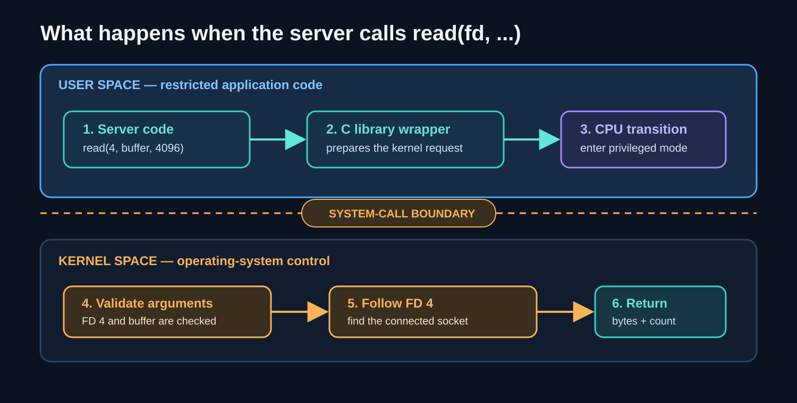
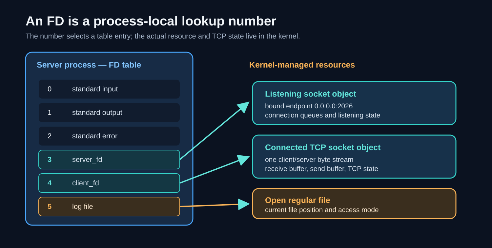
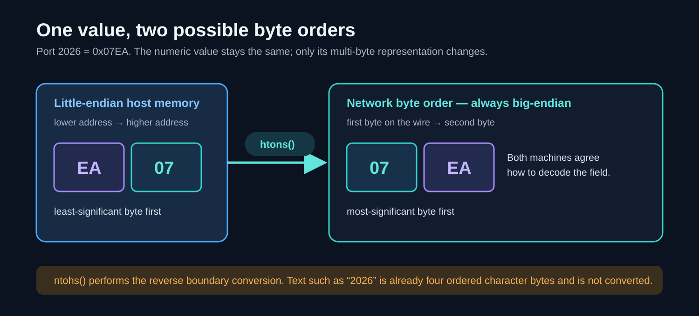
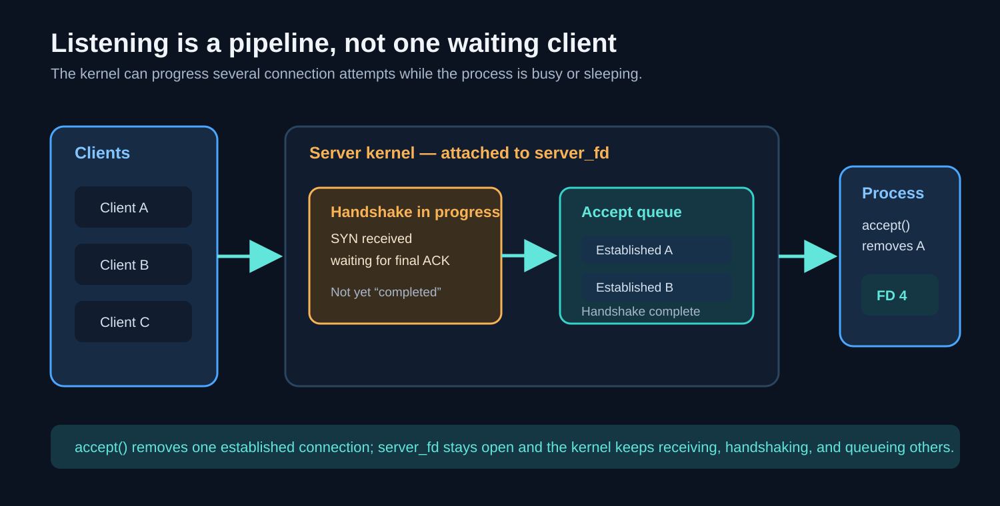
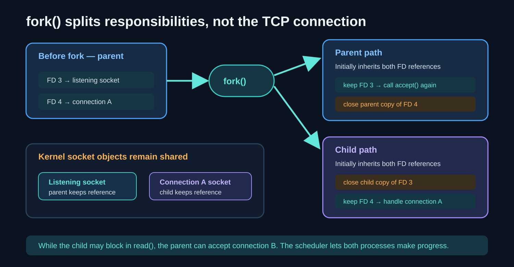

## 1. The one big picture

When you open a web page, two programs communicate across a network. The diagram shows the layers involved and where familiar terms such as HTTP, TCP, IP, and Wi-Fi belong.


- A **client** starts a conversation because it wants something.
- A **server** waits at a known location and responds to clients.
- A **protocol** is a shared set of rules: what bytes mean, how data is divided into units, what order messages follow, and what each participant must do next.

Every networking layer has protocols. IP defines addressing and packet delivery. TCP defines how two endpoints obtain a reliable, ordered byte stream. Protocols above TCP give that stream application meaning:

| Layered protocol | What it adds to the TCP byte stream |
| --- | --- |
| HTTP | Requests, methods, headers, status codes, and response bodies |
| TLS | Encrypted records, integrity protection, and peer authentication |
| RPC | A convention for naming a remote operation and encoding its arguments and result |

The kernel's `read()` and `write()` operations do not know whether the bytes represent HTTP, TLS, an RPC, or your own echo protocol. They only move bytes. A parser or protocol library in user space gives those bytes meaning. This distinction is the thread connecting the entire lecture.

The application does not need to know how radio waves or Ethernet frames work. It asks TCP to move bytes to an IP address and port. TCP asks IP to find the destination machine. That separation is the central reason networking can scale.

## 2. Prerequisite zero: data is bytes

A computer stores and sends **bits**, where each bit is either `0` or `1`.

- 8 bits = 1 **byte**.
- A byte can represent an integer from 0 through 255.
- Text is also bytes. For ordinary English text, ASCII/UTF-8 assigns numbers to characters. For example, the letter `A` is byte `65` in decimal, `0x41` in hexadecimal, and `01000001` in binary.

Humans usually find binary unpleasant to read, so networking tools often show **hexadecimal** (base 16): `0-9` followed by `A-F`. One hexadecimal digit describes four bits, also called a **nibble**. Therefore one byte becomes two hex digits:

```text
binary:  0100 0001
hex:       4    1     -> 0x41
ASCII:                    A
```

The important distinction is between the **data** and its **representation**. The byte `0x41` remains the same byte whether a tool prints it as `65`, `0x41`, `01000001`, or `A`.

## 3. Prerequisite one: how a program asks the operating system for work

Socket code makes much more sense after one operating-system idea is clear: your program does not own the network card or implement TCP by itself. It asks the operating system to do privileged work on its behalf.

### 3.1 Program, process, user space, and kernel

A **program** is the executable code stored on disk. When the operating system runs that program, it creates a **process**: a living instance with its own memory, current instructions, open resources, and process ID. Running the server twice creates two processes from the same program.

Most application code runs in **user space**, where it has restricted access. The **kernel** is the privileged core of the operating system. It controls shared resources such as memory, files, network interfaces, process scheduling, and TCP connection state. The separation protects the machine: a bug in an ordinary process should not be allowed to directly overwrite another process's memory or command the network hardware arbitrarily.



### 3.2 Functions, library wrappers, and system calls

These terms describe different levels, even when they use the same familiar name:

| Term | Meaning | Networking example |
| --- | --- | --- |
| Program | A complete executable that the OS can run | Your echo-server executable or `curl` |
| Process | One running instance of a program | The currently running server |
| Function | A named unit of code called by other code | The C expression `read(fd, buf, size)` |
| Library wrapper | User-space code that prepares a request to the kernel | The C library's implementation of `read()` |
| System call | A controlled entry into the kernel for a privileged service | Ask the kernel to read bytes from the resource selected by `fd` |

So, in ordinary C source, `read(fd, buf, size)` is a **function call** to a POSIX API supplied by the C library. On a typical Unix-like system, that function is a thin wrapper around the kernel's **read system call**. It is not a separate program. The path is:

1. Your code calls the user-space `read()` function.
2. The wrapper places the system-call number and arguments where the operating system expects them.
3. A special CPU instruction changes execution from restricted user mode to privileged kernel mode.
4. The kernel validates the FD, buffer address, and requested size, then performs or waits for the operation.
5. The kernel returns a result, execution resumes in user space, and the wrapper returns that value to your code.

Introductory notes often say “call the `read()` system call” because the wrapper is normally tiny and the distinction is not important for basic socket programming. Both phrases point to the same programmer-visible operation, but now you know the two layers hidden underneath it.

The same broad model applies to `write()`, `close()`, `socket()`, `bind()`, `listen()`, `accept()`, `connect()`, and `fork()` on Unix-like systems. Exact library and kernel implementations can vary, so do not assume every API function always maps to exactly one kernel entry on every operating system.

### 3.3 File descriptors: small numbers that select open resources

A **file descriptor**, abbreviated **FD**, is a small non-negative integer in one process. It is best understood as an index into that process's table of open resources. The number is not the file, socket, or connection itself.



Suppose the server has this table:

| FD in this process | Convention or current meaning |
| --- | --- |
| `0` | Standard input |
| `1` | Standard output |
| `2` | Standard error |
| `3` | The listening socket returned by `socket()` |
| `4` | One connected-client socket returned by `accept()` |
| `5` | A log file returned by `open()` |

When the process calls `read(4, buf, 4096)`, the integer `4` tells the kernel which table entry to use. The kernel follows that entry to the underlying connected socket, then copies available received bytes into `buf`. Another process can also have an FD numbered `4`, but its own table may point to a completely different resource. An FD is therefore **process-local**, not a global socket ID.

Three distinctions prevent many later confusions:

- The **FD number** lives in the process's table.
- The **open resource description or socket object** lives in kernel-managed state.
- The **TCP connection** is the network conversation represented by a connected socket; the kernel maintains its addresses, buffers, sequence numbers, acknowledgements, and state.

More than one FD entry can refer to the same underlying kernel object. This happens after operations such as `dup()` and, importantly for this lecture, after `fork()`. Closing one FD removes one reference. The underlying socket can remain open while another FD still refers to it.

### 3.4 Why files and sockets share `read()`, `write()`, and `close()`

Unix exposes a common interface for many byte-oriented resources. The call has the same shape:

```c
ssize_t n = read(fd, buffer, maximum_bytes);
ssize_t n = write(fd, buffer, number_of_bytes);
int result = close(fd);
```

The FD selects the resource, and the resource type determines the detailed behavior:

| Resource behind the FD | What `read()` means |
| --- | --- |
| Regular file | Copy bytes starting at the current file position |
| Terminal | Obtain bytes entered at the terminal according to its mode |
| Pipe | Obtain bytes written by another process |
| Connected TCP socket | Obtain the next available bytes from TCP's ordered receive stream |
| Listening TCP socket | Ordinary `read()` is not how connections are collected; use `accept()` |

This common API is why people say “a socket is like a file,” but it is only an analogy. A TCP socket has connection state and network behavior that a regular disk file does not have. You also cannot meaningfully seek to byte 100 of a live TCP stream as you could in a regular file.

### 3.5 Blocking: the process may sleep while the kernel keeps working

Many examples in this lecture use **blocking** sockets. If the process calls `read()` on a connected socket and no bytes are ready, the kernel normally puts that process to sleep. This does not freeze the whole computer, and it does not stop TCP. The kernel continues receiving packets, acknowledging data, managing queues, and scheduling other runnable processes. When bytes arrive or another completion condition occurs, the kernel wakes the sleeping process and the call returns.

The same idea explains `accept()`: the server process may sleep while no completed connection is waiting, but the kernel can still carry out handshakes. This division of responsibility is central to the rest of the lecture:

> The application decides what the conversation means; the kernel manages the transport machinery and exposes it through system calls and file descriptors.

## 4. Addressing: which machine, then which program?

To deliver data, the network needs two levels of addressing:

1. An **IP address** identifies a network interface on a machine. Example: `142.250.0.0` is an IPv4-style address. The exact address can change because large services use many machines.
2. A **port number** identifies the intended service on that machine. It is a 16-bit unsigned number, so its range is 0 to 65535.

Together they form a network endpoint:

```text
IP address + port = endpoint
127.0.0.1:2026
```

`127.0.0.1` is the IPv4 loopback address, commonly called `localhost`. It means "this same computer." Data sent to it does not leave your laptop.

Some conventional port numbers are:

| Port | Common service |
| --- | --- |
| 80 | HTTP |
| 443 | HTTPS, meaning HTTP protected by TLS |
| 22 | SSH |
| 25 | SMTP email transfer |
| 6379 | Redis |
| 8080, 3000 | Common development choices, not special standards |

On Unix-like systems, ports below 1024 have traditionally required privileged permission to bind. That is why a development server often uses port 3000, 8080, or the course's 2026. A production service may let a small, carefully protected front proxy own ports 80 and 443, then forward traffic to an unprivileged application process.

## 5. TCP before socket code

**IP** attempts to send packets to the destination machine. **TCP** runs above IP and offers an application a reliable, ordered stream of bytes between two endpoints.

TCP is useful because it handles many awkward details for us: it numbers data, detects loss, retransmits lost data, puts received data back in order, and controls the sender's rate. The application sees a connection and reads bytes in order.

Two critical facts:

1. TCP is a **byte stream**, not a message service. If a client calls `write()` twice, the server may read those bytes in one `read()`, two reads, or several reads. A program must define how messages begin and end.
2. A TCP connection has two endpoints. A connection can be identified by the four values `(client IP, client port, server IP, server port)`.

Before ordinary application data, a TCP client and the kernel complete a connection setup, often called the **three-way handshake**:


You do not write these packets in basic socket code. The kernel sends and receives them for you.

## 6. The smallest TCP server

The course's echo server does one job: it accepts one connection, reads bytes, writes those same bytes back, then closes that client connection. It repeats forever.

The seven calls appear in this order. Notice that `accept()` creates a new client FD while the listening FD remains available for later clients:


### 6.1 `socket()` - ask the kernel for a TCP socket

```c
int server_fd = socket(AF_INET, SOCK_STREAM, 0);
```

- `AF_INET` means the IPv4 address family.
- `SOCK_STREAM` asks for the stream-style socket used with TCP.
- `0` means "choose the usual protocol for that family and socket type," which is TCP here.
- The kernel creates a socket object and places a reference to it in the process's FD table. The returned integer, stored in `server_fd`, is the index of that entry.
- The descriptor's variable name is chosen by the programmer; the kernel returns only a number such as `3`.
- At this point the socket is not yet bound to a port and cannot accept clients. Later calls use the same FD so the kernel knows which socket is being configured.

### 6.2 Build the address structure

```c
struct sockaddr_in addr = {0};
addr.sin_family = AF_INET;
addr.sin_addr.s_addr = INADDR_ANY;
addr.sin_port = htons(2026);
```

This structure tells the kernel which local address the server wants to own.

- `AF_INET` again says IPv4.
- `INADDR_ANY` means "accept connections arriving on any local IPv4 interface." This is convenient for a lab. In production, binding to a specific address is sometimes safer.
- `2026` is the chosen server port.
- `htons` means **host to network short**. A port uses 16 bits unsigned integer. The host's native byte order might be different from the network's standard byte order which is big endian (most significant byte first). So htons converts the port number to the correct format.

### 6.3 Number representation across machines: host and network byte order

The address structure introduces a general prerequisite: two machines must agree not only on a number's value, but also on the order of the bytes used to represent it.

A single byte has no ordering problem. A byte is simply eight bits. The problem begins when one number occupies two or more bytes.

The port number 2026 is a 16-bit number:

```text
2026 in decimal = 0x07EA in hexadecimal = two bytes: 07 and EA
```

The machine must decide which of those two bytes goes at the lower memory address:

| Order | Lower-address byte | Next byte | Common description |
| --- | --- | --- | --- |
| Big-endian | `07` | `EA` | Most-significant byte first |
| Little-endian | `EA` | `07` | Least-significant byte first |



Many x86 and ARM systems use little-endian order for ordinary integers in memory. Internet protocols standardize multi-byte integer fields using **network byte order**, which is big-endian. A standard wire order is necessary because the communicating computers may use different native CPU orders.

`htons(2026)` converts a 16-bit value from the host's native order to network order before the value is placed in `addr.sin_port`. On a little-endian host it swaps the two bytes. On a big-endian host it can leave them unchanged. Your source code stays portable because the function makes the decision.

When a program receives a 16-bit field from the network, `ntohs()` performs the reverse conceptual conversion. The paired conversions are:

```text
htons: host to network, 16-bit value
htonl: host to network, 32-bit value
ntohs: network to host, 16-bit value
ntohl: network to host, 32-bit value
```

Do not memorize a particular laptop's byte order. Memorize the rule: **convert multi-byte integer fields at the boundary between your program and a network protocol.**

Two details prevent common confusion:

- `htons` means **host to network short**, where “short” refers to a 16-bit value in this API. `htonl` handles 32-bit values.
- These functions do not reverse strings or arbitrary payload bytes. They convert multi-byte numeric fields whose protocol specifies network byte order. If you send the text characters `"2026"`, the four character bytes stay in that order.

Example directions:

```c
addr.sin_port = htons(2026);       // host value entering a network structure
uint16_t port = ntohs(peer.sin_port); // network value becoming a host value
```

### 6.4 `bind()` - claim a local endpoint

```c
bind(server_fd, (struct sockaddr *)&addr, sizeof(addr));
```

`bind` associates the socket with a local IP-address/port combination. It is the reason that `localhost:2026` reaches this server.

If no process has bound that port and a remote client attempts a TCP connection, the operating system usually rejects the attempt quickly with a TCP reset (RST). The client then reports **connection refused**. This is different from a slow timeout: a refusal normally means the machine was reached but no service was listening there.

### 6.5 `listen()` - turn it into a listening socket and prepare for connections

```c
listen(server_fd, 1);
```

The socket becomes a **listening socket**. It does not carry an individual application conversation. It tells the kernel to receive connection attempts for the bound endpoint and keep established connections available until the server process calls `accept()`.

At this stage, **completed connection** has a narrow TCP meaning: the client and server kernels have successfully completed the TCP three-way handshake. It does **not** mean that the application request is complete, that the server has called `accept()`, or that any HTTP data has been processed.

A useful Linux-style mental model has two stages:

| Stage | What the kernel is waiting for | TCP state |
| --- | --- | --- |
| Incomplete-handshake stage | The remaining handshake packets | The connection is not yet fully established |
| Established or accept-queue stage | The server application's next `accept()` | The handshake is complete; application data may already be arriving |



Operating systems implement and tune these queues differently, so this is a conceptual model rather than a portable promise about internal data structures. The important sequence is:

1. The client calls `connect()`.
2. The client and server kernels exchange SYN, SYN-ACK, and ACK.
3. The server kernel records an established connection associated with the listening socket.
4. That connection waits for the server process to call `accept()`.

The client's `connect()` can therefore succeed before the server application has called `accept()`. The kernel has completed the transport-level setup on the server's behalf.

The second number is the requested **backlog**, an upper bound related to the waiting queue. It is not "how many clients the server can serve forever." Operating-system rules and limits can affect the effective value. Passing `1` is fine for explaining the concept; real servers choose a much larger value and are still constrained by system limits.

### 6.6 `accept()` - take one connection from the queue

```c
int client_fd = accept(server_fd, NULL, NULL);
```

`accept` normally blocks, meaning the process sleeps until a client connects. It returns a **new FD** for that one client. Keep the distinction clear:

```text
server_fd  -> stays open, continues listening for future clients
client_fd  -> represents one established client connection
```

When `accept()` succeeds, the kernel:

1. Removes one established connection from the listening socket's accept queue.
2. Creates a new connected-socket object, or exposes the already prepared connection through the operating system's socket representation.
3. Places a reference to that connected socket in the process's FD table.
4. Returns the new table index, which the program stores as `client_fd`.

The kernel does not stop managing the connection. It still maintains TCP state, receive and send buffers, acknowledgements, retransmissions, and shutdown. `accept()` merely transfers an established connection from “waiting for the application” to “represented by an FD the application can use.” The listening socket stays open and its queue continues receiving later connections.

If the queue fills, different systems and network conditions can produce different client-visible behavior, such as delay, timeout, or refusal. Never build application logic around one observed full-queue behavior.

### 6.7 `read()`, `write()`, and `close()`

```c
char buf[4096];
int n = read(client_fd, buf, sizeof(buf));
write(client_fd, buf, n);
close(client_fd);
```

- `read` asks for up to 4096 bytes. It returns how many bytes actually arrived. It can return fewer bytes than requested.
- `write` asks the kernel to send bytes. Robust production code must also handle a short write and errors.
- `close(client_fd)` removes this process's FD-table entry and releases that reference. When no descriptor in any process still refers to the connected socket, the kernel can finish its close behavior and eventually release the object.

The return values are part of the contract:

| Call result | Meaning |
| --- | --- |
| `read(...) > 0` | This many bytes were copied into your buffer |
| `read(...) == 0` | End of stream: the peer performed an orderly shutdown of its sending side |
| `read(...) == -1` | An error occurred; inspect `errno` |
| `write(...) >= 0` | This many bytes were accepted from your buffer; it may be less than requested |
| `write(...) == -1` | An error occurred; inspect `errno` |

A successful `write()` means the local kernel accepted those bytes into its networking path. It does not prove that the peer's application has already read or processed them. Likewise, one `read()` returning 20 bytes does not mean the sender made exactly one 20-byte `write()`.

The buffer is ordinary memory in the user process. For `read()`, the kernel copies received bytes **from the socket's kernel receive buffer into the process buffer**. For `write()`, it copies or accepts bytes **from the process buffer into the kernel's sending path**. The FD chooses the socket; the pointer chooses the memory; the size says the maximum or requested number of bytes.

The first example performs only one `read`, so it can echo only the bytes that happen to arrive first. The next slide improves it with:

```c
while ((n = read(client_fd, buf, sizeof(buf))) > 0) {
    write(client_fd, buf, n);
}
```

That loop continues until `read` returns `0`, which normally means the peer has closed its sending side cleanly. This is why the slide says one `read` is not a conversation.

## 7. Closing, FIN, RST, and SIGPIPE

A normal TCP shutdown uses FIN packets to say, "I will not send more bytes." A reset (RST) aborts the connection more abruptly.

If a peer has already gone away and the server writes to that socket, the write can fail. On Unix-like systems, this situation can also generate the `SIGPIPE` signal. Its default action terminates the process, which explains the slide's warning that a server can disappear without an ordinary error message.

Production software treats this as an expected network failure: it checks write results and configures signal handling appropriately. The exact API differs by operating system. The larger lesson is more important than one C fix: **a successful connection earlier does not guarantee the peer still exists when you write.**

The slides use `SO_LINGER {1, 0}` on a client to force an abortive close and demonstrate the failure. This is a teaching tool, not a default setting to copy into ordinary applications.

## 8. A client is the other half

The client does not need `bind`, `listen`, or `accept`. It knows the server destination and calls `connect`:

```text
socket -> choose destination -> connect -> write/read -> close
```

When a client calls `connect` without explicitly binding a local port, the kernel automatically selects a temporary **ephemeral port**. This is why return traffic knows where to go.

```text
client:  192.0.2.10:51842  ->  server: 203.0.113.8:443
server:  203.0.113.8:443   ->  client: 192.0.2.10:51842
```

`51842` is temporary and chosen by the operating system. A busy client can eventually exhaust its available ephemeral ports, especially because recently closed TCP connections can remain in `TIME_WAIT` for a while. This is one reason connection reuse matters.

## 9. DNS: names become IP addresses

People use names such as `google.com`; TCP needs an IP address. **DNS (Domain Name System)** performs that translation.

Conceptually:

```text
your program asks: "What address has example.com?"
resolver replies: "Here is an IP address, cached for this long."
```

The slide uses `gethostbyname("localhost")` to make the hidden work visible. It also correctly warns that it is old: modern C programs should use `getaddrinfo`, because it handles IPv4 and IPv6 and has a better interface.

Name resolution can involve several stages:

1. The operating system may check a local mapping such as `/etc/hosts` first.
2. It sends a query to the configured DNS resolver, traditionally often over UDP.
3. The resolver may use a cached answer or ask other DNS servers on the program's behalf.
4. The result remains cached for its **TTL** (time to live).

DNS can block. A program that resolves a name synchronously may pause before it starts the TCP connection. So one innocent-looking name lookup can hide a real network protocol and a cache.

## 10. Raw TCP tools: telnet, netcat, and OpenSSL

`telnet` and `nc` (netcat) can open a raw TCP connection and let you type bytes. They are useful because they remove the browser's hidden behavior.

```text
nc localhost 2026
```

connects to the course's echo server. Whatever you type is sent as bytes; the echo server returns those bytes.

For an unencrypted text protocol, telnet can also let you type the protocol directly. Do not use telnet for secure remote administration. It sends data in plaintext and has been replaced by SSH for that use.

Once TLS protects a connection, you cannot type application text immediately because the TLS handshake must happen first. `openssl s_client -connect host:443` is a diagnostic client that performs the TLS layer for you. After the handshake, you can inspect or send application data inside the protected connection.

## 11. Where the socket code fits in OSI

The full seven-layer OSI model is a useful teaching model. For this session, focus on these layers:

| Layer | In these slides |
| --- | --- |
| 7. Application | Echo protocol, HTTP, RPC |
| 4. Transport | TCP, ports, `SOCK_STREAM`, `htons` for a port |
| 3. Network | IP addresses, `127.0.0.1`, `INADDR_ANY` |
| 2. Data link | Ethernet/Wi-Fi frames and MAC addresses |
| 1. Physical | Cable, fibre, radio signals |

When your C program calls `write(client_fd, ...)`, it is writing application bytes. The operating system adds TCP and IP information below it. At the destination, those layers are removed in the reverse order before the server's `read` receives application bytes.

## 12. HTTP is a protocol carried by TCP

HTTP/1.1 is a text protocol. A tiny request looks like this:

```http
GET / HTTP/1.1\r\n
Host: example.com\r\n
\r\n
```

`\r\n` means carriage return followed by line feed, also called CRLF. The blank CRLF-only line ends the header block. In HTTP/1.1, the `Host` header lets one IP address serve multiple websites.

The key mental model is that an HTTP client is an ordinary TCP client that writes carefully formatted request bytes. An HTTP server is an ordinary TCP server that parses those bytes and produces a response. The full request path makes the layers visible:


Neither TCP nor `read()` recognizes `GET`, `Host`, a status code, or a header. To TCP, the request is only an ordered sequence of bytes. The HTTP implementation accumulates bytes from one or more `read()` calls and interprets them according to HTTP grammar. The response path is the reverse: the HTTP implementation formats status, headers, and body as bytes, then one or more `write()`/`send()` calls give those bytes to TCP.

For a simple HTTP/1.0-style exchange, a client connects, sends a request, reads until the server closes the connection, and treats those bytes as the response. HTTP/1.1 and later versions add rules that allow a connection to stay open, so a real client must parse message boundaries rather than rely only on closing.

`curl` is a command-line HTTP client. Start with:

```text
curl -i http://example.com/
curl -v https://example.com/
```

- `-i` includes response headers in the output.
- `-v` shows useful connection and protocol details.

The deck uses `google.com` as a live example. The exact response, redirects, headers, and IP address naturally change over time; that does not change the protocol lesson.

## 13. Why the first server handles only one client

The basic echo server does this:

```text
accept one client -> read until that client finishes -> accept the next client
```

If the first client stays connected or sends data slowly, every later client waits. This is called **blocking, sequential handling**. It is easier to understand, but it does not scale.

There are two classic ways to improve it.

### 13.1 One process per connection: `fork()` and inherited file descriptors

`fork()` asks the kernel to create a child process from the calling parent process. Both processes continue from the instruction immediately after `fork()`, but the return value tells each process which role it has:

| `fork()` result | Meaning |
| --- | --- |
| `0` | You are in the child process. Handle this client. |
| positive number | You are in the parent. It is the child's process ID; return to `accept`. |
| `-1` | Creating the child failed. |

Consider the following simplified pattern:

```c
for (;;) {
    int client_fd = accept(server_fd, NULL, NULL);
    pid_t pid = fork();

    if (pid == 0) {             // child process
        close(server_fd);       // child does not accept new clients
        handle_client(client_fd);
        close(client_fd);
        _exit(0);
    }

    close(client_fd);           // parent does not handle this client
                                // parent loops back to accept()
}
```

Step by step:

1. The parent process blocks in `accept()` until it receives one established connection.
2. `accept()` removes that connection from the accept queue and returns `client_fd`.
3. The parent calls `fork()`. The kernel creates a child with a copy of the parent's memory and FD table.
4. The copied FD entries in parent and child refer to the same underlying kernel socket objects. They are not two separate TCP connections.
5. The child closes its copy of `server_fd`, keeps `client_fd`, and handles that client.
6. The parent closes its copy of `client_fd` and immediately calls `accept()` again.
7. The kernel scheduler alternates CPU time between the parent and children. On multiple CPU cores, some can run at the same instant. Either way, one slow client no longer prevents the parent from accepting another client.



The closes in steps 5 and 6 are essential. A kernel socket remains open while any process still holds a reference to it. If the parent forgets to close its copy of `client_fd`, the connection may remain alive after the child finishes. If children retain the listening FD, they unnecessarily keep the listening socket referenced.

The accept queue does not disappear and the kernel does not stop holding later connections. The parent still owns `server_fd`, so the listening socket remains active:

| Component | Job after the fork |
| --- | --- |
| Parent process | Repeatedly calls `accept()` to remove connections from the accept queue |
| Child process | Reads and writes one already-accepted `client_fd` |
| Kernel | Runs TCP, receives new handshakes, queues established connections, buffers bytes, and schedules all processes |

Each successful `accept()` removes one connection from the queue. The parent can then fork another child for it. Meanwhile, the kernel can add newly established connections to the same listening socket's queue.

This design also needs child-process cleanup. After a child exits, the parent normally uses `wait()`/`waitpid()` or appropriate `SIGCHLD` handling so terminated children do not remain as zombie process entries.

The process-per-connection model is simple and gives each client separate process memory, but process creation, memory mappings, scheduling, and context switching have costs. Modern servers often use threads, event loops, or a combination of worker processes and event-driven I/O.

### 13.2 One process, many sockets: readiness notification

Instead of waiting on one client at a time, a server asks the kernel, "Which of these FDs can I read or write without blocking?"

- `select` is older and broadly portable. It scans a fixed set and has practical descriptor limits.
- `poll` improves the interface but still has to examine the set.
- `epoll` is Linux-specific and is designed to report ready FDs efficiently for large sets.
- macOS/BSD use `kqueue`; Windows provides IOCP. Libraries often hide these differences.

The main idea matters first: **the kernel already knows which sockets have data. Ask it, rather than blocking on an arbitrary one.**

### 13.3 File descriptors, limits, and pools

Every open socket consumes an FD. `ulimit -n` reports a process's limit on open FDs in many shells. A server needs FDs for listening sockets, client sockets, log files, and more.

A **connection pool** keeps established connections ready for reuse. Reuse avoids repeatedly paying for TCP setup and, for HTTPS, TLS setup. Pools need limits too: keeping unlimited idle connections merely moves the resource problem somewhere else.

The slide's claim about six browser connections is a useful historical illustration of per-origin connection limits, but modern browser behavior varies and HTTP/2 or HTTP/3 changes the picture by multiplexing multiple requests over a connection. The durable lesson is that clients, too, face finite connection and FD limits.

## 14. A few important socket options

### 14.1 Where socket options are set

A socket has configurable properties maintained by the kernel. A program normally changes one with `setsockopt()` **after `socket()` creates the socket and before the operation affected by the option**.

For a restart-friendly listening socket, the order is:

```c
int server_fd = socket(AF_INET, SOCK_STREAM, 0);

int reuse = 1;
setsockopt(server_fd, SOL_SOCKET, SO_REUSEADDR,
           &reuse, sizeof(reuse));

bind(server_fd, (struct sockaddr *)&addr, sizeof(addr));
listen(server_fd, backlog);
```

The arguments mean:

| Argument | Meaning |
| --- | --- |
| `server_fd` | The exact socket to configure |
| `SOL_SOCKET` | Interpret the option at the general socket layer |
| `SO_REUSEADDR` | The option being changed |
| `&reuse` | Address of the new option value |
| `sizeof(reuse)` | Size of that value |

Real code must check whether `setsockopt()` returned `-1` before continuing.

### 14.2 Reusing a listening address during a quick server restart

After TCP connections close, the kernel may retain protocol state, especially `TIME_WAIT`, so delayed packets from the old connection cannot be mistaken for a new connection. If a server crashes or restarts quickly, a new process may otherwise get `EADDRINUSE` (“address already in use”) when it tries to bind the same local endpoint.

On common Unix-like systems, setting `SO_REUSEADDR` on the new listening socket before `bind()` relaxes certain address-reuse checks and commonly allows the server to rebind its address and port while old connections for that service remain in `TIME_WAIT`.

It does **not**:

- delete `TIME_WAIT` entries;
- make the existing TCP connections belong to the new process;
- allow arbitrary unrelated programs to steal an actively listening endpoint;
- replace `close()` or correct lifecycle handling;
- have identical semantics on every operating system.

`SO_REUSEPORT` is a different option. On systems that support it, multiple sockets can sometimes bind the same endpoint under specific rules, often to distribute incoming connections across workers. Do not infer `SO_REUSEPORT` behavior from `SO_REUSEADDR`.

### 14.3 “Flags,” constants, and options are not all the same thing

The lecture shows several uppercase names, but they enter the API in different places:

| Name | Kind | Where it is used |
| --- | --- | --- |
| `AF_INET` | Address-family constant | First argument of `socket()` and `sin_family` |
| `SOCK_STREAM` | Socket-type constant | Second argument of `socket()` |
| `INADDR_ANY` | Special IPv4 address value | Assigned to `sin_addr.s_addr` before `bind()` |
| `SO_REUSEADDR` | Socket-option name | Passed to `setsockopt()` before `bind()` |
| `SO_LINGER` | Socket-option name | Passed to `setsockopt()` with a `struct linger` value |
| `MSG_NOSIGNAL` | Per-send flag on systems that support it | Passed to `send()` to suppress `SIGPIPE` for that send |

So, `INADDR_ANY` is not a socket-option flag, and `SO_REUSEADDR` is not passed directly to `socket()` or `bind()`.

### 14.4 Other items from the lecture

- `INADDR_ANY` means the listening socket accepts connections on every local IPv4 interface. It is convenient locally but should be deliberate on a deployed system.
- **Promiscuous mode** is an interface-level packet-capture setting, not an ordinary TCP listening-socket option. It asks the network interface to provide frames that are not addressed to the machine to capture software when the link and operating system permit it.
- `SO_LINGER` controls aspects of what `close()` does when unsent data remains. The lecture uses `{1, 0}` to force an abortive close and create an RST for the `SIGPIPE` demonstration; that is not a general recommended setting.

## 15. Packet capture: make invisible behavior visible

Tools such as Wireshark and `tcpdump` capture packets. They are valuable because they show evidence: a DNS query, TCP handshake, retransmission, RST, or plaintext HTTP request.

Useful ways to view captured bytes:

- ASCII view helps with text protocols such as HTTP or Redis.
- Hex view helps with binary protocols, header fields, byte order, and length prefixes.

The practical habit is: when networking behaves strangely, do not rely only on application logs. Check what the network actually observed. For this course, capture only traffic you own or are authorized to inspect.

## 16. TLS: security around the TCP connection

TLS is the modern name for the protocol commonly called SSL. HTTPS means HTTP inside TLS, inside TCP:

```text
HTTP data
TLS encryption and authentication
TCP byte stream
IP packets
```

TLS does **not** secure only HTTP. The same layer can protect many application protocols, including mail and database protocols.

TLS is also a protocol carried over TCP, but it creates an additional protected layer. An application using a TLS library does not normally write plaintext HTTP directly to the socket. Conceptually:

1. HTTP produces plaintext request bytes.
2. The TLS library divides them into TLS records, encrypts and authenticates them, and writes the resulting TLS bytes to TCP.
3. The peer's TLS library reads those TCP bytes, verifies and decrypts the records, and gives the original HTTP bytes to its HTTP implementation.

Thus, the bytes visible in a TCP packet capture for HTTPS are TLS records, not readable HTTP. TCP still treats them as an uninterpreted byte stream.

At a beginner level, TLS provides three goals:

1. **Confidentiality:** outsiders cannot read the application data easily.
2. **Integrity:** tampering is detected.
3. **Authentication:** the client can check that it reached the intended server identity.

During the TLS handshake, the client and server negotiate cryptographic parameters and establish shared session keys. Public-key cryptography and certificates help authenticate the server and establish trust; fast symmetric cryptography protects the bulk data afterward.

A **certificate** binds a public key to an identity such as a domain name. A certificate authority (CA) signs certificates, and the operating system or browser trusts selected CA roots. Certificate pinning narrows trust to a particular key or certificate, but it needs careful operational management because legitimate certificate rotation can otherwise break clients.

## 17. Protocol design starts with a TCP limitation

Remember: TCP gives you an ordered **stream of bytes**, not messages. A higher-level protocol defines how to interpret that stream. A complete protocol can specify:

- message boundaries or **framing**;
- field encodings and their byte order;
- valid message types and fields;
- the permitted sequence of messages;
- success, error, retry, timeout, and shutdown behavior.

Suppose a sender writes these logical messages:

```text
"HELLO" then "BYE"
```

The receiver might read `HELLOBYE` at once, or `HEL` then `LOBYE`. TCP has done nothing wrong. `write()` call boundaries do not appear in the TCP stream. Your protocol must state how the receiver separates messages. This is **message framing**.

Examples from the lecture fit together as follows:

| Protocol or framework | How it gives bytes meaning |
| --- | --- |
| Echo protocol | Every received byte is sent back; the example uses connection close as the end of the exchange |
| HTTP/1.1 | Text grammar for request/status lines and headers, plus rules such as `Content-Length` or chunked coding for bodies |
| TLS | Binary records with type, version/format information, encrypted content, and integrity protection |
| RPC | Encoded operation name/identifier, arguments, result, and error semantics |
| gRPC | RPC semantics with Protocol Buffers by default, carried using HTTP/2 streams |


### 17.1 Fixed-length framing

Every message has exactly `N` bytes.

```text
[ 16-byte record ][ 16-byte record ][ 16-byte record ]
```

Easy to parse, but wasteful for variable-size data and inflexible if `N` must later change.

### 17.2 Delimiter-based framing

Choose a special separator, such as newline for a line protocol:

```text
PING\nPONG\n
```

Easy for text. The protocol must define what happens when the delimiter appears inside data. HTTP uses CRLF to end header lines, then has additional rules for bodies.

### 17.3 Length-prefixed framing

Send the size first, then exactly that many bytes:

```text
[length = 5][H E L L O][length = 3][B Y E]
```

This works well for arbitrary binary data and is common in modern protocols. A safe receiver validates the advertised length before allocating memory or waiting for a huge payload.

## 18. Text, binary, BCD, ASN.1, TLV, base64, and hex

### Text versus binary

Text protocols are easy to inspect manually, test with netcat, and read in logs. They may be verbose and need careful rules for whitespace, escaping, and case. Binary protocols are compact and faster to parse, but require tools such as a hex dump or protocol analyser.

HTTP/1.1 is mostly textual. HTTP/2 changes the framing layer to binary. That shift improves performance and multiplexing but makes raw manual inspection harder.

### BCD

**Binary-coded decimal (BCD)** stores each decimal digit in four bits. For example, decimal digits `9 8 7 6 5` become nibbles:

```text
9    8    7    6    5
1001 1000 0111 0110 0101
```

Displayed in hex, those groups become `98 76 5?`; the final half-byte needs a packing convention. BCD keeps decimal digits exact and appears in some financial, card, telecom, and legacy systems. It is different from simply converting the number 98765 to a normal binary integer.

### ASN.1

ASN.1 is a language for describing the structure of data independently of a programming language. A schema can say that an item contains an integer, an allowed string value, and a Boolean. A tool can generate encoders and decoders from that schema.

The point is not the punctuation of ASN.1. The point is **schema first**: agree on data shape once, then automate serialization work.

### TLV

**TLV** means Type, Length, Value. A message is a sequence of fields such as:

```text
[type: 1][length: 3][value: C A T]
[type: 9][length: 2][value: ...]
```

The length lets an older program skip an unknown field and continue reading the next one. This makes TLV-style encodings useful for evolving protocols. Many binary formats use a variation of this idea.

### Hex and base64

Hex is mainly a readable representation for debugging: two characters per byte, so it doubles the text length.

Base64 encodes arbitrary bytes using a text alphabet. Every 3 input bytes become 4 output characters, so it adds roughly 33% size. Use it when binary must travel through a text-only medium, such as an email attachment or JSON field. It is an encoding, **not encryption**.

## 19. RPC and gRPC

An **RPC** (Remote Procedure Call) tries to make a network request resemble a local function call:

```text
getUser(userId)  ->  request bytes over a network  ->  response bytes
```

Under the hood, the client serializes arguments (**marshalling**), frames and sends them, and the server decodes them (**unmarshalling**) before calling its handler.

The dangerous illusion is that the network behaves like a normal local function call. It does not. A request can time out after the server performed the work; a response can be lost; retries can duplicate an operation. Therefore real RPC designs need timeouts, cancellation, error handling, and often idempotency rules.

gRPC is a widely used RPC framework. It commonly uses Protocol Buffers for schemas and binary messages, and HTTP/2 as the transport protocol. HTTP/2 supports multiple independent streams on one connection, so several RPCs can proceed concurrently without opening a separate TCP connection for each.

## 20. The whole session in one request path

This section joins the whole lecture into one timeline. Assume an HTTP-capable server will listen on `0.0.0.0:2026`, and a client will run:

```text
curl http://localhost:2026/hello
```

An echo server does not understand HTTP; it would merely return the request bytes. For this lifecycle, assume the server has an HTTP parser and response handler above its socket code.

### 20.1 The server prepares before any client exists

1. **The executable becomes a process.** The operating system loads the server program into a user-space process.
2. **`socket(AF_INET, SOCK_STREAM, 0)` creates a TCP socket.** The C library wrapper enters the kernel. The kernel creates a socket object, and the process receives `server_fd` as a handle to it.
3. **The server may set options.** For example, it calls `setsockopt(server_fd, SOL_SOCKET, SO_REUSEADDR, ...)` before `bind()` so rapid restarts can commonly rebind the endpoint.
4. **The server constructs `sockaddr_in`.** `INADDR_ANY` selects all local IPv4 interfaces; `htons(2026)` stores the 16-bit port in network byte order.
5. **`bind()` claims the endpoint.** The kernel associates `server_fd` with local address `0.0.0.0` and port `2026`. `0.0.0.0` is a binding wildcard, not an address that a client uses as the destination.
6. **`listen()` creates the listening role.** The kernel can now process TCP connection attempts for that endpoint and maintain the connection queues.
7. **`accept()` waits.** With no established connection ready, the server process sleeps inside the blocking system call. The kernel can wake it later.

At this point, there is a server process and a listening socket, but no per-client socket and no HTTP request.

### 20.2 `curl` finds the destination and establishes TCP

8. **`curl` parses the URL.** The URL tells it to use HTTP, hostname `localhost`, port `2026`, and path `/hello`.
9. **Name resolution obtains an IP address.** The system's name-service configuration normally resolves `localhost` locally to `127.0.0.1`; it usually does not need an external DNS query. For an Internet hostname, the resolver may consult caches and DNS servers.
10. **The client creates a socket.** `curl` ultimately uses a socket suitable for the selected address and TCP.
11. **The kernel chooses the client endpoint.** Because the client normally did not explicitly bind, the kernel selects a local IP address and ephemeral port when `connect()` runs.
12. **`connect()` starts the TCP handshake.** The client kernel sends SYN. The server kernel replies with SYN-ACK. The client replies with ACK.
13. **The connection becomes established.** It is now identified by the four values `(client IP, client port, server IP, server port)`. The server kernel associates it with the listening socket and makes it available in the accept queue.

This is what “the kernel queues a completed connection” means: the TCP handshake is complete, but the application has not necessarily read any request.

### 20.3 The server accepts a connection

14. **The blocked `accept()` wakes.** The kernel removes one established connection from the accept queue and returns a new `client_fd` to the server process.
15. **The two server FDs now have different jobs.** `server_fd` remains the listening socket for new clients. `client_fd` represents this one TCP byte stream.
16. **Concurrency can begin here.** A sequential server handles `client_fd` itself. A process-per-connection server calls `fork()`, lets the child handle `client_fd`, and sends the parent back to `accept()` for another connection.

The kernel continues to receive new handshakes and queue established connections while existing children serve earlier clients.

### 20.4 The application protocol gives the byte stream meaning

17. **`curl` constructs HTTP request bytes.** The bytes encode a request line such as `GET /hello HTTP/1.1`, headers including `Host`, a blank line, and possibly a body.
18. **`curl` writes those bytes.** Its HTTP library eventually gives bytes to a socket or to a TLS library. For plain HTTP, the local kernel accepts the bytes into TCP's sending path.
19. **TCP transports an ordered stream.** TCP divides data into segments, retransmits losses, and reassembles the byte order. It does not preserve `write()` boundaries and does not understand HTTP.
20. **The server calls `read(client_fd, ...)`.** Each call returns whichever stream bytes are currently available, up to the supplied buffer size. The server may need several reads before it has one complete request.
21. **The HTTP parser interprets the bytes.** It recognizes the request line, CRLF-delimited headers, the blank line, and the body-framing rule. This parser is where raw TCP bytes become an HTTP request.
22. **Application logic chooses a response.** For `/hello`, it might create status `200`, response headers, and a body.
23. **The HTTP implementation serializes the response.** It converts those meanings back into correctly framed response bytes.
24. **The server writes response bytes.** One or more `write()`/`send()` calls pass bytes to the kernel. A successful write does not prove that `curl` has processed them yet.
25. **`curl` reads and parses the response.** TCP delivers response bytes in order; curl's HTTP parser finds the status, headers, and body and then displays the requested output.

For HTTPS, TLS fits between the HTTP implementation and TCP in steps 18 through 25. HTTP creates meaningful plaintext bytes; TLS protects and frames them; TCP transports the resulting TLS byte stream.

### 20.5 The connection is reused or closed

26. **The HTTP rules decide whether the connection can persist.** If both sides keep it alive, another HTTP request may use the same TCP connection.
27. **Otherwise the endpoints close.** A normal TCP shutdown uses FIN in each direction. The kernel may retain `TIME_WAIT` state after closure to protect later connections from delayed packets.
28. **The server releases `client_fd`.** The listening `server_fd` remains open, so the server continues accepting new connections.

The central chain is: program intent becomes protocol-formatted bytes; `write()`/`send()` gives those bytes to TCP; TCP transports an ordered stream; `read()` receives stream bytes at the peer; and the peer's protocol parser recovers their meaning.

Every later topic in the course deepens one part of this lifecycle.

## 21. A small-step study path

Do these in order. Stop once you can explain the observation in plain language.

1. **Explain an endpoint aloud.** Say what `127.0.0.1:2026` identifies and why an IP address alone is insufficient.
2. **Draw the seven server calls.** Label which FD is the listening socket and which FD belongs to one client.
3. **Run or inspect an echo server.** Connect with `nc localhost 2026`, type text, and relate every result to `accept`, `read`, and `write`.
4. **Make the one-read bug visible.** Send a larger or delayed input and explain why a single `read` does not define a full request.
5. **Use `curl -i` on an HTTP site.** Identify the status line, headers, blank line, and body.
6. **Write a paper protocol.** For a chat message, choose fixed length, delimiter, or length prefix. State exactly how the receiver detects the end.
7. **Inspect bytes.** Convert the number 2026 to hexadecimal (`0x07EA`) and explain why the network sends the most significant byte first.
8. **Trace the stack.** For `https://example.com`, write `HTTP -> TLS -> TCP -> IP` from top to bottom.

## 22. Comprehensive revision quiz

Try to answer each question aloud or on paper before opening the solution key. A strong answer explains **why**, not only what the term expands to.

### Questions

#### A. Programs, the kernel, and I/O

1. What is the difference between a program and a process?
2. Is `read(fd, buf, size)` a function, a system call, or a program?
3. What path does execution follow when a C program calls `read()` on a socket, and what may happen to the process if no bytes are ready?
4. What is a file descriptor, why is it process-local, and why can the same `read()` interface work for both files and sockets?
5. What do the three result cases `read() > 0`, `read() == 0`, and `read() == -1` mean?
6. Why may `read(fd, buf, 4096)` return only 200 bytes even when more bytes will arrive later?
7. What is a short write, and what must robust code do about it?
8. Does a successful `write()` prove that the peer application processed the data? Explain.

#### B. Addresses, TCP, and byte order

9. What two pieces form a network endpoint?
10. What four values identify one TCP connection?
11. Why does a server normally call `bind()`, while an ordinary client often does not?
12. What is an ephemeral port, and who normally chooses it?
13. What is byte order, and why is it a problem only for multi-byte values?
14. What is the difference between little-endian and big-endian order?
15. Why did Internet protocols standardize network byte order?
16. What do `htons`, `ntohs`, `htonl`, and `ntohl` do?
17. For port 2026, why might host memory contain `EA 07` while the network field contains `07 EA`?
18. Should `htons()` be applied to a text payload such as the four characters `"2026"`? Why?

#### C. Server lifecycle and connection queues

19. State the purpose of `socket()`, `bind()`, `listen()`, `accept()`, `read()`, `write()`, and `close()` in order.
20. What does `INADDR_ANY` mean when used during `bind()`?
21. What changes when a bound socket calls `listen()`?
22. What exactly is a “completed connection” in the phrase “the kernel queues completed connections”?
23. Can a client's `connect()` succeed before the server application calls `accept()`? Why?
24. What does `accept()` remove from the queue, and what does it return to the process?
25. What is the difference between `server_fd` and `client_fd` after `accept()`?
26. After `accept()`, does the kernel stop managing that connection?
27. What does the `listen()` backlog represent, and what does it not represent?
28. Why can a missing listening service produce “connection refused,” while a filtered or unreachable service may produce a timeout?

#### D. Forking and concurrency

29. Why does the first sequential echo server allow one slow client to delay every later client?
30. What does `fork()` create, and why does it appear to “return twice”?
31. What do `fork()` return values `0`, positive, and `-1` mean?
32. After `fork()`, are the parent's and child's copied `client_fd` values two different TCP connections?
33. Why should the child close `server_fd`, and why should the parent close its copy of `client_fd`?
34. How does process-per-connection handling let the parent accept another client while the first client is still active?
35. Does the kernel stop adding connections to the accept queue after the server forks a child?
36. What is the difference between concurrency and parallel execution?
37. What is a zombie process, and how can a server reap terminated children?
38. How do `select()` and `epoll` provide an alternative to one process per connection?

#### E. Socket options and connection shutdown

39. What is a socket option, and which function changes one?
40. In what order should a server normally call `socket()`, set `SO_REUSEADDR`, `bind()`, and `listen()`?
41. What practical restart problem does `SO_REUSEADDR` commonly solve on Unix-like systems?
42. Name two things `SO_REUSEADDR` does not do.
43. How is `SO_REUSEPORT` conceptually different from `SO_REUSEADDR`?
44. What is the difference between an orderly FIN-based close and an RST?
45. Why can writing to a closed peer trigger `SIGPIPE`?
46. What is `TIME_WAIT`, and why does the kernel keep this state?

#### F. Protocols and the complete request path

47. What is a protocol, beyond simply “a file format”?
48. Why can TCP transport HTTP, TLS, Redis, or a custom protocol without understanding any of them?
49. Does one sender `write()` correspond to exactly one receiver `read()`? What protocol-design problem follows?
50. Where does HTTP give meaning to bytes in a TCP connection?
51. For HTTPS, where does TLS fit between HTTP and TCP?
52. When `curl http://localhost:2026/hello` runs, what information comes from the URL?
53. How does `localhost` usually become `127.0.0.1`, and is an external DNS query always required?
54. At what point does the server obtain a separate socket FD for this client?
55. At what point do raw bytes become an HTTP request rather than merely a TCP stream?
56. Why might an HTTP parser need several `read()` calls for one request?
57. What three common strategies can define message boundaries over TCP?
58. What advantage does TLV gain from including a length with every field?
59. Why is base64 an encoding rather than encryption?
60. Why can an RPC timeout leave the caller uncertain whether the operation happened?
61. What roles do Protocol Buffers and HTTP/2 commonly play in gRPC?
62. What evidence can `tcpdump` or Wireshark provide that application logs may not?

### Solutions

#### A. Programs, the kernel, and I/O

1. A **program** is executable code stored as an artifact. A **process** is a running instance of a program with memory, FDs, execution state, and an identity managed by the OS.
2. It is not a separate program. In C source, `read()` is an API function. On typical Unix-like systems, the C-library function is a thin wrapper that invokes the kernel's read system call.
3. The program calls the C-library wrapper; the wrapper arranges the system-call request; the CPU enters kernel mode; the kernel validates the arguments and operates on the resource identified by `fd`; control and a result return to user space. With a blocking socket and no ready bytes, the kernel may put this process to sleep while TCP and other processes continue, then wake it when data, closure, a signal, or an error makes the call finish.
4. An FD is a small integer indexing an entry in one process's open-resource table. It is process-local because every process has its own table, so FD `4` in two processes may select unrelated resources. Unix exposes a common byte-I/O interface, while the kernel follows the selected entry and uses the referenced object's type to decide whether it is reading a file, terminal, pipe, or connected socket. `close(fd)` removes that process's reference; a shared underlying object remains alive while another reference still exists.
5. A positive value is the number of bytes copied into the buffer. Zero means end of stream, normally an orderly peer shutdown for a TCP socket. `-1` means an error; `errno` supplies the reason.
6. `read()` returns the bytes currently available, up to the requested maximum. TCP arrival timing and segmentation need not match the application's logical message size.
7. A short write occurs when fewer bytes are accepted than requested. Robust code advances its buffer pointer and retries the unsent remainder, while also handling interruptions and errors.
8. No. It shows that the local kernel accepted some bytes into its sending path. The data may still be buffered, in transit, retransmitted, waiting in the peer kernel, or later lost because the connection fails.

#### B. Addresses, TCP, and byte order

9. An IP address and a port number form an endpoint.
10. Client IP, client port, server IP, and server port identify one TCP connection.
11. A server needs a stable endpoint that clients can target. A client normally lets the kernel choose a suitable local IP and ephemeral port during `connect()`.
12. It is a temporary client-side port selected from an OS-managed range, normally chosen by the kernel.
13. Byte order specifies the memory or wire sequence of the bytes of one multi-byte number. A one-byte value has only one byte, so there is nothing to order.
14. Big-endian puts the most-significant byte first; little-endian puts the least-significant byte first.
15. A shared wire order lets machines with different CPU-native orders interpret numeric protocol fields consistently.
16. `htons` and `ntohs` convert 16-bit values between host and network order. `htonl` and `ntohl` do the same for 32-bit values.
17. `2026 = 0x07EA`. A little-endian host stores the least-significant byte `EA` first in memory, while network order transmits the most-significant byte `07` first.
18. No. The payload already consists of four deliberately ordered character bytes. Byte-order conversion is for multi-byte numeric protocol fields, not arbitrary byte sequences.

#### C. Server lifecycle and connection queues

19. `socket()` creates a socket handle; `bind()` claims a local endpoint; `listen()` enables incoming connection handling; `accept()` obtains one established connection; `read()` receives bytes; `write()` sends bytes; `close()` releases an FD and its reference.
20. It is the IPv4 wildcard local address: accept connections arriving on any local IPv4 interface associated with the bound port.
21. The kernel treats the socket as a listening socket, handles TCP connection attempts for its endpoint, and maintains state/queues for connections awaiting the application.
22. It means the TCP three-way handshake has completed and the connection is established. It does not mean an HTTP request or application task is complete.
23. Yes. The kernels can finish the TCP handshake and place the connection in the accept queue before the server process executes `accept()`.
24. It removes one established connection associated with the listening socket and returns a new FD representing that connection.
25. `server_fd` remains the listening socket for future connections. `client_fd` is the connected socket for one client-server byte stream.
26. No. The kernel continues maintaining TCP state, buffers, acknowledgements, retransmissions, and shutdown. The process gains an FD through which it can use that state.
27. The backlog requests a limit related to connections awaiting acceptance. It is not the lifetime number of clients the server may serve and is not always the exact effective queue length because OS policy also applies.
28. A refusal often means the destination host actively replied that no socket was listening on that port. A timeout means no expected reply arrived, which can result from packet filtering, routing failure, congestion, or an unresponsive host.

#### D. Forking and concurrency

29. It remains inside the first client's read/write loop and does not return to `accept()` until that client finishes.
30. `fork()` creates a child process. Parent and child both resume after the call, so the same source line produces a return in each process with different values.
31. Zero means the current code is running in the child; a positive result in the parent is the child's PID; `-1` means creation failed.
32. No. The copied FD entries refer to the same underlying accepted socket and the same TCP connection.
33. Each process should retain only the role it needs. The child does not need to accept new clients, and the parent does not handle that accepted client. Extra references can keep sockets alive unexpectedly.
34. The child blocks or works on the first `client_fd`, while the parent immediately loops back to `accept()`. The scheduler gives both processes execution time.
35. No. While the parent keeps the listening socket open, the kernel continues handshakes and continues placing established connections in its accept queue. Each parent `accept()` removes one.
36. Concurrency means multiple tasks make progress during overlapping time. Parallelism means tasks literally execute at the same instant on different processing resources. Forking enables concurrency even on one CPU core through scheduling.
37. It is a terminated child whose exit status has not yet been collected by its parent. The parent can use `wait()`/`waitpid()` or suitable `SIGCHLD` handling.
38. They let one process ask the kernel which sockets are ready, so the process handles only non-blocking-ready work instead of dedicating a process to each connection.

#### E. Socket options and connection shutdown

39. A socket option is kernel-maintained configuration for a particular socket. `setsockopt()` changes it, and `getsockopt()` reads it.
40. Create the socket, set `SO_REUSEADDR`, bind the endpoint, then listen.
41. It commonly permits a restarted server to rebind its address and port while old connections for that service still leave TCP state such as `TIME_WAIT`.
42. Any two: it does not delete `TIME_WAIT`; transfer old connections to the new process; replace `close()`; or generally authorize unrelated processes to steal an active listening endpoint.
43. `SO_REUSEADDR` mainly relaxes particular address-reuse restrictions. `SO_REUSEPORT`, where supported, can allow multiple sockets to bind the same endpoint under specific rules, often for workload distribution.
44. FIN indicates an orderly end to sending and permits already-sent data to complete. RST aborts the connection immediately and discards normal orderly-shutdown semantics.
45. The kernel discovers that the connection can no longer deliver data to the peer. Unix can report this both as a failed write and as the `SIGPIPE` signal, whose default action terminates the process.
46. `TIME_WAIT` is temporary state retained after a TCP close, normally by the side performing the active close. It lets delayed packets expire and permits the final acknowledgement to be retransmitted if necessary.

#### F. Protocols and the complete request path

47. A protocol defines shared syntax and behavior: framing, field meanings, encodings, valid message sequences, responses, errors, and shutdown/retry rules.
48. TCP deliberately treats application data as uninterpreted bytes. Any application protocol can define how software above TCP constructs and parses those bytes.
49. No. TCP preserves byte order but not write boundaries. The application protocol must define framing so the receiver can find message boundaries.
50. The HTTP client/server library or parser in user space interprets request lines, headers, bodies, status codes, and message-boundary rules.
51. HTTP creates plaintext protocol bytes; TLS frames and protects them; TCP transports the resulting TLS byte stream. The receiver reverses those steps.
52. It supplies the scheme/protocol (`http`), hostname (`localhost`), port (`2026`), and resource path (`/hello`).
53. The OS name-service mechanism usually finds `localhost` in a local hosts mapping and returns `127.0.0.1`. An external DNS query is not normally required for this name.
54. When the server's `accept()` removes an established connection from the accept queue and returns `client_fd`.
55. In the server's HTTP parser, after it has accumulated enough stream bytes to apply HTTP grammar.
56. TCP may deliver only some currently available bytes per call; the request can exceed the buffer; and TCP does not preserve the sender's write boundaries.
57. Fixed length, delimiter/sentinel based, and length-prefixed framing.
58. A parser can skip an unknown type by moving forward by its declared length, supporting extensibility and forward compatibility.
59. Base64 merely changes binary bytes into a text-safe representation. Anyone can decode it without a secret key.
60. The server may have completed the operation but lost or delayed the response. The caller cannot infer “not executed” merely from lack of a timely response.
61. Protocol Buffers commonly define and encode typed messages and service schemas; HTTP/2 supplies multiplexed streams and transport framing for gRPC calls.
62. They show traffic observed at the network boundary: handshakes, DNS queries, flags, retransmissions, resets, timing, and actual transmitted bytes.

## 23. Essential vocabulary

Use these grouped tables as a final checklist. If a term feels unfamiliar, return to the earlier section where it appears.

### 23.1 Data and machine representation

| Term | Plain-language meaning |
| --- | --- |
| Bit | One binary value, either 0 or 1 |
| Byte | Eight bits; the basic unit read and written by the socket API |
| Nibble | Four bits, represented by one hexadecimal digit |
| ASCII | Character encoding for basic English characters; ASCII values are also valid UTF-8 bytes |
| UTF-8 | Variable-length encoding for Unicode text that is compatible with ASCII for basic characters |
| Hexadecimal | Base-16 notation used to display bytes compactly; two hex digits represent one byte |
| Byte order / endianness | The order of bytes within one multi-byte number |
| Big-endian | Most-significant byte first; used as Internet network byte order |
| Little-endian | Least-significant byte first; common as the native order on modern CPUs |
| Host byte order | The native multi-byte integer order used by the current machine |
| Network byte order | Standard big-endian order used for multi-byte fields in Internet protocols |
| `htons` / `ntohs` | Convert 16-bit values between host and network byte order |
| `htonl` / `ntohl` | Convert 32-bit values between host and network byte order |

### 23.2 Programs, the OS, and I/O

| Term | Plain-language meaning |
| --- | --- |
| Program | Executable instructions stored in a file or other runnable artifact |
| Process | A running program instance with memory, FDs, and execution state |
| User space | Restricted environment where ordinary application code runs |
| Kernel | Privileged OS component that manages hardware, processes, files, and networking |
| Kernel mode | CPU privilege mode used while executing trusted kernel code |
| System call | Controlled request by a user process for a kernel operation |
| C-library wrapper | User-space function that prepares and invokes a system call, then returns its result |
| File descriptor (FD) | Small process-local integer handle for an open kernel-managed resource |
| FD table | Per-process mapping from descriptor numbers to open kernel objects |
| Resource reference | Link from an FD-table entry to a kernel object; several entries can refer to the same object |
| Buffer | Memory region temporarily holding bytes for reading, writing, or protocol parsing |
| Blocking call | Call that can put a process/thread to sleep until an event, data, or error occurs |
| `errno` | Thread-local error code examined after many Unix calls return `-1` |
| Short read | A successful read that returns fewer bytes than the requested maximum |
| Short write | A successful write that accepts fewer bytes than requested |

### 23.3 Addressing and TCP

| Term | Plain-language meaning |
| --- | --- |
| IP | Network-layer protocol for addressing and routing packets between interfaces |
| IPv4 | IP version using 32-bit addresses, such as `127.0.0.1` |
| IP address | Address identifying a network interface for IP delivery |
| Loopback | Local virtual network path that keeps traffic on the same machine |
| `localhost` | Conventional hostname for the local machine, commonly resolving to `127.0.0.1` and/or `::1` |
| Port | 16-bit number selecting a transport-layer service on a host |
| Privileged port | Traditionally, a port below 1024 that requires elevated bind permission on Unix-like systems |
| Endpoint | IP address plus port number |
| TCP four-tuple | Client IP, client port, server IP, and server port identifying a TCP connection |
| Client | Program that initiates a connection or request |
| Server | Program that waits at a known endpoint and handles clients |
| TCP | Transport protocol providing a reliable, ordered byte stream |
| Byte stream | Ordered sequence of bytes without built-in application message boundaries |
| TCP segment | TCP's unit of transmitted data and control information inside an IP packet |
| Ephemeral port | Temporary local client port normally selected by the kernel |
| `AF_INET` | Socket API constant selecting the IPv4 address family |
| `SOCK_STREAM` | Socket type requesting stream semantics, normally TCP with `AF_INET` |
| `sockaddr_in` | C structure holding an IPv4 address, port, and address family |
| `INADDR_ANY` | IPv4 wildcard binding value meaning all local IPv4 interfaces |

### 23.4 TCP setup and server lifecycle

| Term | Plain-language meaning |
| --- | --- |
| Socket | Kernel object representing a communication endpoint, accessed through an FD |
| `socket()` | Creates a socket and returns an FD |
| `bind()` | Associates a socket with a local address and port |
| Listening socket | Socket configured to receive incoming connection attempts |
| `listen()` | Changes a suitable bound stream socket into a listening socket |
| Backlog | Requested limit related to established connections waiting for acceptance |
| SYN | TCP flag used to begin connection setup and synchronize sequence numbers |
| SYN-ACK | Server's handshake response acknowledging SYN and sending its own SYN |
| ACK | TCP acknowledgement flag; the final handshake ACK completes ordinary setup |
| Three-way handshake | SYN, SYN-ACK, ACK exchange that establishes a TCP connection |
| Incomplete connection | Connection attempt whose handshake has not yet finished |
| Completed/established connection | TCP connection whose handshake has finished; application work may not have begun |
| Accept queue | Kernel-managed waiting area for established connections not yet returned by `accept()` |
| `accept()` | Removes one established connection from the queue and returns a new connected FD |
| Connected socket | Socket representing one established byte stream between two endpoints |
| `read()` | Receives available bytes from the FD's resource into a program buffer |
| `write()` | Gives bytes from a program buffer to the FD's resource |
| `close()` | Removes the process's FD reference; the underlying object closes when no required references remain |
| Connection refused | Active indication that the destination did not have an accepting listener for that connection attempt |
| Timeout | Failure because an expected event or response did not occur within a deadline |

### 23.5 Shutdown and socket configuration

| Term | Plain-language meaning |
| --- | --- |
| FIN | TCP flag indicating an orderly end of data in one direction |
| RST | TCP flag immediately resetting or aborting a connection |
| Half-close | One endpoint stops sending while it can still receive in the other direction |
| `SIGPIPE` | Unix signal that can occur when writing to a connection that can no longer deliver to its peer |
| `SO_LINGER` | Socket option influencing close behavior when data remains unsent |
| `TIME_WAIT` | Temporary post-close TCP state protecting new connections from old delayed packets |
| Socket option | Kernel-held setting attached to a particular socket |
| `setsockopt()` | Function/system-call interface used to change a socket option |
| `getsockopt()` | Interface used to read a socket option |
| `SOL_SOCKET` | Option level for general socket-layer options |
| `SO_REUSEADDR` | Option relaxing certain local-address reuse restrictions, commonly helping server restarts |
| `SO_REUSEPORT` | Separate, platform-specific option that can permit multiple suitable sockets on one endpoint |

### 23.6 DNS, tools, and network layers

| Term | Plain-language meaning |
| --- | --- |
| DNS | Distributed naming system that maps domain names to data such as IP addresses |
| Resolver | Component that performs name resolution for an application |
| Recursive resolver | DNS service that obtains a final answer on the client's behalf |
| Cache | Stored previous result used to avoid repeated work |
| TTL | Time to live; how long a DNS result may remain cached |
| `/etc/hosts` | Common Unix local hostname-to-address mapping file |
| `gethostbyname()` | Older IPv4-oriented hostname lookup function shown in the lecture |
| `getaddrinfo()` | Modern address-resolution API supporting IPv4, IPv6, and service information |
| telnet | Tool/protocol; its client can manually interact with plaintext TCP services but is insecure for remote login |
| netcat / `nc` | General command-line tool for creating raw TCP or UDP connections/listeners |
| `curl` | Command-line client supporting HTTP and many other application protocols |
| `openssl s_client` | Diagnostic client that performs a TLS handshake and exposes the protected connection |
| `tcpdump` | Command-line packet capture and inspection tool |
| Wireshark | Graphical packet capture and protocol-analysis tool |
| Packet | General network-layer unit, commonly an IP packet in this context |
| Frame | Data-link-layer unit such as an Ethernet frame; “framing” can also mean application message boundaries |
| Promiscuous mode | Interface capture mode that can expose frames not addressed to the host where the link permits |
| OSI model | Conceptual model separating network communication into layers |
| Application layer | Layer where protocols such as HTTP and RPC define application meaning |
| Transport layer | Layer where TCP provides process-to-process byte transport using ports |
| Network layer | Layer where IP provides addressing and routing |
| Data-link layer | Local-link delivery layer using technologies such as Ethernet and Wi-Fi |
| Physical layer | Signals over cable, fibre, or radio |

### 23.7 Concurrency and scaling

| Term | Plain-language meaning |
| --- | --- |
| Sequential server | Server that finishes one client's work before accepting/handling the next |
| Concurrency | Multiple tasks making progress during overlapping periods |
| Parallelism | Multiple tasks executing at the same instant on separate processing resources |
| `fork()` | Unix operation creating a child process from the calling process |
| Parent process | Process that called `fork()` |
| Child process | New process created by `fork()` |
| PID | Process identifier assigned by the OS |
| Scheduler | Kernel subsystem deciding which runnable processes/threads receive CPU time |
| Zombie process | Exited child whose status has not yet been collected by its parent |
| `wait()` / `waitpid()` | Interfaces a parent uses to collect child exit status |
| `SIGCHLD` | Signal notifying a parent about child state changes |
| `select()` | Portable readiness API that checks sets of descriptors |
| `poll()` | Readiness API using an array of descriptor/event entries |
| `epoll` | Linux readiness facility designed for many registered descriptors |
| `kqueue` | BSD/macOS event-notification facility |
| IOCP | Windows I/O completion-port facility |
| FD limit / `ulimit -n` | Limit on how many descriptors a process can keep open |
| Connection pool | Bounded collection of established connections retained for reuse |
| Multiplexing | Carrying multiple logical operations or streams over shared underlying resources |

### 23.8 Application protocols and encodings

| Term | Plain-language meaning |
| --- | --- |
| Protocol | Shared rules for syntax, meaning, message order, errors, and participant behavior |
| Parser | Code that consumes bytes according to a grammar and produces structured meaning |
| Message framing | Rules that locate message boundaries inside a byte stream |
| Fixed-length framing | Every message occupies a predetermined number of bytes |
| Delimiter framing | A sentinel byte sequence marks the end of a message or field |
| Length-prefix framing | A size field tells the receiver how many following bytes belong to the message |
| Serialization | Converting structured values into bytes; deserialization reverses it |
| Text protocol | Protocol whose wire representation is primarily human-readable characters |
| Binary protocol | Protocol using compact byte-oriented fields not intended for direct reading |
| HTTP | Application protocol defining requests, responses, methods, headers, status codes, and bodies |
| CRLF | Carriage return plus line feed; HTTP/1.x uses it to terminate lines |
| HTTP header | Named metadata field in an HTTP request or response |
| HTTP body | Optional payload after the HTTP header section |
| Status code | Three-digit HTTP response result such as 200 or 404 |
| TLS | Protocol that frames, authenticates, and encrypts data carried over a transport such as TCP |
| TLS handshake | Exchange negotiating security parameters, authenticating peers, and establishing keys |
| Certificate | Signed data binding an identity to a public key |
| Certificate authority (CA) | Trusted entity that signs certificates according to validation rules |
| Confidentiality | Protection against unauthorized reading |
| Integrity | Ability to detect unauthorized modification |
| Authentication | Establishing the identity of a communicating peer |
| BCD | Binary-coded decimal, storing each decimal digit in four bits |
| ASN.1 | Schema language for describing structured data independently of programming language |
| Schema | Machine-readable definition of message fields, types, and constraints |
| TLV | Type-Length-Value encoding pattern |
| Base64 | Text-safe encoding turning three input bytes into four characters; not encryption |
| RPC | Remote Procedure Call, representing a remote operation with encoded arguments and results |
| Marshalling | Encoding operation data/objects into a transferable representation |
| Unmarshalling | Decoding transferred bytes back into structured operation data |
| Idempotency | Property that repeating an operation has no additional effect beyond the first successful application |
| Protocol Buffers / protobuf | Schema language and binary serialization format commonly used by gRPC |
| gRPC | RPC framework commonly combining protobuf messages with HTTP/2 transport |
| HTTP/2 | Binary-framed HTTP version supporting multiple streams over one connection |

## 24. What to remember from session one


1. A server is reachable through an IP address and a port.
2. TCP gives an ordered stream of bytes, not messages.
3. A listening socket accepts connections; each accepted connection gets its own socket FD.
4. HTTP, TLS, and RPC are layers built on top of the same TCP foundation.
5. Protocol design means deciding what bytes mean and how a receiver knows where each message ends.
