# Network Architecture - Session 2 Expanded Notes

These notes expand the 41-slide second session, **OSI, SS7, transport protocols, and text protocols**. They assume that this is your first computer-networks course, but they build on the socket and byte-stream foundations from Session 1.

The lecture visits several networks and protocols that may initially seem unrelated. One idea connects them:

> A layer receives some data from above, treats it as payload, adds the information needed for its own job, and hands the result to the layer below.

The other recurring idea is that moving bytes and understanding bytes are different jobs. TCP, UDP, Ethernet, and SS7 move units of data under different promises. HTTP, SMTP, SIP, MAP, and FTP define what those units mean to applications.

## 1. A map of the session

This lecture has five connected parts:

1. **Sockets** revisit how clients and servers ask the kernel to communicate.
2. **OSI** gives us a vocabulary for separating networking responsibilities.
3. **SS7** shows that telephone networks solve many of the same problems as Internet networks, using a different protocol family.
4. **TCP, UDP, and QUIC** make different transport promises and pay different setup costs.
5. **SMTP, POP3, IMAP, and FTP** show how application protocols give structure and meaning to transported bytes.

A useful question throughout the lecture is:

> At this moment, which layer is looking at the data, what name does it give the data unit, and which fields does it understand?

## 2. Prerequisite: bytes do not carry their own meaning

A network ultimately carries bits. Eight bits form a byte. A sequence of bytes does not announce whether it is a number, English text, an image, a TCP header, or part of an email.

For example, the byte `0x41` can be interpreted as:

- the decimal number 65;
- the ASCII/UTF-8 character `A`;
- one field inside a larger binary structure; or
- part of compressed or encrypted data that has no useful meaning by itself.

A **protocol** supplies the missing agreement. It defines some combination of:

- **syntax**: which fields exist and how they are encoded;
- **framing**: where one unit ends and the next begins;
- **semantics**: what each field or message means;
- **sequencing**: which message is valid next;
- **error behavior**: what to retry, reject, or close;
- **state**: what each participant must remember.

TCP provides a reliable, ordered **byte stream**, but it does not know that the bytes contain an SMTP command, an HTTP header, a TLS record, or an RPC request. Application code or a protocol library parses the bytes and gives them meaning.

UDP differs in one important way: it preserves individual **datagram boundaries**, but the bytes inside each datagram still need a protocol-defined meaning.

## 3. Socket recap: the operating system owns the transport machinery

An application usually runs in restricted **user space**. The privileged **kernel** manages network interfaces, routing tables, TCP state, queues, and socket buffers. A program requests kernel work through system calls exposed by functions such as `socket()`, `connect()`, `accept()`, `read()`, `write()`, and `close()`.

A **file descriptor** is a small integer used by one process to select an open kernel-managed resource. It is not the connection itself. Two processes may both have FD `4`, but those numbers refer to entries in different per-process tables.

### 3.1 The server-side sequence

```c
int server_fd = socket(AF_INET, SOCK_STREAM, 0);

struct sockaddr_in addr = {0};
addr.sin_family = AF_INET;
addr.sin_addr.s_addr = INADDR_ANY;
addr.sin_port = htons(2026);

bind(server_fd, (struct sockaddr *)&addr, sizeof(addr));
listen(server_fd, 128);

for (;;) {
    int client_fd = accept(server_fd, NULL, NULL);
    /* read and write protocol bytes using client_fd */
    close(client_fd);
}
```

Read it as a lifecycle:

| Call | Meaning |
| --- | --- |
| `socket()` | Ask the kernel to create an IPv4 TCP socket and return an FD. |
| `bind()` | Attach the listening endpoint to a local IP address and port. |
| `listen()` | Mark it as a passive listening socket and configure pending-connection capacity. |
| `accept()` | Remove one completed TCP connection from the accept queue and return a **new connected FD**. |
| `read()` | Copy available bytes from that connection's receive buffer into user memory. |
| `write()` | Copy bytes from user memory toward the connection's send buffer. |
| `close()` | Remove this process's reference to the socket; TCP shutdown follows when appropriate. |

`listen(fd, backlog)` does not set a lifetime maximum number of clients. The backlog is a request concerning pending connections. Exact queue handling and caps are operating-system-specific.

`htons(2026)` converts a 16-bit host integer into **network byte order**, which is big-endian. It changes how the two bytes of the numeric port are arranged in memory; it does not convert arbitrary strings.

### 3.2 The client-side sequence

```c
int fd = socket(AF_INET, SOCK_STREAM, 0);
/* fill destination address */
connect(fd, (struct sockaddr *)&addr, sizeof(addr));
write(fd, "hello", 5);
/* read the application response */
close(fd);
```

A normal client usually does not call `listen()` or `accept()`. If it does not explicitly `bind()`, the kernel selects a suitable local IP address and an **ephemeral source port**. `connect()` chooses the destination and starts the TCP handshake.

The complete connection is identified by a **4-tuple**:

```text
(source IP, source port, destination IP, destination port)
```

Thousands of clients can therefore connect to the same server port while still having distinct connections.

### 3.3 Two FDs, two different jobs

The listening FD and a connected FD are not interchangeable:

- the **listening FD** represents the local service endpoint and is passed to `accept()`;
- each **connected FD** represents one particular client-server TCP conversation and is passed to `read()` and `write()`.

Closing one connected FD does not close the listening FD. The server can continue accepting new clients.

## 4. OSI from scratch: a model of responsibilities

The **Open Systems Interconnection model**, or **OSI model**, is a seven-layer conceptual model standardized in the 1980s. Real systems do not always draw boundaries exactly this way. Its value is that it lets us ask, “Which responsibility are we discussing?”

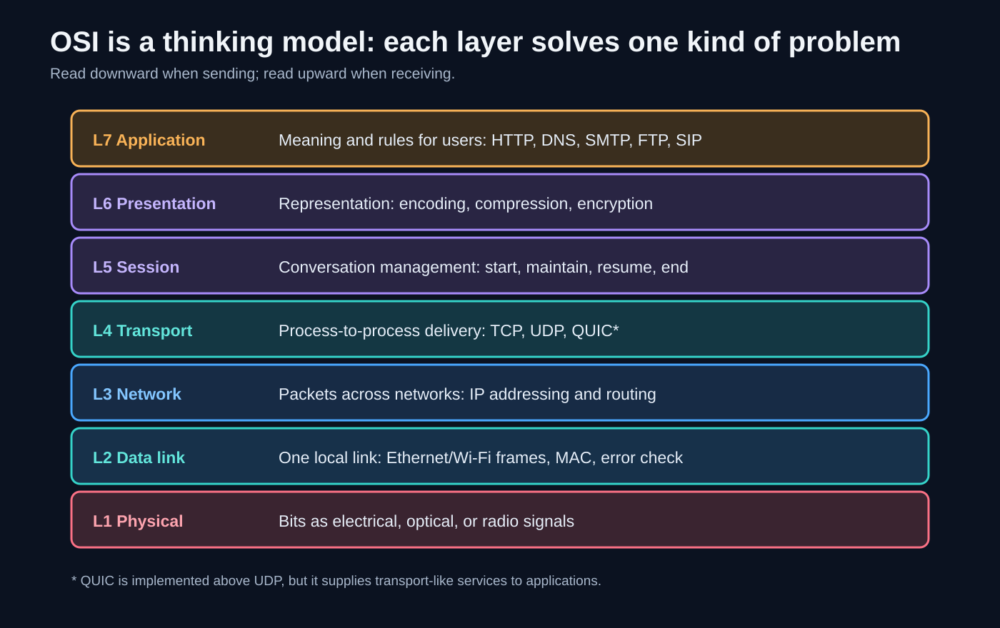

| Layer | Main question | Common examples |
| --- | --- | --- |
| L7 Application | What does the conversation mean to the application? | HTTP, DNS, SMTP, FTP, SIP |
| L6 Presentation | How is data represented or transformed? | text encoding, compression, encryption |
| L5 Session | How is a longer conversation managed? | dialogues, checkpoints, session state |
| L4 Transport | How do processes communicate end to end? | TCP, UDP; QUIC supplies transport-like services above UDP |
| L3 Network | How does a packet cross multiple networks? | IP, ICMP, routing |
| L2 Data link | How is data moved across one local link? | Ethernet, Wi-Fi, MAC addressing, link error detection |
| L1 Physical | How are bits represented in a medium? | electrical, optical, or radio signals |

### 4.1 A layer offers a service and hides an implementation

Each layer:

1. **uses** the service of the layer below;
2. performs its own responsibility; and
3. **offers** a service to the layer above.

HTTP can use TCP without knowing whether the current local link is Ethernet, Wi-Fi, fibre, or satellite radio. TCP can use IP without choosing every physical hop. This hiding of details makes components replaceable.

Layering is not magic isolation. A slow radio link can still increase TCP latency, and a small MTU can affect transport behavior. The point is that upper layers usually observe consequences through a stable interface instead of controlling the hardware directly.

### 4.2 OSI is not the same as the Internet's implementation stack

The Internet is commonly described with fewer layers:

| Internet view | Rough OSI correspondence |
| --- | --- |
| Application | OSI L5-L7 |
| Transport | OSI L4 |
| Internet | OSI L3 |
| Link | OSI L1-L2 |

For example, TLS is often informally placed near OSI L6 because it transforms representation through encryption, but in deployed systems it is a protocol/library between an application protocol and transport. Treat OSI placement as a reasoning aid, not a law enforced by software.

## 5. Encapsulation and decapsulation

**Encapsulation** means putting one protocol's data inside another protocol's payload field.

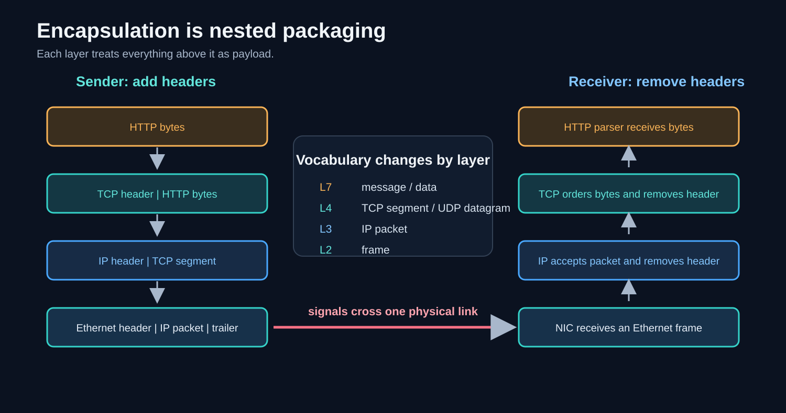

Suppose a browser sends a small HTTP request over TCP/IPv4 and Ethernet:

1. HTTP creates request bytes such as `GET / HTTP/1.1...`.
2. TCP treats those bytes as payload and adds transport fields such as ports, sequence numbers, flags, and a checksum.
3. IP treats the TCP segment as payload and adds source/destination IP addresses, TTL, and other fields.
4. Ethernet treats the IP packet as payload and adds local-link addresses and an error-detection trailer.
5. The physical layer represents the frame as signals.

At the receiver, **decapsulation** proceeds upward in reverse. Each implementation examines its own header and passes its payload upward.

### 5.1 Names for protocol data units

| Context | Common name |
| --- | --- |
| Application | message, request, response, record, or simply data |
| TCP | segment |
| UDP | datagram |
| IP | packet or datagram |
| Ethernet/Wi-Fi | frame |
| Physical | bits/signals |

People often use “packet” loosely for many of these. In careful explanations, the specific name tells you which header is being discussed.

### 5.2 MTU and MSS

The **Maximum Transmission Unit (MTU)** is the largest network-layer packet a link can carry in one frame without link-specific fragmentation. Ethernet commonly has an IP MTU of 1500 bytes.

For a simple IPv4/TCP packet with no options:

```text
1500-byte IP packet
- 20-byte IPv4 header
- 20-byte TCP header
= 1460 bytes of TCP payload
```

That 1460-byte value is a common TCP **Maximum Segment Size (MSS)**. MSS is about TCP payload; MTU is about the link's network-layer packet. IPv6 or TCP options change the arithmetic.

The application still sees a byte stream. A `write()` of 4000 bytes need not become one packet, and one `read()` need not correspond to one sender `write()`.

## 6. L1 and L2: Ethernet, Wi-Fi, and satellite links

### 6.1 Shared-media access

When several devices share a communication medium, they need rules for deciding who may transmit.

Classic shared Ethernet used **CSMA/CD**:

- **carrier sense**: listen before transmitting;
- **multiple access**: several devices share the medium;
- **collision detection**: detect overlapping transmissions, stop, back off randomly, and retry.

Modern switched full-duplex Ethernet links do not normally experience those old shared-cable collisions. A device has a dedicated link to a switch and can transmit and receive simultaneously.

Wi-Fi uses **CSMA/CA**, collision avoidance:

1. sense whether the radio channel is busy;
2. wait for an allowed interval;
3. choose a random backoff;
4. transmit when the counter reaches zero;
5. expect a link-layer acknowledgement;
6. infer possible loss/collision and retry if no acknowledgement arrives.

A radio generally cannot reliably detect a weak competing signal while its own much stronger transmission is active. It therefore tries to avoid collisions and learns success from explicit L2 acknowledgements.

TCP acknowledgements and Wi-Fi acknowledgements solve different problems:

- a Wi-Fi ACK confirms one local-link frame across one wireless hop;
- a TCP ACK participates in end-to-end delivery across the entire path.

### 6.2 Satellite access and why layering matters

A satellite Internet service includes terminals, radio links, satellites, gateways, routing, and higher-layer systems. Calling the whole service “only a physical layer” is an oversimplification.

The useful layering claim is narrower: an IP packet can cross a satellite/radio portion without HTTP or TCP needing a satellite-specific API. Routers may decrement TTL, link headers change at every hop, NAT may rewrite addresses, and packets may be queued or lost, but upper-layer protocol formats remain recognizable.

## 7. Control plane and data plane

Many networks separate:

- the **control plane**, which makes decisions or coordinates setup; and
- the **data plane** or **bearer plane**, which carries the user's voice, video, file, or ordinary packets.

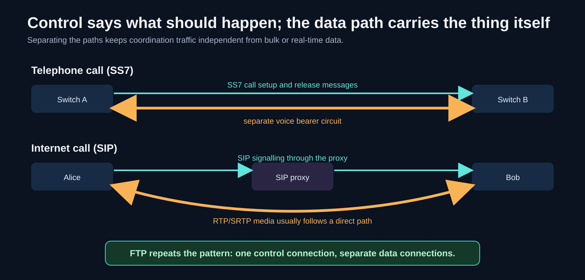

Examples in this lecture:

- SS7 signalling sets up and releases a separate telephone voice circuit.
- SIP signalling negotiates an Internet call, while RTP/SRTP carries media.
- FTP sends commands over a control connection and listings/files over separate data connections.

“Separate” is logical and sometimes physical. Paths can share devices or links while still being handled as different flows. The design benefit is that control messages remain small and independently manageable.

## 8. SS7: the signalling network behind traditional telephony

**Signalling System No. 7 (SS7)** is a family of protocols used by traditional telephone and mobile networks for tasks such as call setup, routing, roaming, and SMS delivery.

Before common-channel signalling, some telephone control tones travelled **in-band** in the same channel as voice. That coupled control to sounds a caller could potentially generate. SS7 moved signalling to a separate packet-switched network, called **out-of-band signalling**.

Important consequence:

> The voice circuit can be carrying a conversation while SS7 is mostly idle. SS7 is involved when the network needs to set up, modify, query, or release service state.

### 8.1 SS7 is a stack, not one peer of TCP

It is misleading to compare all of SS7 with TCP alone. SS7 contains protocols at several layers, while TCP is one transport protocol in the Internet family.

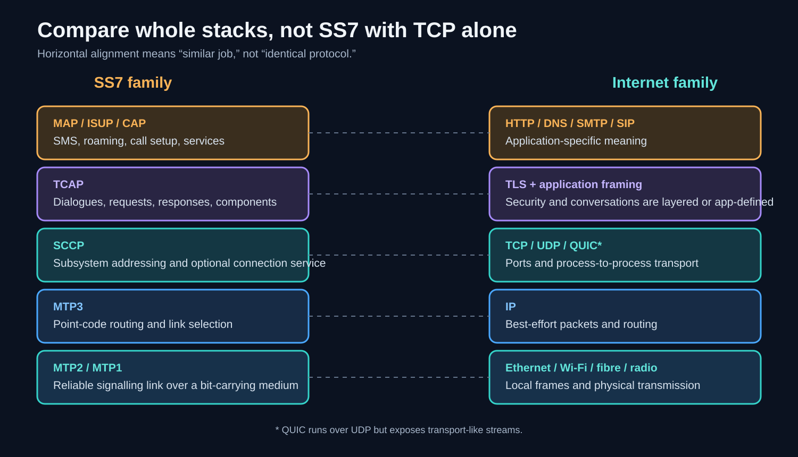

| SS7 component | Beginner-friendly job |
| --- | --- |
| MTP1 | Carry bits over a physical signalling link. |
| MTP2 | Frame, sequence, acknowledge, retransmit, and check errors on one signalling link. |
| MTP3 | Route signalling messages using signalling point codes and choose links. |
| SCCP | Add richer addressing, including subsystem numbers and global-title translation. |
| TCAP | Represent transactions/dialogues made of requests, responses, and errors. |
| MAP | Perform mobile-network operations such as routing queries and SMS transfer. |
| ISUP | Set up, manage, and release telephone calls/circuits. |

The correspondence with OSI or TCP/IP is approximate. Boundaries, reliability, addressing, and trust assumptions differ.

### 8.2 SS7 addressing vocabulary

- A **signalling point** is a node in the SS7 network.
- A **point code** identifies a signalling point for MTP3 routing.
- **OPC** is the originating point code; **DPC** is the destination point code.
- A **Signalling Link Selection (SLS)** value helps distribute related messages across links while preserving suitable ordering.
- A **Subsystem Number (SSN)** selects an application/subsystem within a node, somewhat analogous in purpose to selecting a service.
- A **Global Title (GT)** is a higher-level address such as a telephone-number-like identifier.
- **Global Title Translation (GTT)** maps that higher-level address toward a routable destination, conceptually similar to a lookup plus routing decision, though it is not DNS.

## 9. SS7 encapsulation: the same nesting idea with different names

An SMS text payload is not placed directly in an MTP2 frame. It is wrapped in structures whose headers solve successively broader jobs.

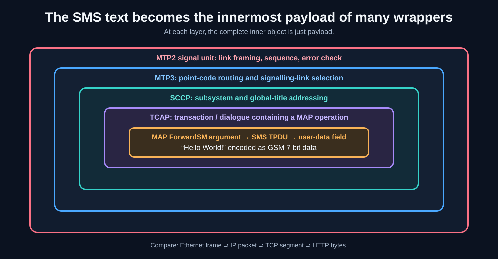

A simplified path from inside to outside is:

```text
user text
inside an SMS TPDU
inside a MAP operation argument
inside a TCAP component/dialogue
inside an SCCP message
inside an MTP3 routing payload
inside an MTP2 signal unit
```

Compare it with:

```text
HTTP bytes
inside a TCP segment
inside an IP packet
inside an Ethernet frame
```

The names are different, but the abstraction is identical: one layer's complete data unit becomes another layer's payload.

## 10. SMS size and encoding

### 10.1 Octets, septets, and the 140-octet user-data field

An **octet** is exactly eight bits. The SMS transport-protocol user-data field has a maximum of 140 octets in the common GSM design.

The historic signalling limits surrounding SMS help explain why messages were kept small, but avoid reducing the standardization history to “MTP2 is 272 octets, therefore SMS is 140.” Multiple protocol fields and design choices are involved. The safe fact to remember is that the SMS TPDU user-data budget is 140 octets.

### 10.2 GSM-7 packing

The GSM 7-bit default alphabet uses **septets**, seven-bit character codes. It is not ASCII, even though both can represent many familiar Latin characters.

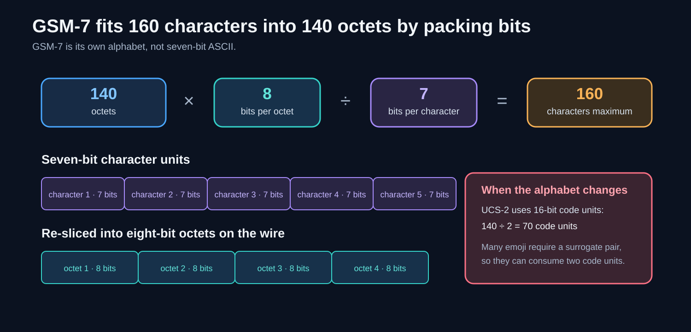

For a single unsegmented message:

```text
140 octets × 8 bits per octet = 1120 bits
1120 bits ÷ 7 bits per septet = 160 septets
```

The septets are placed into a continuous bit stream and repacked into octets. After the first character, character boundaries usually do not align with byte boundaries.

Some GSM-7 characters use an escape code and therefore consume two septets. So “160 characters” really means at most 160 septets, not always 160 visible symbols.

### 10.3 UCS-2, emoji, and concatenated SMS

When text cannot be represented in GSM-7, phones commonly use a 16-bit representation usually described in SMS contexts as **UCS-2**:

```text
140 octets ÷ 2 octets per code unit = 70 code units
```

That gives at most 70 basic 16-bit code units in a single SMS. Many emoji require two UTF-16 surrogate code units, so “70 characters” can overstate the number of visible emoji.

Long messages are sent as **concatenated SMS**. A small **User Data Header (UDH)** inside each part identifies the parts, but consumes payload space. Common practical limits become 153 GSM-7 septets per part or 67 16-bit code units per part. The receiving phone reassembles the parts for display.

## 11. The SMS store-and-forward path

SMS does not require both phones to maintain one end-to-end connection. An **SMS Center (SMSC)** stores the message and attempts delivery.

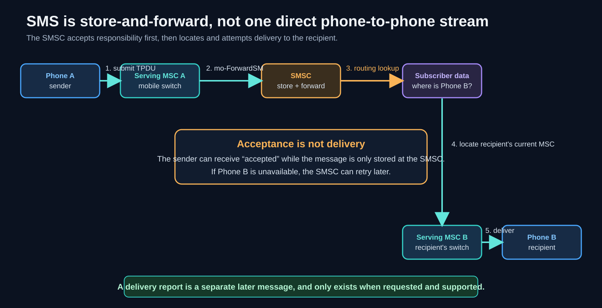

A simplified mobile-originated to mobile-terminated path is:

1. Phone A submits an SMS TPDU through its serving mobile network.
2. The serving network invokes an operation such as MAP `mo-ForwardSM` toward the SMSC.
3. Once the SMSC accepts the message, responsibility has moved to the store-and-forward system. Acceptance does not prove delivery to Phone B.
4. The SMSC asks subscriber/routing data where Phone B is currently served.
5. It sends the mobile-terminated message toward Phone B's serving switch.
6. The network attempts over-the-air delivery to Phone B.
7. If requested and supported, a later status report can report an outcome.

This is “a database lookup wrapped in a queue” because routing data is consulted and the SMSC can retain work for later retry when the recipient is unavailable.

## 12. Telephone call setup with ISUP

For a circuit-switched call, SS7's **ISDN User Part (ISUP)** coordinates switches while a separate bearer circuit carries voice.

Common messages include:

| Message | Purpose |
| --- | --- |
| IAM - Initial Address Message | Request call setup and carry the called number and bearer information. |
| ACM - Address Complete Message | Indicate that routing reached the terminating side and call progress is occurring. |
| ANM - Answer Message | Indicate that the called party answered; charging/bearer state can change. |
| REL - Release | Request release and include a cause. |
| RLC - Release Complete | Confirm that the circuit/resources were released. |

After answer, voice flows on the bearer path. SS7 is not carrying the sampled conversation itself.

## 13. IMS, SIP, SDP, and RTP

Modern IP telephony uses a different protocol family while preserving control/data separation.

- **IMS (IP Multimedia Subsystem)** is an operator architecture for IP multimedia services.
- **SIP (Session Initiation Protocol)** is a text-based signalling protocol used to establish, modify, and end sessions.
- **SDP (Session Description Protocol)** describes proposed media formats, addresses, and ports. It is commonly carried inside SIP messages.
- **RTP (Real-time Transport Protocol)** carries media timing and sequence information, commonly over UDP.
- **SRTP** adds confidentiality, integrity, and replay protection to RTP media.
- A **user agent (UA)** is a SIP endpoint such as a softphone.
- A **proxy** or **Session Border Controller (SBC)** can route and control signalling.

A simplified call is:

1. Alice sends `INVITE` containing an SDP offer.
2. Proxies forward the request.
3. Provisional responses such as `100 Trying` and `180 Ringing` report progress.
4. Bob returns `200 OK` with an SDP answer.
5. Alice sends `ACK`.
6. RTP/SRTP carries media, often on a path different from the signalling path.
7. `BYE` and `200 OK` end the session.

SIP uses HTTP-like syntax and three-digit response codes, but it is a distinct protocol with different methods, state machines, routing, and purposes.

## 14. Where reliability lives: per-hop and end-to-end

**Per-hop reliability** repairs an error between adjacent nodes. **End-to-end reliability** is maintained by the two final endpoints across all intermediate hops.

Traditional SS7 MTP2 can sequence, acknowledge, and retransmit signalling units on each signalling link. TCP numbers bytes and acknowledges them end to end between hosts.

These choices are not simply “one reliable and one unreliable.” They place responsibility differently:

| Concern | SS7-style example | TCP/IP-style example |
| --- | --- | --- |
| Local link repair | MTP2 sequence and retransmission between signalling points | Ethernet/Wi-Fi may detect errors or retry locally |
| Cross-network routing | MTP3 point codes | IP addresses and routers |
| End-to-end reliable stream | Higher SS7 services where required | TCP between endpoints |
| Security | Historically based heavily on controlled-network trust | TCP has none natively; TLS is layered above |

Local repair can respond quickly to one bad hop. End-to-end checking is still valuable because only the endpoints know whether the whole path delivered the intended data.

## 15. Flow control is not congestion control

The two terms are often confused:

- **Flow control** protects the receiver. It stops a fast sender from overflowing a slow receiver's buffers. TCP's advertised receive window is the main example.
- **Congestion control** protects the network path. It tries to avoid injecting more traffic than bottleneck links and queues can handle.

The usable amount of in-flight TCP data is limited by both the receiver window and the congestion-control algorithm.

### 15.1 Loss-based TCP

Classic congestion-control approaches such as Reno and CUBIC increase sending aggressiveness and treat loss as an important congestion signal. When congestion is inferred, they reduce the rate. The resulting rate can look like a rising-and-falling sawtooth.

Packet loss can also come from radio errors or other non-congestion causes. Very large buffers can hide loss while producing long queueing delays, called **bufferbloat**.

### 15.2 BBR's different model

**BBR (Bottleneck Bandwidth and Round-trip propagation time)** estimates:

- the bottleneck delivery rate; and
- the minimum round-trip time observed when queues are relatively empty.

It uses these estimates to pace traffic and control the amount in flight, instead of requiring packet loss as its primary signal.

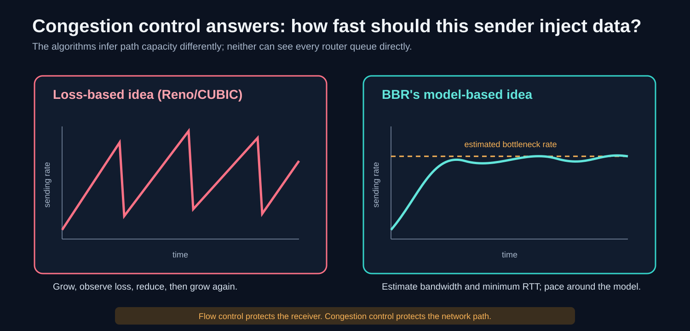

The useful conceptual relation is the **bandwidth-delay product**:

```text
bandwidth-delay product ≈ bottleneck bandwidth × round-trip time
```

It estimates how much data can be in flight while fully using the path. Real BBR versions have more states and details than this one equation, and no congestion-control algorithm is best for every path or competing-traffic situation.

## 16. TCP connection setup in detail

TCP is full-duplex: both sides can send. Each direction needs an initial sequence-number space to be announced and acknowledged.

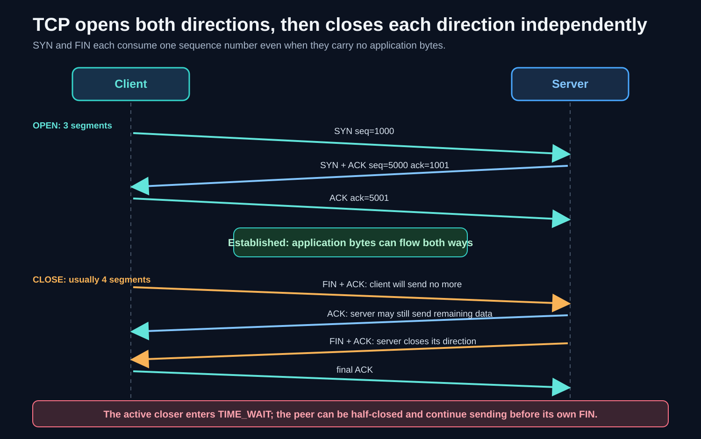

A simplified handshake is:

1. Client sends `SYN`, perhaps with initial sequence number 1000 and TCP options.
2. Server sends `SYN+ACK`, acknowledges 1001, and announces its own initial sequence number, perhaps 5000.
3. Client sends `ACK` acknowledging 5001.

Now both sides know that the peer received their initial sequence number. The server-side connection becomes established and can be returned by `accept()` according to the operating system's queueing behavior.

### 16.1 Why acknowledgement numbers are “next expected byte”

TCP sequence numbers count positions in the byte stream. An acknowledgement number means, “I have everything before this number; this is the next sequence number I expect.”

`SYN` and `FIN` each consume one sequence number even without application payload. Therefore a `SYN seq=1000` is acknowledged with `ack=1001`.

### 16.2 TCP options negotiated during setup

Common options include:

- **MSS**: the largest TCP payload the sender wants in one segment;
- **window scale**: permits receive windows larger than the original 16-bit field;
- **SACK permitted**: allows selective acknowledgement of received ranges;
- **timestamps**: assist measurement and protection against old duplicates.

The two directions can advertise different capabilities and values.

### 16.3 Initial Sequence Numbers

An **Initial Sequence Number (ISN)** should be difficult for an off-path attacker to predict. Predictable ISNs historically enabled blind injection attacks. Modern generation uses secret-dependent calculations and time-varying input; the exact implementation is operating-system-specific.

## 17. Pending connections, SYN floods, and SYN cookies

There are two conceptually different pending states:

1. a **half-open** handshake has received a SYN but not the client's final ACK;
2. a **completed/established** connection finished the handshake and may wait for the application to call `accept()`.

Exact Linux and other OS queue structures, limits, and the interpretation of the `listen()` backlog differ. Keep the conceptual pipeline clear even if implementation details vary.

A **SYN flood** sends many SYNs, often with spoofed source addresses, and does not finish the handshake. Without defenses, half-open state consumes finite memory/queue capacity until it expires, preventing legitimate clients from connecting.

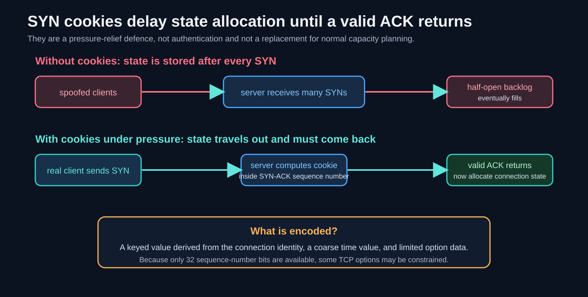

With **SYN cookies** under pressure:

1. the server avoids keeping ordinary per-connection state for the incoming SYN;
2. it encodes a secret-validated cookie and limited connection information in its SYN-ACK sequence number;
3. a real client returns that value plus one in its ACK;
4. the server recomputes and validates the cookie;
5. only then does it construct established connection state.

SYN cookies demonstrate a broader design technique: move enough temporary state into a tamper-resistant token that the client must return. They reduce state-exhaustion risk, but they do not prove user identity, encrypt traffic, or stop every denial-of-service attack. The small sequence-number field can constrain the TCP options represented.

## 18. TCP shutdown, half-close, TIME_WAIT, and reset

TCP closes each sending direction separately.

1. The active closer sends `FIN` (usually also carrying the ACK flag).
2. The peer acknowledges it. The peer may still send data: this is a **half-closed** connection.
3. When the peer's application finishes, it sends its own `FIN` (also normally with ACK).
4. The original closer acknowledges that FIN and enters **TIME_WAIT**.

The common case uses four segments, but three are possible if the peer combines its acknowledgement of the first FIN with its own FIN. Therefore “FIN and ACK cannot be combined” is incorrect. `FIN+ACK` is normal; what cannot be assumed is that both applications become ready to close at the same moment.

### 18.1 Why TIME_WAIT exists

TIME_WAIT lasts for a period commonly described as twice the **Maximum Segment Lifetime (2 MSL)**. It lets the active closer:

- retransmit the final ACK if the peer repeats its FIN; and
- allow delayed duplicate segments from the old connection to expire before an identical 4-tuple is safely reused.

TIME_WAIT is usually evidence of a completed active close, not a stuck socket.

### 18.2 CLOSE_WAIT points to the application

If a socket remains in **CLOSE_WAIT**, the peer's FIN arrived and the local TCP acknowledged it, but the local application has not closed its side. Large persistent numbers commonly indicate an application resource-management bug.

### 18.3 `SO_LINGER` and abortive close

`SO_LINGER` controls how `close()` behaves when data or connection state remains. A linger setting equivalent to `{enabled=1, timeout=0}` requests an **abortive close**. The stack discards unsent data and sends a reset (`RST`) rather than completing an orderly FIN exchange.

The peer may observe “connection reset” and lose bytes it had not consumed. This is useful for demonstrations or narrow designs that intentionally reject remaining data, not as a routine speed optimization.

### 18.4 `SO_REUSEADDR` is a listening-address option

A restarting server commonly sets `SO_REUSEADDR` after `socket()` and before `bind()`:

```c
int yes = 1;
setsockopt(server_fd, SOL_SOCKET, SO_REUSEADDR, &yes, sizeof(yes));
bind(server_fd, ...);
```

It permits address reuse in cases defined by the operating system, commonly allowing a listener to restart despite relevant old TCP states such as TIME_WAIT. It does not make it safe for arbitrary live servers to own the same endpoint, does not remove TCP correctness rules, and is not the same as `SO_REUSEPORT`.

## 19. Round-trip time is a setup tax

A **round-trip time (RTT)** is the time for a message to reach the peer and for a response to return. Long geographic distance imposes a propagation-delay floor that more bandwidth cannot remove.

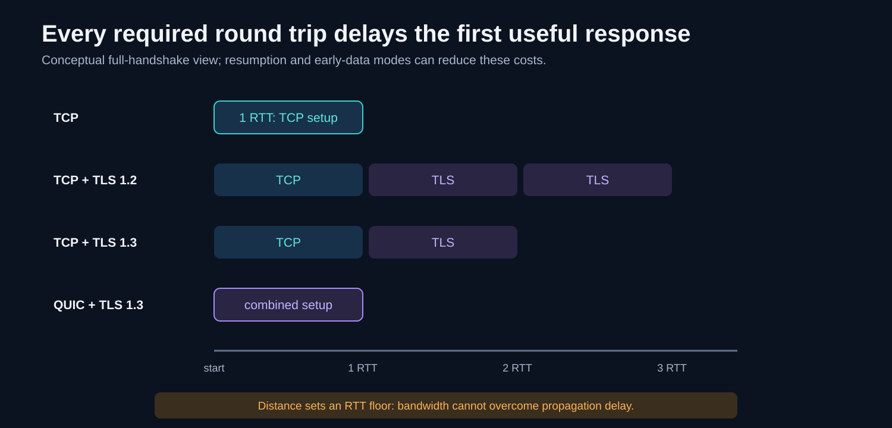

Conceptually:

- a fresh TCP connection requires one RTT for its three-way handshake before ordinary post-handshake application data;
- a full TLS handshake adds cryptographic negotiation;
- TLS 1.3 generally reduces full-handshake round trips compared with TLS 1.2;
- QUIC integrates TLS 1.3 with transport setup;
- session resumption, TCP Fast Open, and 0-RTT/early-data modes can reduce repeat-connection latency, with important security and replay constraints.

Exact “RTT counts” depend on protocol version, whether the connection is resumed, when the application is allowed to send, and what is counted as useful response data. Use the diagram as a latency model, not a universal packet trace.

## 20. UDP: datagrams with deliberately few promises

UDP is a small transport protocol. Its header has four 16-bit fields:

| Field | Purpose |
| --- | --- |
| Source port | Identifies the sending endpoint when present. |
| Destination port | Selects the receiving service. |
| Length | Total UDP header plus payload length. |
| Checksum | Detects corruption over a pseudo-header, UDP header, and payload. |

The minimum UDP header is 8 bytes, compared with TCP's minimum 20-byte header.

UDP provides:

- process addressing through ports;
- preservation of datagram boundaries;
- length information; and
- checksum-based corruption detection.

UDP does **not** itself provide:

- a connection handshake;
- delivery guarantee;
- duplicate suppression;
- ordering across datagrams;
- retransmission;
- a reliable byte stream;
- flow control; or
- congestion control.

That does not mean a UDP application should ignore congestion. It means the transport does not impose TCP's policy. A responsible protocol above UDP must decide which of these functions it needs.

### 20.1 Datagram boundaries versus a TCP byte stream

If an application performs three UDP sends, the receiver observes separate datagrams if they arrive. A receive buffer that is too small can truncate a datagram.

If an application performs three TCP writes, the receiver sees one ordered stream. Reads can split or combine the bytes in any convenient way. The application must add framing.

### 20.2 Size is not permission to send one huge datagram

For IPv4, a theoretical maximum UDP payload with ordinary headers is 65,507 bytes:

```text
65,535 maximum IPv4 total length
- 20 bytes minimum IPv4 header
- 8 bytes UDP header
= 65,507 bytes UDP payload
```

But a typical path MTU is far smaller. Large IP datagrams may be fragmented or dropped, and losing one fragment loses the whole datagram. Applications normally choose much smaller payloads or implement path-aware sizing.

### 20.3 Why real-time applications often use UDP

In interactive audio or games, an old retransmitted update may arrive too late to be useful. The application might prefer:

- discard late data;
- interpolate missing audio;
- send a newer position instead of retrying an old one; or
- selectively make only critical messages reliable.

DNS also commonly uses UDP for compact request-response exchanges, while supporting TCP or other transports when needed.

## 21. QUIC: transport-like services above UDP

QUIC is not simply “TCP copied into UDP.” It is a distinct secure transport protocol implemented on top of UDP so it can be deployed without adding a new IP protocol to kernels and middleboxes.

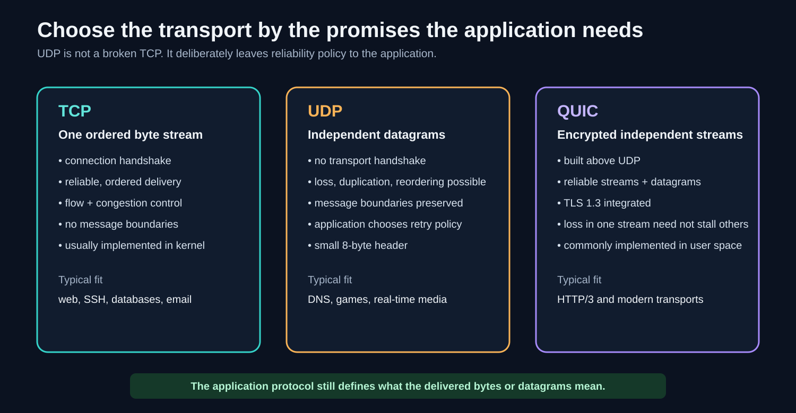

QUIC commonly provides:

- an integrated TLS 1.3 handshake;
- reliable ordered delivery within each stream;
- multiple independent streams in one connection;
- optional unreliable datagrams;
- congestion and flow control;
- connection migration using connection identifiers; and
- much of its implementation in updateable user-space software.

### 21.1 Head-of-line blocking

**Head-of-line (HOL) blocking** means later useful data waits behind missing earlier data.

HTTP/2 multiplexes many logical streams over one TCP byte stream. If one TCP packet is lost, TCP must repair the gap before delivering later bytes to the application, even if those later bytes belong to another HTTP/2 stream.

QUIC gives streams separate ordering spaces. A gap in one stream need not prevent delivery of already available data in another stream. Packet loss can still reduce the whole connection's congestion window, so “HOL blocking is gone” specifically means transport-level cross-stream delivery blocking is avoided, not that loss has zero effect elsewhere.

### 21.2 Why user-space implementation matters

TCP is normally implemented in the OS kernel. A major transport change therefore depends on OS deployment and compatibility with network devices.

QUIC packets look like UDP to the kernel and many middleboxes, while endpoints implement QUIC logic in libraries or applications. Browsers and servers can deploy protocol improvements faster. This flexibility has a cost: user-space implementations must still be efficient, secure, interoperable, and fair to other traffic.

HTTP/3 maps HTTP semantics onto QUIC streams. QUIC is the transport; HTTP/3 is the application protocol above it.

## 22. Text protocols: you can type the application bytes yourself

A **text protocol** encodes control messages mainly as readable characters. This is not the same as saying every payload is text or that the protocol is secure.

When you type an SMTP command into `nc` or `telnet`, the path is:

1. the terminal converts keystrokes to character bytes;
2. the tool writes those bytes to a connected TCP socket;
3. TCP transports a raw ordered byte stream;
4. the server reads bytes and its SMTP parser recognizes a command and delimiter;
5. the server serializes a textual reply and writes it back.

TCP never recognizes `EHLO`, `USER`, `RETR`, or `PASV`. Those meanings exist only in SMTP, POP3, or FTP implementations.

Text protocols are approachable and extensible, but they still need exact grammar. Spaces, line endings, terminators, escaping, reply codes, and state all matter.

## 23. Email is a multi-protocol workflow

“Sending an email” and “reading an email” use different application protocols.

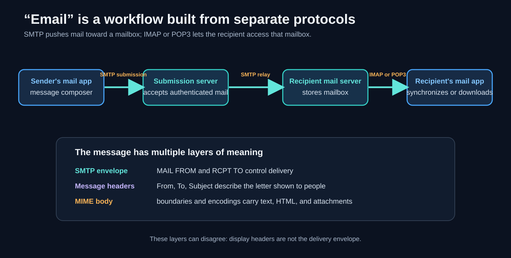

- **SMTP** pushes a message from a client to a submission server and between mail servers.
- **IMAP** lets clients synchronize server-held mailboxes and state.
- **POP3** lets a client list and retrieve messages using a simpler download-oriented model.
- **MIME** defines message body types, multipart structure, and safe encodings for attachments.

Common ports are:

| Port | Conventional use |
| --- | --- |
| 25 | SMTP relay between mail servers; policy and TLS use vary. |
| 587 | Message submission, normally with authentication and STARTTLS. |
| 465 | Message submission with TLS from the first byte. |
| 110 | POP3 without implicit TLS. |
| 995 | POP3 over implicit TLS. |
| 143 | IMAP without implicit TLS, often upgraded with STARTTLS. |
| 993 | IMAP over implicit TLS. |

Do not send real credentials through a plaintext manual session. Local throwaway servers are appropriate for learning.

## 24. SMTP: envelope, message, and conversation state

**Simple Mail Transfer Protocol (SMTP)** is a command-response protocol. A client sends a command line; the server replies with a three-digit status code and text.

A simplified conversation is:

```text
S: 220 mail.example ready
C: EHLO learner.example
S: 250-mail.example
S: 250 SIZE 10485760
C: MAIL FROM:<alice@example.test>
S: 250 OK
C: RCPT TO:<bob@example.test>
S: 250 OK
C: DATA
S: 354 End data with <CRLF>.<CRLF>
C: From: Alice <alice@example.test>
C: To: Bob <bob@example.test>
C: Subject: A manual SMTP message
C:
C: Hello Bob.
C: .
S: 250 queued
C: QUIT
S: 221 bye
```

`C:` and `S:` are annotations for these notes, not bytes you type.

### 24.1 The envelope is not the letter

SMTP has two distinct kinds of addressing:

- `MAIL FROM` and `RCPT TO` form the **SMTP envelope** used for transport and delivery;
- `From:` and `To:` inside `DATA` are **message headers** shown to people and processed by mail software.

They can differ for legitimate reasons such as mailing lists, forwarding, and bounce handling. They can also be abused. Base SMTP does not prove that the visible `From:` identity is authorized.

Modern systems add controls such as:

- **SMTP authentication** for submission;
- **SPF**, which publishes which hosts may send for an envelope domain;
- **DKIM**, which signs selected message content and headers for a domain; and
- **DMARC**, which adds alignment and policy around visible sender domains, SPF, and DKIM.

These mechanisms are not “just headers and verbs” in implementation; they involve DNS records, cryptographic verification, and receiver policy.

### 24.2 The DATA terminator and dot-stuffing

SMTP ends the DATA body with this delimiter:

```text
<CRLF>.<CRLF>
```

That means a line containing only `.` terminates the message. To carry a body line that begins with a dot, the sender adds another dot. The receiver removes that extra dot. This is **dot-stuffing**.

The blank line between message headers and body is also semantic. Without it, a parser may keep treating lines as headers.

### 24.3 STARTTLS versus implicit TLS

With **STARTTLS**, the connection begins as plaintext SMTP. The client requests an upgrade, then a TLS handshake begins on the same TCP connection. After the upgrade, commands are encrypted and a simple telnet session can no longer display them.

With **implicit TLS**, TLS starts immediately when the TCP connection opens. Use a TLS-aware tool such as `openssl s_client`, not telnet, to inspect it.

## 25. MIME and base64: carrying structured bodies and attachments

SMTP was designed around line-oriented text. **Multipurpose Internet Mail Extensions (MIME)** lets a message describe multiple content types and safely represent arbitrary attachment bytes.

### 25.1 Why base64 expands data

Base64 takes 24 input bits, splits them into four 6-bit values, and maps those values to safe printable characters:

```text
3 input bytes = 24 bits
24 bits ÷ 6 bits = 4 base64 characters
```

Therefore the core expansion is:

```text
4 output bytes / 3 input bytes = 4/3 ≈ 1.333
```

That is about 33% overhead before line breaks and surrounding MIME headers. `=` characters pad the final group when the input length is not divisible by three. Base64 is an encoding, not encryption; anyone can decode it.

Modern SMTP extensions can transport more than the original seven-bit assumptions, but base64 remains widely used for interoperable binary attachments.

### 25.2 Multipart boundaries

A MIME message can declare a boundary:

```text
Content-Type: multipart/mixed; boundary="=_example_7f3a"

--=_example_7f3a
Content-Type: text/plain; charset=utf-8

See the attachment.
--=_example_7f3a
Content-Type: image/png
Content-Transfer-Encoding: base64

iVBORw0KGgo...
--=_example_7f3a--
```

The boundary separates body parts. It must be chosen so it does not occur as a boundary line inside the encoded parts. The final boundary has an extra `--` suffix.

This is layering inside one application protocol:

```text
SMTP conversation
contains an Internet message
whose body is structured by MIME
whose attachment bytes are represented with base64
```

## 26. POP3 and IMAP: two mailbox models

### 26.1 POP3 as a small stateful conversation

A simplified POP3 session is:

```text
S: +OK POP3 ready
C: USER bob
S: +OK
C: PASS secret
S: +OK authenticated
C: STAT
S: +OK 2 1840
C: LIST
S: +OK 2 messages
S: 1 720
S: 2 1120
S: .
C: RETR 1
S: +OK 720 octets
S: ...message bytes...
S: .
C: DELE 1
S: +OK marked
C: QUIT
S: +OK deletion committed
```

Important semantics:

- `STAT` reports message count and total size.
- `LIST` reports message numbers and sizes.
- `RETR n` returns one complete message.
- `DELE n` marks a message during the transaction; deletion is normally committed when a successful `QUIT` enters the update phase.
- Multiline responses use a dot terminator and dot-stuffing, similar to SMTP.

Plain `USER` and `PASS` expose credentials to anyone who can observe the plaintext connection. Use TLS in real systems.

### 26.2 POP3 versus IMAP

| Concern | POP3-oriented model | IMAP-oriented model |
| --- | --- | --- |
| Primary copy | Often downloaded to a device | Remains on server; clients cache/synchronize |
| Multiple devices | State coordination is limited | Mailbox and flags synchronize across clients |
| Read/unread state | Often local to a client | Server-side flags such as `\Seen` |
| Folders | Simple mailbox model | Server-side mailbox hierarchy |
| Search | Often requires local download | Server can execute searches |
| Partial retrieval | Simpler, usually whole-message retrieval | Can fetch chosen sections or byte ranges |
| New-mail updates | Usually polling | IMAP can support `IDLE` notifications |

POP3 can be configured to leave copies on the server, so “POP always deletes everything” is too absolute. The deeper distinction is that IMAP was designed around a server-resident synchronized mailbox model.

## 27. Framing: length, delimiter, or a combination

TCP does not preserve application message boundaries. A protocol must define how its parser finds them.

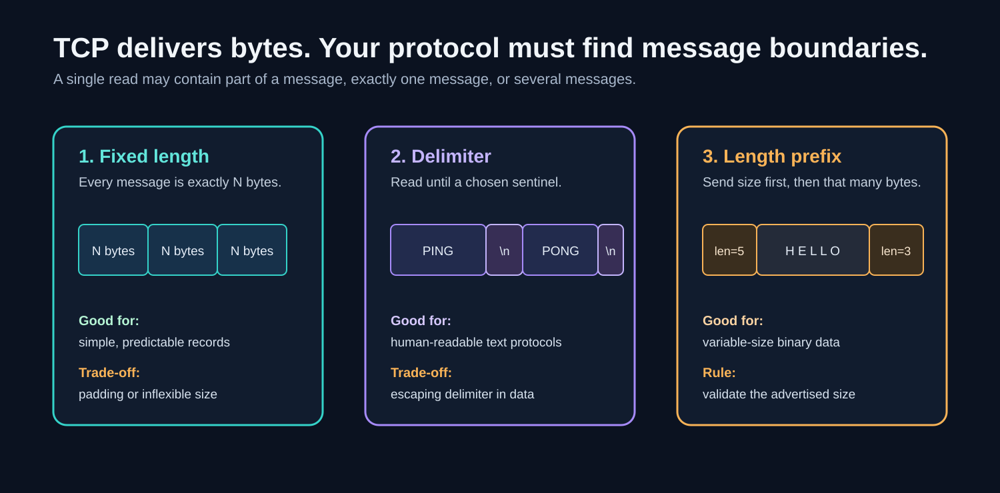

### 27.1 Delimiter-based framing

Agree on a special byte sequence that marks the end:

- SMTP DATA: `<CRLF>.<CRLF>`;
- HTTP/1 header section: an empty line, `<CRLF><CRLF>`;
- MIME multipart: declared boundary lines;
- many command protocols: line ending `CRLF`.

Advantages: simple, readable, and streamable without knowing the final size first.

Cost: the delimiter must be forbidden or escaped inside content. A parser must handle partial delimiters split across multiple reads.

### 27.2 Length-based framing

Send a length, then read exactly that amount:

- HTTP `Content-Length`;
- Protobuf messages preceded by a varint length;
- fixed-size fields in binary protocols;
- SMS user-data length.

Advantages: payload content cannot be confused with a delimiter, and binary bytes need not be escaped.

Cost: the receiver must validate lengths before allocating memory or waiting. A malicious or corrupted huge length must not cause unbounded allocation. Senders may need to know or buffer the size in advance.

### 27.3 Combining control delimiters and body lengths

Many protocols use both:

- HTTP/1 uses delimited header lines plus a body length or transfer coding;
- IMAP uses lines plus literals whose byte count is declared;
- POP3 uses a status line plus a dot-terminated multiline body;
- HTTP/2 uses binary length-prefixed frames over a TCP stream.

When two components disagree about which length or delimiter wins, security bugs such as **request smuggling** can appear. Parsing rules must be unambiguous and consistent at every intermediary.

## 28. FTP: control and data on different TCP connections

**File Transfer Protocol (FTP)** keeps commands and replies on a long-lived **control connection**, traditionally to server TCP port 21. Directory listings and file contents use separate **data connections**.

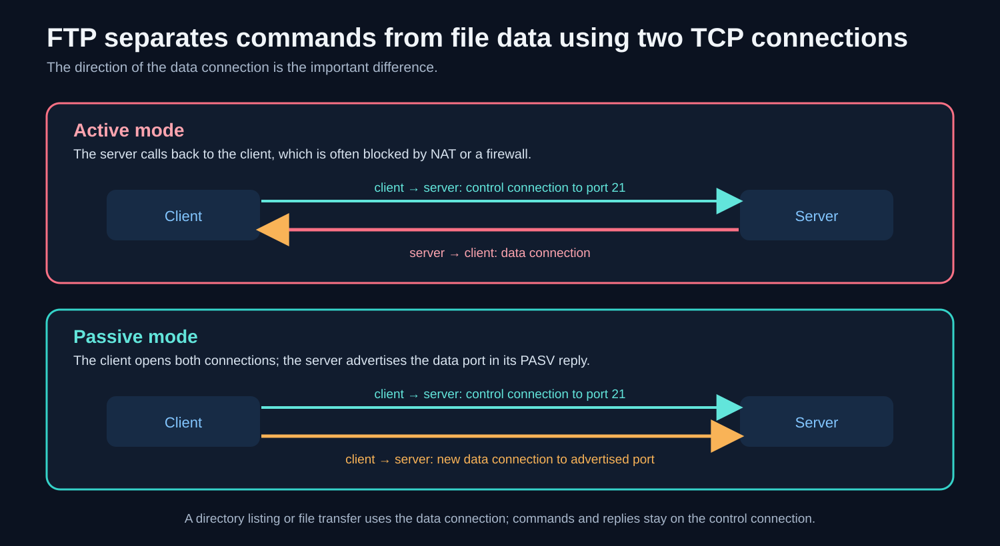

### 28.1 Active mode

1. The client opens the control connection to the server.
2. The client tells the server an address/port for data.
3. The server opens the data connection back toward the client, historically from port 20.

Inbound callbacks are awkward through NAT and firewalls because the client appears to receive an unsolicited connection.

### 28.2 Passive mode

1. The client opens the control connection.
2. The client sends `PASV`.
3. The server listens on a temporary data port and returns it.
4. The client opens the data connection to that advertised endpoint.
5. A command such as `LIST` or `RETR` uses that data connection.

Both connections are client-initiated, which fits NAT/firewall policy much better. Modern FTP clients may prefer **EPSV**, whose response avoids embedding an IP address and works more cleanly with IPv6.

### 28.3 Decoding a PASV port

A traditional PASV reply contains six decimal octets:

```text
(h1,h2,h3,h4,p1,p2)
```

The first four form the IPv4 address. The last two are the high and low bytes of a 16-bit port:

```text
port = p1 × 256 + p2
```

For `(127,0,0,1,117,48)`:

```text
port = 117 × 256 + 48
     = 29,952 + 48
     = 30,000
```

This is big-endian/network byte order expressed as decimal text: high byte first, then low byte.

FTP is separate from **SFTP**, which is a file-transfer subsystem over SSH. FTP protected with TLS is commonly called FTPS. These are not interchangeable names.

## 29. One complete request path: retrieving an email attachment

This path joins the whole lecture together.

1. A mail client resolves its server name to an IP address using DNS.
2. The process calls `socket()` and `connect()` toward the IMAP-over-TLS port.
3. The kernel chooses a local route and ephemeral port, then performs the TCP three-way handshake.
4. The server kernel finishes the handshake and queues the established connection until the server process calls `accept()`.
5. TCP exists at L4, but no IMAP command has meaning yet.
6. TLS performs a cryptographic handshake over the TCP byte stream. TLS records now frame, protect, and encrypt the later application bytes.
7. The mail client serializes an IMAP command. Its TLS library converts it into protected TLS records and writes bytes to the socket.
8. TCP numbers and segments those bytes; IP packets them; the local link frames them. Each hop can replace its L2 framing while routers forward the L3 packet.
9. The server decapsulates upward: link → IP → TCP → TLS → IMAP parser.
10. The IMAP parser understands the command, selects mailbox state, and returns the requested MIME body part.
11. MIME headers tell the client that the part is, for example, a PNG encoded in base64.
12. The client decodes base64 back into the original image bytes.
13. TCP may be reused for more commands. When either application finishes, TLS closes its protected session and TCP performs orderly FIN-based shutdown or another valid termination.

At every step, the same bytes acquire meaning only at the layer whose parser understands them.

## 30. Safe hands-on exercises

The slide demonstrations are useful because a text protocol becomes visible. Keep them local and disposable.

### 30.1 General method

1. Run a local test server in a container.
2. Expose only the required localhost ports.
3. Connect with `nc` (netcat) or `telnet` if installed.
4. Type one protocol command at a time and read every status line.
5. Capture loopback traffic with Wireshark if you want to see framing and TCP behavior.
6. Stop and remove the disposable container when finished.

On modern macOS, `telnet` may not be installed. `nc localhost 3025` is usually enough for a plaintext line protocol. For TLS, use `openssl s_client` with appropriate options.

### 30.2 Do not confuse a demo with production practice

- Do not reuse demo passwords.
- Do not expose an unauthenticated SMTP relay to a public interface.
- Do not send real credentials over plaintext POP3, IMAP, SMTP, or FTP.
- Do not treat abortive `SO_LINGER` as a routine optimization.
- Prefer secure modern services and libraries for real applications.

## 31. A small-step study path

If the lecture still feels dense, use this order:

1. Redraw the seven OSI responsibilities without protocol names.
2. Trace one HTTP request through encapsulation and decapsulation.
3. Explain why the listening socket and connected socket are different.
4. Trace SYN, SYN-ACK, ACK and then the two independent FIN directions.
5. Compare TCP's byte stream, UDP's datagrams, and QUIC's streams.
6. Trace SMTP submission, SMTP relay, and IMAP/POP retrieval.
7. Compare Internet encapsulation with SS7 encapsulation.
8. Trace SMS store-and-forward and calculate GSM-7 versus UCS-2 limits.
9. Explain active versus passive FTP using connection direction.
10. Attempt the quiz from memory, then revisit only the weak sections.

## 32. Comprehensive revision quiz

Try to answer aloud or on paper before opening the solutions. A good answer should explain **why**, not only expand an acronym.

### Questions

#### A. Bytes, sockets, and layering

1. Why can the same byte sequence have several possible meanings?
2. What must an application protocol define beyond merely choosing TCP?
3. What is a file descriptor, and why is it incorrect to call the number itself a TCP connection?
4. Explain the different purposes of a listening FD and a connected FD.
5. What happens when a client omits `bind()` before `connect()`?
6. What four values normally identify one TCP connection?
7. What does `listen(fd, backlog)` limit, and what does it not limit?
8. Why can one server port handle many simultaneous client connections?

#### B. OSI and encapsulation

9. What is the main purpose of the OSI model?
10. State the main responsibility of each OSI layer from L1 to L7.
11. Why is it misleading to demand one exact OSI layer for TLS or QUIC?
12. Define encapsulation and decapsulation.
13. In Ethernet → IPv4 → TCP → HTTP, what does TCP treat as payload, and what does IP treat as payload?
14. Distinguish frame, packet, segment, datagram, and application message.
15. Calculate a common TCP MSS for a 1500-byte IP MTU with 20-byte IPv4 and TCP headers.
16. Why does one application `write()` not necessarily equal one TCP segment or one peer `read()`?

#### C. Links, control, and data

17. Why did classic shared Ethernet need collision detection?
18. Why does Wi-Fi use collision avoidance and explicit link acknowledgements?
19. How is a Wi-Fi ACK different from a TCP ACK?
20. Which part of the statement “Starlink is a physical layer” is useful, and which part is oversimplified?
21. Define control plane and data/bearer plane.
22. Give one control/data separation example from SS7, SIP, and FTP.
23. Does layering guarantee that a slow L1 link cannot affect TCP? Explain.
24. Why can link-layer framing change hop by hop while an application conversation continues?

#### D. SS7, SMS, and calls

25. What problem did out-of-band SS7 signalling solve compared with in-band control tones?
26. Why should SS7 be compared with the whole TCP/IP stack rather than TCP alone?
27. State the beginner-level jobs of MTP2, MTP3, SCCP, TCAP, MAP, and ISUP.
28. Distinguish point code, subsystem number, and global title.
29. Trace the nesting of an SMS text from TPDU outward to MTP2.
30. Show why 140 octets can hold 160 GSM-7 septets.
31. Why can one emoji reduce practical SMS capacity much more than one Latin letter?
32. Explain why “SMSC accepted the message” is not the same as “Phone B received it.”

#### E. Reliability, congestion, and TCP setup

33. Distinguish per-hop reliability from end-to-end reliability.
34. Distinguish flow control from congestion control.
35. What behavior creates the sawtooth associated with loss-based TCP?
36. What two path properties does BBR try to estimate, and what is their product useful for?
37. Why does TCP use a three-way rather than a two-way handshake?
38. If the client sends `SYN seq=1000`, why does the server acknowledge 1001?
39. Name four options that may be negotiated in SYN packets.
40. Why should initial TCP sequence numbers be difficult for attackers to predict?

#### F. Queues, attacks, and shutdown

41. What is a half-open TCP connection?
42. What does “completed connection” mean in an accept queue?
43. How does a SYN flood consume server resources?
44. Explain SYN cookies without saying merely “they stop SYN floods.”
45. What important limitations do SYN cookies have?
46. Why does orderly TCP close usually require four segments?
47. What is a half-close, and why can it be useful?
48. Contrast TIME_WAIT, CLOSE_WAIT, `SO_REUSEADDR`, and abortive `SO_LINGER`.

#### G. TCP, UDP, QUIC, and latency

49. List the four fields in a UDP header.
50. Which promises does UDP deliberately not make?
51. How do UDP and TCP differ in preserving application send boundaries?
52. Why is sending a 65,507-byte UDP payload usually a poor practical choice?
53. Why can dropping an old audio or game update be better than retransmitting it?
54. Which services does QUIC add above UDP?
55. Explain transport-level head-of-line blocking in HTTP/2 over TCP and how QUIC changes it.
56. Why can increased bandwidth not remove the latency caused by long geographic distance?

#### H. SMTP, MIME, mail access, framing, and FTP

57. Trace the roles of SMTP, MIME, IMAP, and POP3 in an email workflow.
58. Distinguish the SMTP envelope from message headers.
59. What ends SMTP DATA, and what is dot-stuffing?
60. Why does base64 add about 33% size overhead, and why is it not encryption?
61. What is a MIME multipart boundary?
62. Give the central architectural difference between POP3 and IMAP.
63. Compare delimiter framing, length framing, and a protocol that combines both.
64. Explain FTP active versus passive mode and decode PASV bytes `117,48` into a port.

### Solutions

#### A. Bytes, sockets, and layering

1. **Bytes have representation but no self-declared semantics.** `0x41` could be a number, a character, or part of an opaque binary field. Context and a protocol's parser decide how to interpret it.
2. **The application protocol defines syntax, framing, semantics, valid sequence, state, and error behavior.** TCP only provides a reliable ordered byte stream; it does not identify requests, headers, or message boundaries.
3. **An FD is a process-local integer index into an open-resource table.** Its entry refers to a kernel socket object that represents transport state. Another process can reuse the same number for something unrelated, and more than one FD can refer to one underlying object.
4. **The listening FD represents the service endpoint and is used with `accept()`.** A connected FD represents one established client conversation and is used for application `read()`/`write()`. Closing one client FD need not stop the listener.
5. **The kernel chooses a suitable local address and ephemeral source port.** `connect()` supplies the destination and triggers TCP setup; an explicit client `bind()` is only needed when the program requires a chosen local endpoint.
6. **The 4-tuple is source IP, source port, destination IP, and destination port.** Protocol is also part of endpoint lookup in the broader stack, but the TCP connection is commonly described by those four values.
7. **The backlog concerns pending connections, subject to OS interpretation and caps.** It is not a lifetime maximum client count and does not mean only that many clients can ever be served.
8. **Every client normally has a different source IP/port combination.** The complete 4-tuple distinguishes each connected socket even when all clients use the same destination IP and server port.

#### B. OSI and encapsulation

9. **OSI separates networking responsibilities into a shared conceptual vocabulary.** It helps locate a problem or protocol responsibility; it is not a promise that every real implementation has seven separate modules.
10. **L1 signals; L2 local-link frames; L3 cross-network packets/routing; L4 process-to-process transport; L5 conversation/session management; L6 representation/transformation; L7 application meaning.** Real protocols may combine responsibilities.
11. **Real protocol boundaries do not always match the conceptual OSI boundaries.** TLS transforms representation but is deployed between application and transport; QUIC runs over UDP while supplying transport-like services. The useful question is what job they perform.
12. **Encapsulation adds a layer's control information around data from above. Decapsulation validates/removes that information and passes the payload upward.** The operations occur in opposite directions at sender and receiver.
13. **TCP treats HTTP bytes as its payload. IP treats the entire TCP segment, including TCP header and HTTP bytes, as its payload.** Ethernet then treats the complete IP packet as payload.
14. **A frame is a link-layer unit, a packet is normally an IP-layer unit, a TCP segment is a TCP unit, a UDP datagram is a UDP message-preserving unit, and an application message is defined by the application protocol.** “Packet” is also used loosely in casual speech.
15. **Formula: MSS = MTU − IP header − TCP header.** `1500 − 20 − 20 = 1460` bytes. Options or IPv6 headers change this value.
16. **TCP exposes a stream rather than preserving calls or packets.** The stack may split or combine writes, and a read returns whatever ordered bytes are currently available up to the buffer limit. Framing must be handled above TCP.

#### C. Links, control, and data

17. **Several devices shared one half-duplex medium, so transmissions could overlap.** CSMA/CD listened, detected a collision, stopped, randomly backed off, and retried. Switched full-duplex Ethernet largely removes this old collision domain.
18. **A transmitter's own radio signal overwhelms its ability to hear a competing weak signal.** Wi-Fi therefore senses before transmitting, backs off, and infers success from an explicit receiver ACK.
19. **A Wi-Fi ACK confirms a local frame over one wireless hop.** A TCP ACK is end-to-end transport state acknowledging positions in a byte stream across the complete route. One can occur many times beneath a single TCP exchange.
20. **The useful claim is that IP/TCP applications need no satellite-specific API to cross that link.** The oversimplification is treating the complete Starlink service as only L1; terminals, link protocols, routing, gateways, and higher-layer mechanisms also exist.
21. **The control plane coordinates decisions, setup, and state. The data or bearer plane carries user content.** Separation lets small control exchanges manage large or real-time data flows independently.
22. **SS7 sets up a separate voice bearer; SIP negotiates while RTP/SRTP carries media; FTP uses a control connection and separate data connections.** The exact physical paths need not be completely disjoint.
23. **No. Layering hides implementation details, not performance consequences.** A slow or lossy L1/L2 can raise delay and loss, which TCP observes and reacts to through its own interface.
24. **Every local link has its own framing and addresses.** A router removes the incoming link frame, processes the IP packet, and places that packet into a new outgoing-link frame. The end-to-end application state remains above those hop-specific wrappers.

#### D. SS7, SMS, and calls

25. **It separated control decisions from caller-accessible voice tones.** A separate signalling network improved security, capacity, and control by preventing ordinary audio from directly serving as trunk-control signalling.
26. **SS7 includes physical/link, routing, addressing, transaction, and application protocols.** TCP is only one transport protocol. The fair comparison is protocol family/stack to protocol family/stack.
27. **MTP2 handles reliable adjacent-link frames; MTP3 routes by point code; SCCP adds subsystem/global-title addressing; TCAP organizes transactions/dialogues; MAP defines mobile operations; ISUP controls telephone call circuits.** MTP1 carries bits beneath them.
28. **A point code routes to an SS7 node, an SSN selects a subsystem within a node, and a global title is a higher-level address translated toward a routable destination.** Their jobs resemble network address, service selector, and lookup-based logical address, but the analogy is not exact.
29. **Text is encoded inside SMS user data and a TPDU; the TPDU is carried by a MAP operation; MAP is a TCAP component/dialogue; TCAP is carried by SCCP; SCCP becomes MTP3 user data; MTP3 is framed by MTP2.** Each outer layer sees the complete inner unit as payload.
30. **Formula: `140 × 8 ÷ 7 = 160`.** The 140 octets contain 1120 bits, which fit 160 seven-bit septets. Packing crosses byte boundaries.
31. **A Latin GSM-7 character commonly consumes one septet, but text outside that alphabet triggers 16-bit encoding.** Many emoji need two surrogate code units, and concatenation headers reduce per-part capacity further.
32. **Acceptance only means the SMSC took store-and-forward responsibility.** It may still need to find the recipient's serving network, wait for availability, retry, or eventually fail. Delivery status is a later separate outcome.

#### E. Reliability, congestion, and TCP setup

33. **Per-hop reliability repairs between adjacent nodes; end-to-end reliability is verified by the final endpoints.** Fast local repair can coexist with end-to-end checks because only endpoints can validate the whole path.
34. **Flow control protects a receiver's buffers; congestion control protects the shared network path.** TCP uses an advertised receive window for the former and a congestion window/algorithm for the latter.
35. **The sender grows until it infers congestion, commonly from loss, then reduces its sending rate and grows again.** Repetition creates the sawtooth. Buffering may delay loss while increasing latency.
36. **BBR estimates bottleneck bandwidth and minimum round-trip propagation time.** Their product approximates the bandwidth-delay product, the quantity of in-flight data that can fill the path without requiring a large standing queue.
37. **Each direction needs its ISN both announced and acknowledged.** SYN announces the client's ISN; SYN-ACK acknowledges it and announces the server's; the final ACK confirms receipt of the server's ISN.
38. **SYN consumes one sequence number.** TCP acknowledgements name the next expected sequence position, so the next position after 1000 is 1001 even if SYN carried no application byte.
39. **MSS, window scale, SACK-permitted, and timestamps are common examples.** Options are advertised in the setup so both directions know supported behavior.
40. **A predictable ISN can help an off-path attacker forge believable segments without seeing the connection.** Secret-dependent, time-varying generation makes blind injection substantially harder.

#### F. Queues, attacks, and shutdown

41. **A half-open connection received an initial SYN and sent a SYN-ACK but has not received the final valid ACK.** The handshake is not yet fully established at the server.
42. **It means the TCP handshake finished and the kernel has an established connection ready for `accept()`.** It does not mean the application request was read, processed, or answered.
43. **Each unanswered spoofed SYN can make the server retain temporary handshake state until timeout.** Enough entries can exhaust a finite backlog or related resources and block legitimate handshakes.
44. **Under pressure the server encodes secret-verifiable, time-limited connection information in its SYN-ACK ISN instead of storing normal state.** When the ACK returns, it recomputes the cookie and allocates an established connection only if validation succeeds.
45. **They do not authenticate users, encrypt traffic, or stop bandwidth and CPU exhaustion.** Only limited information fits in 32 bits, so some option negotiation can be constrained, and they are usually a fallback under load.
46. **Each full-duplex sending direction closes independently with FIN and must be acknowledged.** The first FIN, its ACK, the peer's later FIN, and the final ACK commonly make four segments; an ACK and peer FIN can sometimes be combined.
47. **After receiving one FIN, the other side may continue sending until it closes its own direction.** This is useful when a client finishes its request but still needs to receive the response.
48. **TIME_WAIT belongs to the active closer and protects the old connection's final exchange; CLOSE_WAIT means the local application has not closed after peer FIN. `SO_REUSEADDR` affects rules for rebinding a listener. Abortive zero-time `SO_LINGER` discards unsent data and resets instead of orderly FIN shutdown.** They solve different problems.

#### G. TCP, UDP, QUIC, and latency

49. **Source port, destination port, length, and checksum.** Each is 16 bits, giving the ordinary 8-byte UDP header.
50. **UDP does not promise setup, delivery, ordering, duplicate suppression, retransmission, flow control, or congestion control.** Applications add only the behavior their use case needs.
51. **UDP preserves each arriving datagram as a unit. TCP merges application writes into one ordered stream with no retained message boundary.** TCP applications therefore need framing; UDP applications still need a payload format.
52. **It is far larger than common path MTUs and will require fragmentation or fail.** Loss of one fragment loses the entire datagram, and many devices restrict or drop fragmented traffic. Practical protocols keep datagrams path-sized.
53. **Its playback or simulation deadline may have passed.** Retrying it adds delay and may block newer, more useful state, so concealment or a fresh update can produce a better result.
54. **QUIC adds integrated TLS 1.3, reliable independent streams, flow and congestion control, connection management/migration, and optional datagrams above UDP.** It is a distinct transport, not just a TCP packet placed inside UDP.
55. **HTTP/2 streams share one ordered TCP delivery sequence, so a missing byte can delay later bytes from every stream.** QUIC orders each stream independently, so one stream's gap need not block ready bytes in another, though shared congestion effects remain.
56. **Signals propagate at a finite speed and often follow long non-straight routes through equipment.** More bandwidth sends more bits per second, but it does not make the first bit cross the physical distance instantly.

#### H. SMTP, MIME, mail access, framing, and FTP

57. **SMTP submits and relays mail toward the recipient server; MIME structures the stored message and encodes body parts; IMAP synchronizes a server-resident mailbox; POP3 offers simpler listing/retrieval.** One user-visible email action therefore crosses several protocol responsibilities.
58. **`MAIL FROM` and `RCPT TO` are transport envelope fields used for routing and bounces. `From:` and `To:` are message headers displayed as part of the letter.** They need not match, which enables both legitimate forwarding and spoofing risk.
59. **SMTP DATA ends with `<CRLF>.<CRLF>`, a dot alone on a line.** A sender adds an extra dot to any body line beginning with a dot; the receiver removes it so content cannot accidentally become the delimiter.
60. **Three bytes, or 24 bits, become four printable 6-bit symbols, giving a `4/3` expansion.** It is reversible public representation with no secret key, so it provides no confidentiality.
61. **It is a declared delimiter separating MIME body parts such as text and attachments.** Opening lines begin with `--boundary`; the final one adds a closing `--`. The chosen boundary must not be mistaken for content.
62. **IMAP treats the server mailbox and its flags/folders as authoritative synchronized state; POP3 is oriented toward simple message retrieval/download.** POP can leave server copies, so the distinction is an architectural model rather than an absolute deletion rule.
63. **Delimiter framing reads to a sentinel but must escape that sentinel; length framing reads an advertised byte count but must validate it.** HTTP/1 combines delimited headers with a length or transfer coding for the body; IMAP literals are another combination.
64. **In active FTP the server opens the data connection back to the client; in passive FTP the client opens it to a server-advertised port, which works better through NAT/firewalls.** `117 × 256 + 48 = 30000`, because 117 is the high byte and 48 the low byte.

## 33. Essential vocabulary

### 33.1 Data, protocols, and operating-system interface

- **Bit**: one binary digit, 0 or 1.
- **Byte**: eight bits in modern systems.
- **Octet**: exactly eight bits; common standards language.
- **Septet**: seven bits; used for GSM 7-bit character codes.
- **Protocol**: shared rules for representation, framing, meaning, order, state, and behavior.
- **Parser**: code that recognizes a protocol structure and converts bytes into meaningful fields.
- **Serialization**: converting structured application information into protocol bytes.
- **User space**: restricted environment where ordinary application code runs.
- **Kernel**: privileged OS core that manages networking, processes, memory, and hardware.
- **System call**: controlled request from a process for kernel work.
- **Socket**: kernel-managed communication endpoint exposed to a process through an API.
- **File descriptor (FD)**: process-local integer selecting an open resource-table entry.
- **Listening socket**: passive socket representing a local service endpoint.
- **Connected socket**: socket representing one established peer-to-peer conversation.
- **Ephemeral port**: temporary local port commonly selected for an outgoing client connection.
- **4-tuple**: source IP, source port, destination IP, destination port.
- **Backlog**: requested capacity associated with pending connection processing; exact semantics are OS-specific.
- **Network byte order**: big-endian order used for multi-byte numeric protocol fields.
- **`htons()`**: host-to-network conversion for a 16-bit unsigned integer.
- **`SO_LINGER`**: socket option controlling some `close()` behavior when data/state remains.
- **`SO_REUSEADDR`**: socket option permitting address reuse under OS-specific binding rules.
- **`SO_REUSEPORT`**: distinct option that can allow multiple sockets to bind in supported configurations; not a synonym for `SO_REUSEADDR`.

### 33.2 Layers and encapsulation

- **OSI model**: seven-layer conceptual model for separating network responsibilities.
- **Physical layer (L1)**: transmission of bits as signals.
- **Data-link layer (L2)**: framing and delivery across one local link.
- **Network layer (L3)**: addressing and routing packets across networks.
- **Transport layer (L4)**: process-to-process communication behavior.
- **Session layer (L5)**: management of ongoing conversations in the OSI model.
- **Presentation layer (L6)**: representation, encoding, compression, and encryption concepts.
- **Application layer (L7)**: protocol meaning used by applications.
- **Service**: capability one layer offers to the layer above.
- **Encapsulation**: wrapping an upper-layer unit with lower-layer control information.
- **Decapsulation**: processing/removing lower-layer information and passing payload upward.
- **Header**: control fields placed before a payload.
- **Trailer**: control fields placed after a payload, such as Ethernet FCS.
- **Payload**: the inner data carried by a protocol unit.
- **Protocol Data Unit (PDU)**: generic name for one layer's structured unit.
- **Frame**: link-layer PDU.
- **IP packet**: network-layer PDU containing an IP header and payload.
- **TCP segment**: TCP header plus TCP payload.
- **UDP datagram**: one UDP header and its preserved payload unit.
- **MTU**: maximum network-layer packet size a link carries without link-specific fragmentation.
- **MSS**: maximum TCP payload size advertised for a segment.

### 33.3 Link technologies

- **Ethernet**: widely used wired link-layer family.
- **MAC address**: link-layer identifier used for local frame delivery.
- **EtherType**: Ethernet field identifying the payload protocol, such as IPv4.
- **FCS**: Frame Check Sequence used to detect frame corruption.
- **CRC**: Cyclic Redundancy Check, an error-detection method.
- **CSMA/CD**: carrier-sense multiple access with collision detection, associated with classic shared Ethernet.
- **Collision domain**: set of transmitters whose simultaneous transmissions can interfere on shared Ethernet.
- **Full duplex**: simultaneous transmission in both directions, eliminating old shared-medium collisions on a switched link.
- **CSMA/CA**: carrier-sense multiple access with collision avoidance, used by Wi-Fi.
- **Contention window**: range from which a random medium-access backoff is chosen.
- **Link-layer ACK**: acknowledgement of a local-link frame, separate from TCP acknowledgement.
- **RF**: radio frequency.
- **LEO**: low Earth orbit.
- **Gateway**: device connecting one network or technology domain to another.

### 33.4 Control and telephone signalling

- **Control plane**: logic/messages that establish state and make forwarding or service decisions.
- **Data plane**: machinery/path that carries user data according to control decisions.
- **Bearer**: channel or flow carrying user voice/media.
- **In-band signalling**: control information carried in the same channel as user content.
- **Out-of-band signalling**: control information carried separately from user content.
- **SS7**: protocol family for traditional telephony signalling.
- **Signalling point**: node participating in SS7 signalling.
- **MTP1**: SS7 Message Transfer Part physical signalling-link functions.
- **MTP2**: adjacent-link framing, sequencing, acknowledgements, retransmission, and error checks.
- **MTP3**: SS7 routing, network management, and link selection.
- **OPC / DPC**: originating and destination point codes.
- **SLS**: Signalling Link Selection field used in distributing signalling traffic.
- **SCCP**: Signalling Connection Control Part, adding subsystem/global-title addressing and service classes.
- **SSN**: Subsystem Number selecting an SS7 application at a node.
- **Global Title (GT)**: higher-level SS7 address translated toward routing information.
- **GTT**: Global Title Translation.
- **TCAP**: Transaction Capabilities Application Part, structuring dialogues and components.
- **MAP**: Mobile Application Part, defining mobile-network operations.
- **ISUP**: ISDN User Part, controlling telephone circuits/calls.
- **IAM**: Initial Address Message requesting call setup.
- **ACM**: Address Complete Message reporting call progress/routing completion.
- **ANM**: Answer Message reporting that the called party answered.
- **REL / RLC**: release request and release-complete confirmation.
- **Per-hop reliability**: repair/verification between adjacent network nodes.
- **End-to-end reliability**: repair/verification between final communicating endpoints.

### 33.5 SMS and IP telephony

- **SMS**: Short Message Service.
- **TPDU**: SMS Transfer Protocol Data Unit.
- **TP-UD**: SMS user-data field.
- **TP-UDL**: field describing SMS user-data length in units determined by encoding.
- **TP-DCS**: Data Coding Scheme field selecting interpretation such as GSM-7 or UCS-2-related encoding.
- **GSM-7**: GSM 7-bit default alphabet encoded as packed septets.
- **UCS-2**: 16-bit universal-character representation traditionally used in SMS contexts.
- **UDH**: User Data Header used for concatenation and other SMS features.
- **Concatenated SMS**: long message split into individually transported parts and reassembled for display.
- **SMSC**: Short Message Service Center that stores and forwards messages.
- **Store-and-forward**: accept and retain work, then deliver when the next destination becomes available.
- **VLR**: Visitor Location Register, holding serving-area subscriber information in classic mobile networks.
- **HLR**: Home Location Register, holding home subscriber/routing data in classic mobile networks.
- **MSC**: Mobile Switching Center.
- **IMS**: IP Multimedia Subsystem.
- **SIP**: Session Initiation Protocol for signalling IP sessions.
- **SDP**: Session Description Protocol for describing proposed media parameters.
- **RTP**: Real-time Transport Protocol for media sequencing and timing.
- **SRTP**: Secure RTP, adding media protection.
- **User agent (UA)**: SIP endpoint acting for a user.
- **SBC**: Session Border Controller at an administrative/network boundary.
- **Softphone**: software telephone endpoint.

### 33.6 TCP operation and defense

- **Full duplex**: both endpoints can send independently.
- **Sequence number**: TCP position identifying a byte-stream location; SYN/FIN also consume positions.
- **Acknowledgement number**: next TCP sequence position the receiver expects.
- **ISN**: Initial Sequence Number chosen for one TCP direction.
- **SYN**: TCP flag used to synchronize sequence spaces and open a connection.
- **ACK**: TCP flag indicating a valid acknowledgement field.
- **FIN**: orderly declaration that one endpoint will send no more bytes.
- **RST**: reset that aborts or rejects TCP connection state.
- **PSH**: TCP flag requesting prompt delivery behavior; not an application message delimiter.
- **Receive window**: amount of buffer space the receiver advertises for flow control.
- **Window scaling**: TCP option allowing a larger effective receive window.
- **SACK**: Selective Acknowledgement of received byte ranges beyond a gap.
- **RTO**: Retransmission Timeout.
- **Duplicate ACK**: repeated acknowledgement of the same next-expected sequence position.
- **Fast retransmit**: retransmission triggered by duplicate-ACK evidence before the normal timeout.
- **Half-open connection**: TCP setup awaiting the final handshake acknowledgement.
- **Established/completed connection**: handshake finished; may be waiting for `accept()`.
- **SYN flood**: state-exhaustion attack using many incomplete handshakes.
- **Spoofing**: forging a source identity such as a source IP address.
- **SYN cookie**: stateless handshake technique encoding verifiable information in the server's ISN.
- **Half-close**: one TCP sending direction is closed while the opposite direction remains usable.
- **TIME_WAIT**: active-closer state protecting final ACK reliability and old-duplicate expiry.
- **MSL**: Maximum Segment Lifetime used in the reasoning behind TIME_WAIT.
- **CLOSE_WAIT**: local state after peer FIN while waiting for the local application to close.
- **Abortive close**: reset-based termination that can discard unsent data instead of orderly FIN shutdown.

### 33.7 Flow, congestion, and latency

- **Flow control**: prevents a sender from overflowing the receiver.
- **Congestion control**: limits traffic to protect the network path and share bottlenecks.
- **Congestion window**: sender-side TCP limit derived by congestion control.
- **Reno**: classic loss-based TCP congestion-control family.
- **CUBIC**: common loss-based congestion-control algorithm with cubic window growth.
- **BBR**: model-based congestion control estimating bottleneck bandwidth and round-trip propagation time.
- **Bottleneck**: path resource with the least relevant capacity.
- **Bandwidth-delay product**: bandwidth × RTT; approximate data volume needed in flight to fill a path.
- **Pacing**: spacing transmissions according to a target rate.
- **Bufferbloat**: excessive queueing delay caused by persistently full oversized buffers.
- **RTT**: round-trip time.
- **Propagation delay**: travel time imposed by physical distance and signal speed.
- **TCP Fast Open**: mechanism permitting data in the SYN for eligible repeat connections.
- **0-RTT / early data**: application data sent before a fresh handshake fully completes, with replay/security limitations.

### 33.8 UDP, QUIC, and HTTP/3

- **UDP**: minimal datagram transport with ports, length, and checksum but no built-in reliability or ordering.
- **Datagram boundary**: preserved edge around one UDP send/receive unit.
- **IP fragmentation**: splitting an IP packet to fit links; loss of one fragment prevents full reassembly.
- **Pseudo-header**: selected IP-layer fields included in a transport checksum calculation.
- **QUIC**: secure multiplexed transport built above UDP.
- **Stream**: ordered byte sequence within a QUIC connection; each stream has independent ordering.
- **Connection ID**: QUIC identifier that can allow a connection to survive some address/path changes.
- **Connection migration**: continuing a logical QUIC connection across a network-path change.
- **HOL blocking**: later useful data waiting behind missing earlier data.
- **HTTP/2**: HTTP mapping that multiplexes streams over TCP.
- **HTTP/3**: HTTP mapping over QUIC.
- **Middlebox**: network device beyond ordinary forwarding, such as a NAT or firewall, that may inspect or modify traffic behavior.

### 33.9 Email protocols and framing

- **SMTP**: protocol for submitting and relaying email.
- **SMTP relay**: transfer of a message between mail servers.
- **Message submission**: authenticated handoff from a user's client to an outgoing server.
- **SMTP envelope**: `MAIL FROM` and `RCPT TO` delivery metadata.
- **Message header**: fields inside the message such as `From`, `To`, and `Subject`.
- **Status code**: numeric SMTP/SIP reply category followed by more detail.
- **EHLO**: Extended SMTP greeting that also asks for supported extensions.
- **DATA**: SMTP command beginning transfer of message headers and body.
- **CRLF**: carriage return followed by line feed, the Internet-protocol line ending used by SMTP and others.
- **Dot-stuffing**: escaping a data line beginning with `.` so it is not confused with a terminator.
- **STARTTLS**: command that upgrades an existing plaintext protocol connection to TLS.
- **Implicit TLS**: TLS begins immediately when the TCP connection is opened.
- **MIME**: standards for typed and multipart Internet message bodies.
- **Content-Type**: MIME header describing the media type and parameters.
- **Base64**: reversible binary-to-text encoding using 6-bit symbols.
- **Multipart boundary**: declared delimiter separating MIME body parts.
- **SPF**: sender policy mechanism authorizing sending hosts for a domain.
- **DKIM**: domain-associated cryptographic signature over selected email content.
- **DMARC**: domain policy/reporting based on aligned SPF or DKIM results.
- **POP3**: simple mailbox listing/retrieval protocol.
- **IMAP**: protocol for server-resident mailbox synchronization and manipulation.
- **IMAP flag**: server-side message state such as `\Seen`.
- **IMAP IDLE**: mechanism allowing a server to report mailbox changes without repeated polling.
- **Delimiter framing**: ends a unit with a special byte sequence.
- **Length framing**: prefixes or otherwise declares the number of bytes in a unit.
- **Request smuggling**: ambiguity attack caused by components disagreeing about message boundaries.

### 33.10 FTP and network boundaries

- **FTP**: File Transfer Protocol using separate control and data TCP connections.
- **Control connection**: FTP connection carrying commands and status replies.
- **Data connection**: FTP connection carrying a listing or file body.
- **Active FTP**: server initiates the data connection back to the client.
- **Passive FTP**: client initiates a data connection to a server-advertised endpoint.
- **PASV**: FTP command requesting classic IPv4 passive mode.
- **EPSV**: extended passive command returning a port without embedding the server IP.
- **NAT**: Network Address Translation between address realms.
- **Firewall**: policy enforcement that permits or blocks traffic flows.
- **FTPS**: FTP protected with TLS.
- **SFTP**: SSH File Transfer Protocol; distinct from FTP.
- **Wireshark**: packet-capture and protocol-dissection tool.
- **Telnet client**: tool capable of a plaintext interactive TCP session; Telnet itself also defines negotiation bytes.
- **Netcat (`nc`)**: general tool for opening plaintext TCP or UDP connections.

## 34. Corrections to tempting oversimplifications

These short corrections are worth remembering because the slide format necessarily compresses detail:

- **GSM-7 is not ASCII.** Both use fewer than eight bits for familiar characters, but their tables and packing rules differ.
- **The 140-octet SMS field should not be derived from one MTP2 limit alone.** It is a standardized TPDU budget within a larger design.
- **FIN and ACK can be combined.** Normal FIN segments usually have the ACK flag set, and a three-segment close is possible.
- **UDP is not TCP with every promise removed.** It has its own datagram semantics and is the correct substrate for many application-defined policies.
- **QUIC is not literally TCP in user space.** It supplies some similar transport services with different stream, security, and connection semantics.
- **Starlink is not only L1.** The useful abstraction is that upper layers can use a satellite path through stable interfaces.
- **A completed TCP connection has completed the handshake, not the application request.**
- **SMTP's later security controls are not merely headers.** They also rely on authenticated submission, DNS policy, cryptographic signatures, TLS, and receiver decisions.
- **POP3 can leave mail on the server.** IMAP's defining strength is a synchronized server-resident mailbox model, not the simple statement “POP always deletes.”
- **An advertised maximum is not a recommended packet size.** A 65,507-byte UDP payload is theoretically possible in one IPv4 datagram but usually operationally fragile.

## 35. What to remember from Session 2

1. **One layer's complete unit becomes another layer's payload.** Ethernet ⊃ IP ⊃ TCP ⊃ HTTP and MTP2 ⊃ MTP3 ⊃ SCCP ⊃ TCAP ⊃ MAP ⊃ SMS are instances of the same nesting idea.
2. **The OSI model is a map of responsibilities.** Use it to reason; do not force every real protocol into an exact box.
3. **Reliability has a location.** It can be repaired on a local link, end to end, inside a kernel transport, or in a user-space protocol.
4. **TCP is an ordered byte stream; UDP is a datagram transport; QUIC offers secure independent streams over UDP.** None of them defines application meaning.
5. **Handshake state is a resource.** A SYN flood targets half-open state; SYN cookies postpone allocation until a client returns a verifiable token.
6. **TCP shutdown is directional.** FIN closes one sending direction, TIME_WAIT protects the active close, and RST is an abort.
7. **Distance costs round trips.** Faster links help throughput, but protocol designs also reduce the number of sequential exchanges before useful data.
8. **Email is several protocols.** SMTP moves mail, MIME structures it, and IMAP/POP3 retrieve it.
9. **Framing is unavoidable.** A stream protocol needs lengths, delimiters, or a careful combination.
10. **Control and data often want separate treatment.** SS7/voice, SIP/RTP, and FTP control/data all demonstrate this recurring architectural choice.
