# Network Architecture - Session 3 Expanded Notes

These notes expand the 34-slide third session, **one process, many clients: scaling servers**. They assume this is your first computer-networks course and build from the process, socket, TCP, and protocol foundations in Sessions 1 and 2.

The lecture asks one question:

> How can one computer keep thousands of network conversations in progress without creating an expensive operating-system thread or process for every idle client?

The short answer is: **separate waiting from working**. Let the kernel watch many sockets, wake a small number of workers only when useful work can proceed, and keep expensive setup out of the request path.

That answer connects `select()`, `epoll`, worker pools, CGI, FastCGI, servlets, Apache, HAProxy, Varnish, nginx, Go's network poller, file-descriptor limits, memory, timeouts, and Little's Law.

## 1. A map of the session

The lecture has five connected parts:

1. **Concurrency models:** process per connection, thread per connection, and one readiness loop over many sockets.
2. **I/O multiplexing:** how `select()` and `epoll` tell a program which file descriptors can make progress.
3. **Running application code:** how CGI starts a program per request, while FastCGI and servlets reuse long-lived workers.
4. **Scaling limits:** file descriptors, memory, CPU/scheduling work, latency, and queues.
5. **Real server designs:** how Apache, HAProxy, Varnish, nginx, and language runtimes combine these ideas.

Keep this question in mind:

> Is this component **waiting for an event**, **moving bytes**, **interpreting a protocol**, or **performing application work**?

Many confusing server diagrams become simple once those jobs are separated.

## 2. Prerequisite: concurrency is not the same as parallelism

These words are related but not interchangeable.

- **Sequential:** start one job, finish it, then start the next.
- **Concurrent:** several jobs are in progress during overlapping periods. The CPU may switch between them whenever one waits.
- **Parallel:** instructions from different jobs actually run at the same moment, usually on different CPU cores.
- **Asynchronous:** starting an operation does not require the caller to wait there until it finishes; completion is observed later.

A single-core computer can be concurrent without being parallel. Suppose client A is waiting 100 ms for database data. During that wait, the CPU can process clients B and C. The jobs overlap in time even though only one instruction stream executes at an instant.

Network servers benefit because connections spend much of their life **waiting**:

- waiting for a client to send the next request;
- waiting for more bytes of a partially received message;
- waiting for a socket's send buffer to have space;
- waiting for an upstream service or database;
- waiting during a keep-alive interval.

If each wait owns a whole process or thread, the server pays for many execution contexts that are asleep. A readiness loop lets one execution context represent many waits.

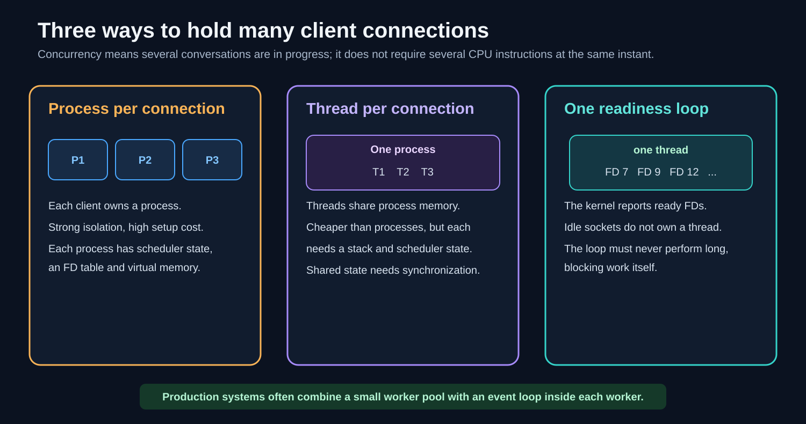

### 2.1 Process, thread, and scheduler

A **process** is a running program with its own virtual address space and process-local file-descriptor table. Processes give useful fault and memory isolation.

A **thread** is an execution path inside a process. Threads in one process share code, heap memory, and open resources, but each thread needs its own stack, registers, and scheduler state. Shared memory is efficient, but simultaneous access may require locks or other synchronization.

The operating-system **scheduler** decides which runnable threads use the CPU. Switching the CPU from one thread to another is a **context switch**. A sleeping thread is not consuming CPU instructions, but it still owns resources and must eventually be scheduled again.

### 2.2 Waiting versus working

An important design distinction is:

- **waiting concurrency:** how many connections or operations are presently waiting;
- **working concurrency:** how many handlers are actively using CPU, disk, databases, or other scarce services.

Ten thousand mostly idle connections may need only a few active workers. A bounded worker pool can therefore be much smaller than the number of connected clients.

This is the recurring architecture of the lecture:

1. a readiness mechanism holds many waits cheaply;
2. a limited set of workers performs actual work;
3. completed work returns to the readiness-controlled path.

## 3. Socket and file-descriptor recap

A socket is a kernel-managed communication object. A process normally refers to it using a **file descriptor**, or FD: a small integer indexing that process's descriptor table.


The number is not the connection itself. FD `7` means “look at entry 7 in this process's table.” That entry refers to a kernel object containing TCP state, receive/send buffers, and connection information.

An event-loop server commonly owns:

- one or more **listening FDs** used with `accept()`;
- many **connected client FDs** used with `read()` and `write()`;
- possibly connected **upstream FDs** to databases or application servers;
- files, logs, pipes, and readiness-mechanism FDs.

This is why “10,000 clients” may require more than 10,000 descriptors. A reverse proxy can need one client socket and one upstream socket for the same in-flight request.

### 3.1 Blocking and non-blocking operations

A **blocking** call may put its calling thread to sleep until it can make progress. For example, `read(fd, ...)` on a blocking socket with no available data may sleep until bytes arrive, EOF occurs, an error occurs, or a configured interruption happens.

A **non-blocking** socket does not make the thread wait merely because the operation cannot proceed now. Instead, `read()` or `write()` returns `-1`, with an error such as `EAGAIN`/`EWOULDBLOCK`, telling the application to try again after readiness is reported.

This is the usual event-loop pattern:

1. configure the connected socket as non-blocking;
2. ask the kernel to report when reading or writing may proceed;
3. perform as much bounded I/O as is currently possible;
4. store unfinished protocol state or unsent bytes;
5. return to the wait loop.

### 3.2 Readiness is not completion

**Readable** usually means a read can proceed without waiting. The result might be:

- one or more bytes;
- `0`, meaning orderly end-of-stream for TCP;
- an error that can now be observed.

It does not mean a complete HTTP request, FastCGI record, or application message has arrived. TCP supplies a byte stream, so one logical message can arrive across several reads, and one read can contain several messages.

**Writable** usually means the kernel currently has some capacity to accept outgoing bytes. It does not promise that:

- the entire application response will fit;
- the bytes have reached the peer;
- the peer application has read or processed them.

Production code keeps an output buffer and handles **partial writes**.

## 4. Three server concurrency models

### 4.1 Process per connection

The Session 1 echo server calls `accept()`, then `fork()`. After `fork()`, the parent and child have separate process state but descriptor entries referring to the same underlying open socket objects.

The conventional ownership split is:

- child closes its inherited listening FD, handles one connected FD, then exits;
- parent closes its copy of that connected FD and returns to `accept()`.

`fork()` normally uses **copy-on-write**: the kernel does not immediately copy every memory page. Parent and child initially share physical pages until one modifies a page. Even so, creating a process still costs process metadata, page tables, descriptor references, scheduler work, and later cleanup.

The model is easy to reason about and isolates failures, but creating one process after every accept puts setup cost directly in the client-visible path.

### 4.2 Thread per connection

Threads avoid a separate address space per client, so creation and switching can be cheaper than processes. A straightforward server may accept a connection, create a thread, and let that thread block in a sequence of reads and writes.

The simple mental model is attractive: the code for one client looks sequential. The costs remain:

- a stack and scheduler entry per thread;
- thread creation/destruction unless a pool is used;
- synchronization around shared application state;
- many context switches if too many threads become runnable;
- a thread pinned to an idle keep-alive connection in the simplest design.

A **thread pool** amortizes creation: make a fixed or bounded number at startup, give them work, and reuse them. But if every idle connection still occupies one pool thread, the number of clients remains tied to the number of threads.

### 4.3 One loop, many sockets

An event loop uses I/O multiplexing:

1. register or describe many FDs of interest;
2. block once, waiting for any of them to become ready;
3. receive the ready subset;
4. do a small amount of work for each ready FD;
5. update state and repeat.

Idle connections still consume socket state and memory, but they do not each require a sleeping thread.

The loop is not automatically fast. A callback that blocks for 500 ms prevents that loop from serving every other connection assigned to it for 500 ms.

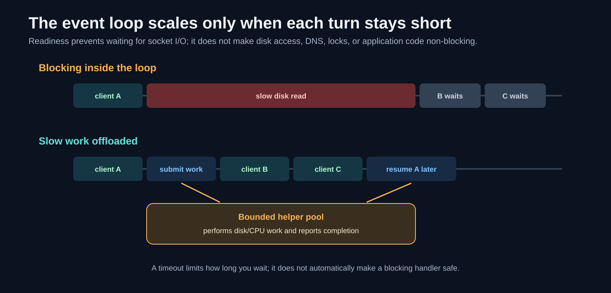

## 5. Reading the lecture's `fork()` echo server

The simplified server follows this lifecycle:

```c
int server_fd = socket(AF_INET, SOCK_STREAM, 0);
/* fill address, bind, and listen */

for (;;) {
    int client_fd = accept(server_fd, NULL, NULL);

    if (fork() == 0) {
        /* child: echo this client's bytes */
        close(server_fd);
        /* read/write loop */
        close(client_fd);
        _exit(0);
    }

    /* parent: child owns the conversation */
    close(client_fd);
}
```

Small but important details omitted by a teaching slide include:

- check every call for errors;
- the child should close its listening-FD copy;
- the parent must reap exited children, or they become **zombie processes**;
- `read()` and `write()` can be interrupted;
- `write()` can be short or fail if the peer closes;
- `listen(server_fd, 1)` requests only a very small pending-connection capacity;
- `_exit()` is generally used after `fork()` in low-level code when avoiding duplicated buffered user-space cleanup matters.

The kernel continues accepting handshakes into its queues while the parent repeatedly calls `accept()`. Forking does not transfer ownership of the listening service to one child; it creates another descriptor reference, which the child should close.

## 6. `select()` from scratch

`select()` is a C library interface to a synchronous I/O-multiplexing operation. It lets one thread wait for readiness on several descriptors.

Its conceptual signature is:

```c
int select(
    int nfds,
    fd_set *readfds,
    fd_set *writefds,
    fd_set *exceptfds,
    struct timeval *timeout
);
```

### 6.1 The three descriptor sets

- `readfds`: descriptors for which reading-related progress is wanted. A listening socket becomes readable when an accept can proceed.
- `writefds`: descriptors for which writing-related progress is wanted. Register a client here when the application has buffered output to send.
- `exceptfds`: exceptional conditions such as out-of-band/urgent data on platforms that support it. It is **not** a general “connected and closed sockets” list.

Passing `NULL` for a set means the application is not monitoring that category.

### 6.2 The timeout

The last parameter controls how long this call waits:

- `NULL`: wait indefinitely until readiness, a signal, or an error;
- zero-valued `timeval`: return immediately, which polls without waiting;
- positive `timeval`: wait up to that duration.

The timeout belongs to this `select()` call. There is not automatically a separate default timeout for each descriptor or set. If the application needs per-connection idle deadlines, it stores those deadlines itself and chooses the next wait duration accordingly.

After `select()` returns:

- positive return value: number of ready bits across the returned sets;
- `0`: timeout expired;
- `-1`: error, with `errno` explaining it.

### 6.3 `fd_set` and its macros

An `fd_set` is commonly implemented as a bitmap. The macros operate on it:

```c
FD_ZERO(&readfds);          /* clear all bits */
FD_SET(server_fd, &readfds);/* request interest */
FD_ISSET(fd, &readfds);     /* test returned readiness */
FD_CLR(fd, &readfds);       /* remove one bit */
```

`nfds` is the highest-numbered descriptor in any set, plus one. It is not the number of clients.

The sets are **value-result parameters**: the application supplies its interests, and `select()` modifies the sets to leave only the ready entries. That is why the lecture rebuilds `readfds` on every loop.

### 6.4 The complete loop

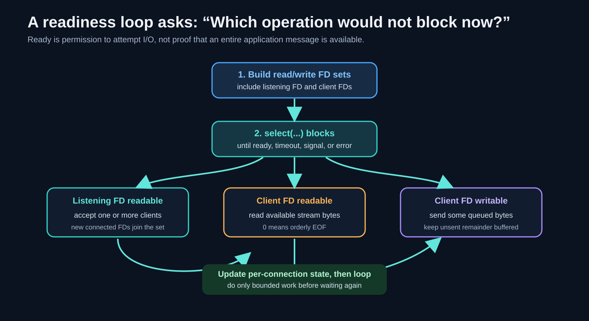

The lecture's loop does four jobs:

1. rebuild a set containing the listening FD and every client FD;
2. call `select()` and sleep until at least one is ready;
3. if the listening FD is ready, call `accept()` and remember the new connected FD;
4. for each readable client, consume available bytes or close/remove it on EOF/error.

This line removes a client from an unordered array in constant time:

```c
clients[i] = clients[--nclients];
i--;
```

Step by step:

1. decrement `nclients`, making the old last index the new end;
2. copy that old last entry into the removed slot `i`;
3. decrement `i` so the loop examines the moved entry next.

It is O(1) because it does not shift every later item. The tradeoff is that client order is not preserved.

### 6.5 Problems deliberately hidden by the small example

The sample teaches the control flow, not a production server. A robust version must address:

- **array capacity:** reject or shed a connection before writing beyond `clients[]`;
- **descriptor range:** on Linux/glibc, `FD_SET()` cannot safely represent FD numbers at or above 1024;
- **non-blocking mode:** readiness can race with another consumer or cover less data/space than expected;
- **partial writes:** buffer the unsent suffix and monitor writability only while output remains;
- **slow handlers:** never perform unbounded CPU, disk, DNS, or upstream work in the loop;
- **error handling:** distinguish EOF, retryable `EAGAIN`, signal interruption, and fatal errors;
- **fairness:** cap work per connection so one busy client cannot monopolize the loop;
- **timeouts:** store connection-specific deadlines and close or cancel expired work;
- **protocol state:** preserve partial headers, bodies, and frames between reads.

One particularly useful lesson is that `select(..., NULL)` for the timeout does not itself make a client wedge the loop. The wait wakes when any monitored FD is ready. The loop wedges when code called **after readiness** performs a blocking or unbounded operation, or when the program has no policy for connections that remain idle forever and slowly exhaust resources.

## 7. Why `select()` reaches a scaling ceiling

Two different costs matter.

### 7.1 Representable descriptor numbers

On Linux with glibc, `fd_set` has `FD_SETSIZE` equal to 1024, so descriptor numbers 1024 and above cannot be safely placed in the set. This is a property of that interface and library representation, not a universal law saying every process may open only 1024 files.

The process's actual open-file limit is a separate resource limit, often inspected with:

```sh
ulimit -n
```

Its value is platform, distribution, service-manager, container, and configuration dependent. Never infer it from `FD_SETSIZE`; inspect both constraints relevant to the deployment.

### 7.2 Work proportional to the watched range

On every iteration the application reconstructs sets, transfers them across the user/kernel boundary, and scans returned bits. The kernel checks descriptors up to `nfds - 1`, and user code often scans the client list again.

If 10,000 connections are watched but only 3 are active, doing bookkeeping proportional to all 10,000 on each wait is unattractive. This motivated interfaces that keep the interest set inside the kernel and return event records for ready descriptors.

## 8. `epoll`: retain interest, return events

`epoll` is Linux's scalable readiness-notification facility. Its basic lifecycle is:

```c
int epfd = epoll_create1(EPOLL_CLOEXEC);

/* add or update interests */
epoll_ctl(epfd, EPOLL_CTL_ADD, client_fd, &event);

for (;;) {
    int n = epoll_wait(epfd, events, MAX_EVENTS, timeout_ms);
    for (int i = 0; i < n; i++) {
        /* handle events[i] for one ready FD */
    }
}
```

Three operations divide the work:

- `epoll_create1()` creates an epoll instance and returns its FD;
- `epoll_ctl()` adds, changes, or removes a watched FD from the **interest set**;
- `epoll_wait()` waits and copies a batch of ready event records into user memory.

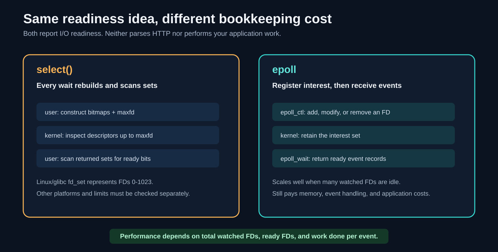

“`epoll` is O(ready)” is useful shorthand, not a complete complexity proof. It means the application receives a ready-event list instead of scanning every watched FD after each wait. Costs still include registrations, kernel bookkeeping, wakeups, ready-list processing, memory, cache effects, and whatever work the application performs.

Idle connections are therefore cheap **to wait on**, not free. Each still owns an FD, socket structures, TCP state, buffers, timers, application metadata, and possibly TLS state.

### 8.1 Level-triggered and edge-triggered modes

- **Level-triggered** readiness keeps reporting an FD while the condition remains true. It is usually easier to learn and is the default.
- **Edge-triggered** readiness reports transitions into readiness. Code must normally use non-blocking I/O and drain reads/writes until `EAGAIN`; otherwise it may wait forever for an edge that already occurred.

Edge-triggering can reduce repeated notifications in some workloads, but it is not automatically faster, and mistakes are harder to debug. Choose it only when its behavior is understood and measured.

### 8.2 Similar facilities on other platforms

- `kqueue`: BSD systems and macOS;
- IOCP: Windows completion-based I/O;
- `poll()`: portable readiness API without `fd_set`'s fixed bitmap representation, though it still scans an array;
- `io_uring`: modern Linux interface for submitting and completing batches of asynchronous operations.

These do not have identical semantics. “Same family of problem” is safer than “same API with another name.” In particular, IOCP and `io_uring` often emphasize operation **completion**, while `select`, `poll`, `epoll`, and `kqueue` are commonly taught through **readiness**.

## 9. Production architecture: combine isolation and multiplexing

Large servers rarely follow one classroom model in a pure form. A common design is:

1. start a small number of worker processes, often chosen with CPU topology and workload in mind;
2. run a readiness loop inside each worker;
3. let each loop manage many sockets;
4. offload blocking disk or CPU-heavy jobs to bounded helper threads/processes;
5. restart a failed worker without discarding the whole service.

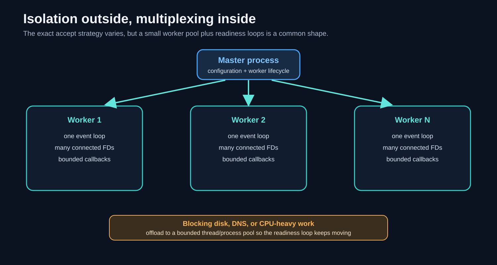

### 9.1 How new connections reach workers

Several strategies exist:

- one process accepts and passes connected sockets to workers;
- workers inherit a shared listening socket and coordinate acceptance;
- each worker gets its own listening socket on the same address using `SO_REUSEPORT`, and the kernel distributes flows among those sockets.

`SO_REUSEPORT` is not the same as `SO_REUSEADDR`.

- `SO_REUSEADDR` is commonly used before `bind()` to support legitimate address reuse patterns such as quick server restart, with platform-specific rules.
- `SO_REUSEPORT` allows multiple compatible sockets to bind the same endpoint under operating-system-defined conditions and can distribute incoming connections.

Both are socket options set with `setsockopt()` before `bind()`. Exact security, UID, balancing, and platform semantics must be checked for the target OS.

### 9.2 Go's apparent blocking style

Go code can launch one goroutine per connection and write code that looks blocking. This is not necessarily one operating-system thread per goroutine.

The runtime can:

1. put network FDs in non-blocking mode;
2. register them with its network poller (`epoll` on Linux, platform equivalents elsewhere);
3. park a goroutine when its I/O cannot proceed;
4. run other goroutines on a smaller set of OS threads;
5. make the parked goroutine runnable when readiness arrives.

This preserves a simple sequential programming style while using readiness underneath. Goroutines are still not free: each has stack and runtime metadata, and application state and buffers remain.

## 10. Timeouts, deadlines, retries, and backoff

Without limits, slow or dead peers can occupy resources indefinitely.

### 10.1 Timeout versus deadline

- **Timeout:** a duration, such as “wait no more than 2 seconds from now.”
- **Deadline:** an absolute time, such as “this whole request must finish by 12:00:02.”

Deadlines compose better across multiple stages. If DNS uses 200 ms and connection setup uses 300 ms from a 2-second end-to-end budget, the application should pass only the remaining 1.5 seconds to later work.

Useful server limits include:

- accept/backlog policies;
- TLS handshake timeout;
- request-header timeout;
- body read timeout or minimum progress rate;
- upstream connect/read/write timeout;
- response write timeout;
- keep-alive idle timeout;
- total request deadline.

### 10.2 Retry is not the same as timeout

A timeout answers, “When do I stop waiting for this attempt?” A retry answers, “Should I start another attempt?”

Retries can amplify overload. They should normally be:

- limited in count;
- restricted to errors likely to be transient;
- safe for the operation's semantics, using idempotency where needed;
- bounded by an overall deadline;
- delayed with **backoff** and often **jitter** to avoid synchronized retry storms.

Servers also need **cancellation**: when the client goes away or the deadline expires, downstream work should be stopped when possible instead of continuing uselessly.

## 11. CGI prerequisites: standard streams, pipes, environment, fork, and exec

The **Common Gateway Interface (CGI)** is a convention between a web server and an external program. It answers:

> How can a server that understands HTTP run arbitrary application code without embedding that code into the server?

Before following the request path, recall five operating-system concepts.

### 11.1 Standard file descriptors

New Unix processes conventionally begin with:

| FD | Name | Normal direction from the program's view |
| --- | --- | --- |
| `0` | standard input (`stdin`) | program reads bytes |
| `1` | standard output (`stdout`) | program writes normal output |
| `2` | standard error (`stderr`) | program writes diagnostic output |

These are ordinary descriptor numbers. They can point to a terminal, file, pipe, or socket.

### 11.2 Pipe

A **pipe** is a kernel-managed byte stream with a read end and a write end. If the web server keeps one end and gives the other end to a child process, they can exchange bytes without the child knowing the server's internal data structures.

### 11.3 Environment variables

An environment is a set of name-value strings supplied to a new program, such as:

```text
REQUEST_METHOD=POST
QUERY_STRING=name=alice
CONTENT_LENGTH=17
HTTP_USER_AGENT=curl/8.x
```

CGI uses the environment for request metadata. The request body travels through `stdin`.

### 11.4 `fork()` and `exec()` perform different jobs

- `fork()` creates a child process based on the current process.
- an `exec`-family call replaces the current process image with another program while preserving selected process properties and open FDs.

The child is not a second web server after `exec()`. It becomes the CGI application.

### 11.5 Descriptor redirection

The server creates pipes, then arranges the child's descriptor table so:

- FD 0 refers to the request-body pipe;
- FD 1 refers to the response pipe;
- FD 2 refers to the error-log pipe.

Low-level code commonly uses `dup2()` for this reassignment before `exec()`.

## 12. One CGI request, step by step

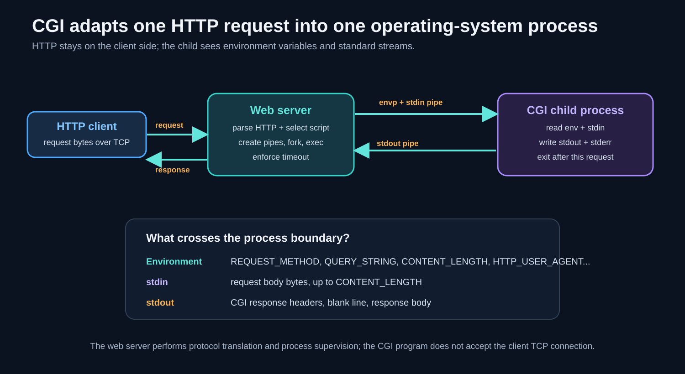

1. The client establishes TCP, optionally TLS, and sends an HTTP request.
2. The web server reads raw bytes and its HTTP parser identifies method, target, headers, and body framing.
3. Routing decides that a CGI program should handle the request.
4. The server creates pipes for the child's standard input, output, and error.
5. It calls `fork()` or an equivalent process-creation mechanism.
6. In the child path, it maps pipe ends onto FDs 0, 1, and 2.
7. It constructs CGI environment variables from HTTP/request/server metadata.
8. It calls `exec()` to run the target program.
9. The server writes the HTTP request body into the child's `stdin` pipe.
10. The CGI program reads environment variables and, when applicable, the body from `stdin`.
11. The CGI program writes response metadata, a blank line, and body bytes to `stdout`.
12. It writes diagnostics to `stderr`, which the server sends to its error log rather than to the client page.
13. The server parses the CGI output, creates the HTTP response, and writes it to the client connection.
14. The CGI program exits; the server closes pipes and reaps the child.

The CGI program does not call `accept()` on the public listening socket and does not usually parse the client's HTTP bytes itself. The web server is an **adapter** between two protocols/interfaces:

```text
client-facing HTTP/TCP  <->  CGI environment + standard streams
```

## 13. How HTTP becomes CGI variables

CGI maps parts of the request into conventional names:

| HTTP/request concept | CGI representation |
| --- | --- |
| method | `REQUEST_METHOD=GET` or `POST` |
| target query after `?` | `QUERY_STRING=...` |
| request body size | `CONTENT_LENGTH=...` |
| body media type | `CONTENT_TYPE=...` |
| protocol version | `SERVER_PROTOCOL=HTTP/1.1` |
| `User-Agent` header | `HTTP_USER_AGENT=...` |
| `X-Trace-Id` header | commonly `HTTP_X_TRACE_ID=...` |

The simplified header rule is: uppercase the field name, replace hyphens with underscores, and add `HTTP_`. `Content-Type` and `Content-Length` have special CGI variables rather than the ordinary `HTTP_` form.

This is protocol translation, not mere renaming. A secure server must decide which metadata is trusted. For example, a client-supplied forwarding header must not automatically be treated as the authenticated source address unless a trusted proxy policy establishes that meaning.

## 14. CGI response framing

A CGI response commonly begins like this:

```text
Content-Type: text/html

<html>...</html>
```

The blank line separates the CGI response headers from its body. The server reads/parses those headers, determines an HTTP status and response headers, then sends the body to the client using the correct HTTP framing.

The CGI output is not always a byte-for-byte complete HTTP response. The web server may add or normalize status, `Date`, connection behavior, transfer framing, compression, and other HTTP details.

`stdout` and `stderr` must remain distinct. If debug text is mixed into `stdout`, it can corrupt response headers or body. Keeping error data on FD 2 allows the web server to log it separately.

## 15. Why CGI is expensive, and why embedding has risks

Traditional CGI normally creates and executes a fresh program for each request. That puts several costs on the critical path:

- process creation;
- program loading and dynamic linking;
- language-runtime startup;
- application/module initialization;
- configuration parsing;
- database connection setup unless separately pooled;
- process teardown and reaping.

The actual memory cost is subtler than “copy the whole program”: copy-on-write can share pages after `fork()`, and executable pages may be shared. The repeated lifecycle and initialization are still expensive at high request rates.

One historical alternative loaded application modules directly into the web server process, such as `mod_php` or `mod_perl`. This removes per-request process creation and can be fast, but it couples failure, memory use, security, lifecycle, and runtime compatibility to the server process.

FastCGI takes a middle path: separate long-lived application processes communicate with the web server through a socket.

## 16. FastCGI: persistent application workers

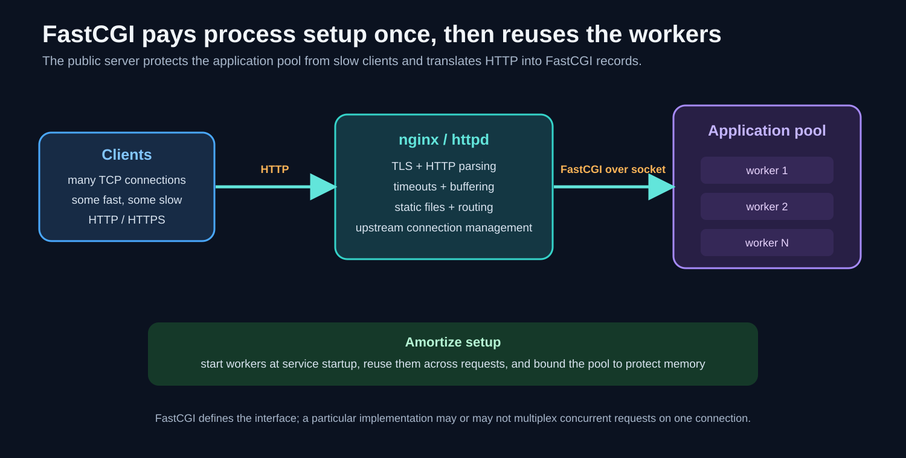

With FastCGI:

1. a manager starts a fixed or bounded pool of application workers;
2. the web server accepts public clients, handles TLS, parses HTTP, applies timeouts, and buffers slow I/O;
3. for a dynamic route, it connects or reuses a Unix-domain or TCP socket to the application service;
4. it translates request metadata/body into typed FastCGI records;
5. a worker processes the request and returns output/error/end records;
6. the worker remains alive for another request.

The important optimization is **amortization**: pay application startup once and spread that cost across many requests.

The public server and application pool can also have different concurrency policies. The public tier may hold thousands of slow client connections with event loops while allowing only a bounded number of expensive application requests to run simultaneously.

This protects memory and downstream services, provided waiting queues are also bounded.

## 17. FastCGI records and framing

FastCGI carries typed records over its transport connection. A record header identifies:

- protocol version;
- record type;
- request ID;
- content length;
- padding length.

The **request ID** lets records be associated with a logical request. The original specification permits implementations that multiplex several requests over one FastCGI connection, but support is negotiated/implementation-dependent. Do not assume every FastCGI deployment does so.

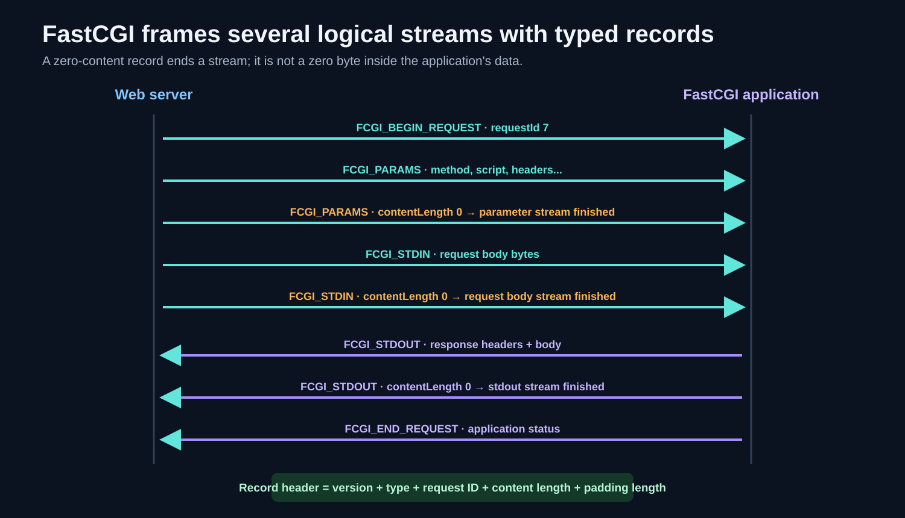

### 17.1 Request direction

A typical Responder flow includes:

1. `FCGI_BEGIN_REQUEST`: starts a logical request and names its role.
2. One or more `FCGI_PARAMS` records: name-value pairs such as `REQUEST_METHOD`, `SCRIPT_FILENAME`, `QUERY_STRING`, and `CONTENT_LENGTH`.
3. An empty `FCGI_PARAMS` record: ends the parameter stream.
4. Zero or more non-empty `FCGI_STDIN` records: request-body bytes.
5. An empty `FCGI_STDIN` record: ends the body stream.

The declared CGI `CONTENT_LENGTH` and a FastCGI record's `contentLength` are different levels:

- `CONTENT_LENGTH` describes the HTTP/CGI request body as a whole;
- each FastCGI record header describes only that record's content bytes.

The body may be divided across several `FCGI_STDIN` records, but their total should agree with the request body length under normal completion.

### 17.2 Response direction

The application sends:

- `FCGI_STDOUT` records for CGI-style response headers and body;
- optional `FCGI_STDERR` records for diagnostic output;
- a zero-length `FCGI_STDOUT` record to end that stream;
- `FCGI_END_REQUEST` with application and protocol status.

Because streams are typed, error output cannot accidentally become page content unless software incorrectly combines the streams.

### 17.3 Length and end markers

FastCGI uses both:

- **length framing:** every record says how many content bytes follow;
- **structural end marker:** a record of a particular stream type with content length zero marks that logical stream's end.

The empty record is not a delimiter byte pattern that can collide with content. It is an ordinary record whose header declares zero content.

Session 2 emphasized lengths and delimiters as common framing tools. A fuller view adds fixed-size units, connection close, self-describing grammars, and external boundaries, but those ultimately rely on known size, a recognizable terminator, or context that tells the parser when the unit is complete.

## 18. CGI, FastCGI, and servlets compared

| Property | CGI | FastCGI | Servlet-style server |
| --- | --- | --- | --- |
| Application lifetime | usually one process per request | long-lived external worker pool | long-lived classes/objects inside JVM server |
| Boundary | environment + pipes | typed records over Unix/TCP socket | method calls and in-process objects |
| Isolation from public server | process boundary per request | persistent process boundary | usually same JVM process as container |
| Startup cost | paid on every request | paid at worker startup | paid at server/application startup |
| Typical concurrency | many short-lived processes | bounded worker pool | bounded thread/executor pools plus async facilities |
| Failure impact | often localized to one request process | may kill one reusable worker | can affect a larger JVM/container |

A **servlet container** such as Tomcat or Jetty is itself a long-lived server/runtime. It parses requests and calls application code using in-process APIs. Pre-created threads are reused instead of constructing an operating-system process per request.

Modern frameworks differ in details, but they repeatedly use the same optimization:

> Move setup outside the request path, reuse initialized workers, and bound the scarce work.

Long-lived workers create new responsibilities: memory leaks accumulate, stale configuration remains loaded, unhealthy workers must be restarted, and deployments must drain in-flight requests safely.

## 19. “Web server” is a protocol statement, not a synonym for server

A **server** is any program that offers a service to clients. A **web server** speaks HTTP on its client-facing interface.

Examples that often speak HTTP directly or through a companion component:

- router administration interfaces;
- many Node applications and cloud APIs;
- CouchDB's HTTP API;
- Kafka when accessed through an HTTP/REST proxy.

Examples with native non-HTTP protocols:

- Redis uses RESP;
- MySQL uses its binary client/server protocol;
- MQTT brokers use MQTT;
- Kafka brokers use Kafka's binary protocol.

All still use bytes, sockets, FDs, queues, and concurrency. But protocol properties change the scaling design:

- request/response versus streaming;
- short-lived versus persistent sessions;
- independent requests versus ordered connection state;
- small commands versus large transfers;
- server push/subscriptions;
- flow-control and acknowledgement rules;
- whether reconnecting loses session state.

Do not copy an HTTP optimization into a database or message broker without checking these properties.

## 20. HTTP statelessness and application state

HTTP is described as a **stateless protocol** because the meaning of a request does not require the server to remember a mandatory protocol session created by earlier requests. Each message identifies its method, target, headers, and body framing.

This does **not** mean every real HTTP application is stateless.

Applications commonly use:

- cookies and login sessions;
- shopping carts;
- per-user rate limits;
- caches;
- uploaded data;
- database records;
- WebSocket or streaming connections;
- in-memory locks and jobs.

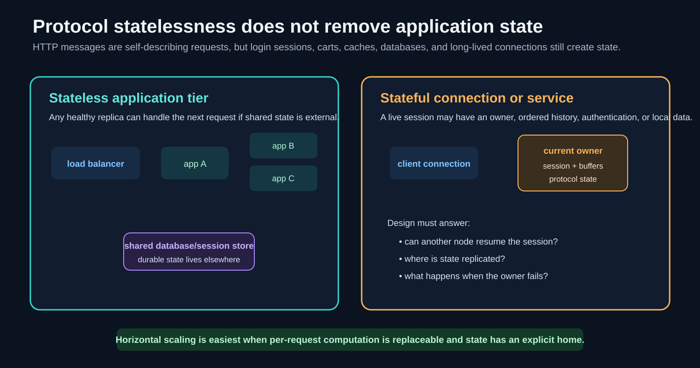

An application tier is easy to replicate when any healthy instance can process a request using explicit shared/durable state. A load balancer can send later requests to another replica.

If essential session state exists only in one process, the system needs one or more of:

- **sticky sessions:** route a client repeatedly to the same instance;
- shared session storage;
- replication;
- reconnection/resumption logic;
- ownership transfer;
- a protocol-specific failure policy.

Horizontal scaling is therefore not free. Stateless request handling removes one major constraint, but databases, caches, coordination, deployment, observability, and load balancing still need design.

Persistent database connections are commonly pooled because repeated TCP, TLS, authentication, and session setup is expensive. A pool also protects the database by bounding the number of concurrent connections. Too many application replicas each with large pools can overwhelm the database even if every application node is healthy.

## 21. The four resource walls

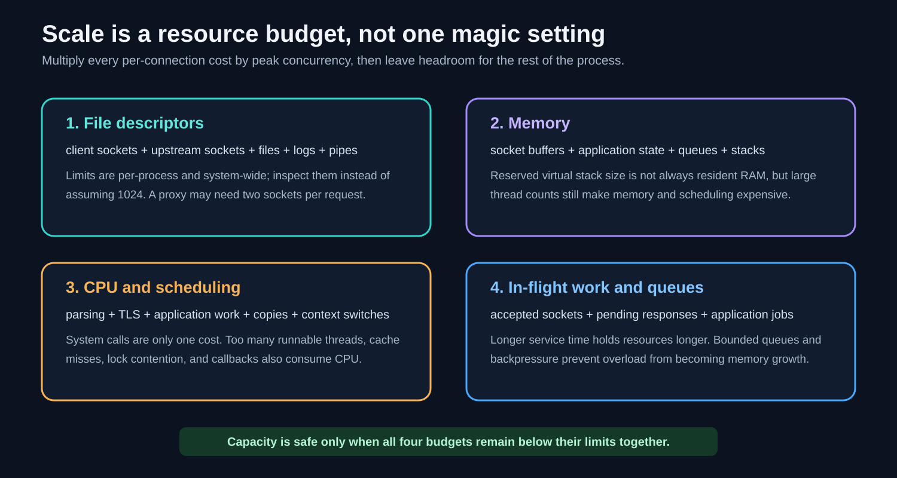

### 21.1 File descriptors

Every accepted client socket consumes a descriptor. So may each upstream connection, file, log, pipe, DNS mechanism, and readiness instance.

There are several distinct limits:

- process soft limit;
- process hard limit;
- system-wide open-file capacity;
- application configuration such as nginx `worker_connections`;
- readiness-interface limits such as Linux/glibc `FD_SETSIZE` for `select()`.

Raising only one limit may reveal the next. Capacity planning should count all descriptor types and leave operational headroom.

### 21.2 Memory

Per-connection memory can include:

- kernel socket structures;
- TCP send and receive buffers;
- TLS state and buffers;
- HTTP parser state;
- pending request/response bodies;
- application/session metadata;
- timers and event registrations;
- thread/goroutine/coroutine stack and runtime metadata.

A nominal thread stack size such as 8 MiB is often virtual address-space reservation and may grow/commit on demand depending on platform. It should not be treated as “8 MiB of physical RAM immediately copied for every thread.” Nevertheless, large thread counts increase address-space pressure, resident memory as stacks are used, scheduler load, and debugging complexity.

Go goroutine stacks start small and can grow, which makes one-goroutine-per-connection practical for far more connections than one-OS-thread-per-connection. The connection's other buffers and state still dominate at scale.

### 21.3 CPU, system calls, and context switches

`read()`, `write()`, `accept()`, `epoll_wait()`, and `sendfile()` request kernel work. A system call crosses a protection boundary, validates arguments, performs work, and returns. Exact hardware costs vary by CPU, kernel, mitigations, cache state, and operation.

Do not reduce all performance to “system calls are slow.” Servers may spend more CPU on:

- TLS cryptography;
- parsing and serialization;
- compression;
- application code;
- memory allocation and copying;
- lock contention;
- cache misses;
- waking and scheduling many threads.

Useful optimizations either reduce work, batch work, avoid unnecessary copies/transitions, or perform the work in a better place.

### 21.4 Queued and in-flight work

Requests waiting in a queue still consume memory and time. If arrival rate remains above service capacity, a queue grows until:

- latency becomes unacceptable;
- a deadline expires;
- memory is exhausted;
- a queue limit rejects work;
- the whole system becomes unstable.

**Backpressure** is how a downstream limit becomes visible upstream. It may mean pausing reads, limiting concurrency, returning an overload response, refusing new connections, or asking producers to retry later.

Bounded queues turn unlimited memory growth into an explicit overload decision.

## 22. C10K and descriptor limits without mythology

**C10K** names the engineering challenge, popularized around 1999, of handling roughly 10,000 simultaneous client connections on one machine. It drove interest in non-blocking I/O, scalable event notification, efficient kernels, and better server architectures.

The `K` means one thousand, so C10K means 10,000 connections. It does not derive from `FD_SETSIZE`, and C10K is not a claim that 10,000 is a current universal ceiling.

The lecture also mentions C10M and demonstrations of millions of connections. Such results depend on:

- connection activity pattern;
- memory per connection;
- number of NIC queues and CPU cores;
- kernel/network-stack tuning or bypass;
- packet rate and bandwidth;
- TLS/application work;
- client generator capacity;
- acceptable latency and failure behavior.

A server that holds two million idle TCP connections is not necessarily capable of serving two million active requests per second. **Connection capacity, request throughput, bandwidth, and useful application work are different measurements.**

## 23. Reducing crossings and copies

### 23.1 `read()` plus `write()`

A conventional static-file server can:

1. call `read(file_fd, buffer, n)` to copy file bytes into user memory;
2. call `write(socket_fd, buffer, n)` to copy them toward the kernel's socket path.

The application can inspect or transform the bytes, but this introduces user-space buffer handling and at least two calls.

### 23.2 `sendfile()`

`sendfile(out_socket, in_file, ...)` asks the kernel to transfer file data toward a socket without bouncing the payload through an application buffer.

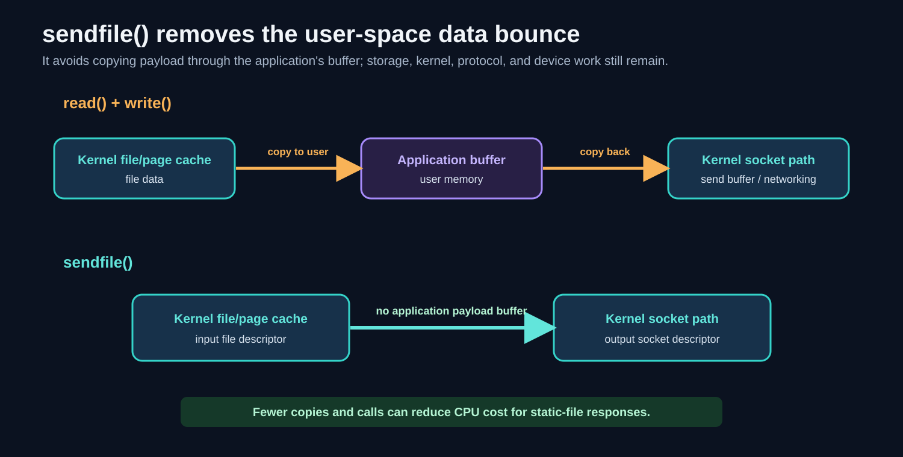

“Zero copy” is contextual shorthand. It normally means avoiding particular CPU copies between kernel and user buffers, not that no component anywhere copies, DMA-transfers, buffers, encrypts, or packets the data.

TLS, compression, file-system behavior, cache misses, and platform support can change the path. Correctness also requires handling partial progress and errors.

### 23.3 `io_uring`

Linux `io_uring` uses shared submission and completion rings. Applications can submit batches of operations and receive completions with fewer transitions in favorable workloads. It is broader than socket readiness and can cover file, network, timeout, and other operations.

It is not “epoll but newer” in every respect. It changes the programming model toward submitted operations and later completions, and its security, kernel-version, feature-support, and complexity tradeoffs must be evaluated.

### 23.4 Kernel bypass

Frameworks such as DPDK and user-space network stacks can move packet processing out of the normal kernel networking path. They may reduce interrupts, copies, scheduling, or generalized-kernel overhead in tightly controlled workloads.

The price can include dedicating CPU cores/NIC queues, rebuilding TCP/IP functionality, different security boundaries, and losing compatibility with ordinary tools such as host firewalls, packet capture paths, socket APIs, and kernel observability. Kernel bypass is a specialized architectural choice, not the default answer to an unmeasured bottleneck.

## 24. Little's Law: throughput, latency, and concurrency

The lecture's equation is a form of **Little's Law**:

\[
L = \lambda W
\]

where:

- \(L\) = average number of items in the chosen system boundary;
- \(\lambda\) = long-run average arrival/completion rate, in items per unit time;
- \(W\) = average time each item spends inside that boundary.

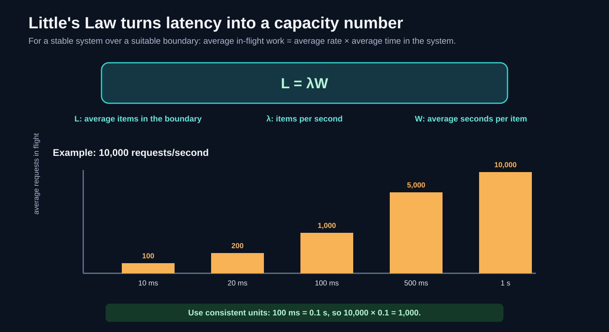

### 24.1 Unit-safe example

Assume a stable service completes 10,000 requests/second and the average request spends 100 ms within the measured boundary.

First convert milliseconds to seconds:

\[
100\text{ ms} = 0.1\text{ s}
\]

Then:

\[
L = 10{,}000\ \frac{\text{requests}}{\text{s}} \times 0.1\ \frac{\text{s}}{\text{request}} = 1{,}000\ \text{requests}
\]

If average time rises to 1 second at the same throughput:

\[
L = 10{,}000 \times 1 = 10{,}000
\]

Ten times the average time means ten times the average in-flight work if throughput remains 10,000 requests/second.

### 24.2 Requests in flight are not always TCP connections

Be precise about the system boundary and unit:

- HTTP/1.1 often has at most one active request at a time per connection unless pipelining is used;
- HTTP/2 and HTTP/3 can carry multiple concurrent request streams on one connection;
- an idle keep-alive connection is a connection but not an in-flight request;
- one request may fan out to several upstream operations;
- a queue may contain requests that have no dedicated upstream connection yet.

Therefore Little's Law predicts average items in the boundary you defined. It does not automatically say `ss -s` must equal a request-level prediction.

### 24.3 Conditions and percentiles

Little's Law is an average relationship for a stable system over a representative interval. It uses average time, not p50 latency alone. A latency distribution with a long tail can have an average much larger than its median.

When load exceeds sustainable capacity, the system is not in steady state: the queue grows. In that interval, a simple steady-state calculation may describe observed averages poorly.

### 24.4 Why “slowness is a memory problem” is useful

Longer waits keep request state, buffers, timers, and sometimes downstream resources alive for longer. Moving truly delay-tolerant work to an asynchronous job queue can shorten the synchronous request path.

But the work has not disappeared. The job queue must be bounded, durable if required, observable, retry-safe, and provisioned. Asynchrony changes where waiting happens and what the client is promised.

## 25. Apache's progression: prefork, worker, event

Apache HTTP Server's **Multi-Processing Modules (MPMs)** choose how network connections are associated with processes and threads.

### 25.1 Prefork MPM

- several worker processes created in advance;
- traditionally one active connection per process;
- strong compatibility with non-thread-safe modules;
- high process cost per active connection.

Pre-forking is better than forking on every request because setup is paid at startup, but the number of simultaneous connections remains tied closely to the process pool.

### 25.2 Worker MPM

- multiple processes;
- each process contains multiple worker threads;
- more concurrent connections per process;
- modules/application code must be thread-safe.

In a simplistic keep-alive design, an idle connection can occupy a worker thread while waiting for the next request.

### 25.3 Event MPM

Event MPM separates some connection waiting from request processing. Event/listener logic can manage sockets that are idle in keep-alive state and assign worker threads when application work is available.

This does not mean every Apache action is one universal epoll loop or that no thread ever waits. The exact implementation is platform- and version-dependent. The architectural point is stable: do not dedicate scarce request workers to idle connections when a readiness facility can watch them.

## 26. HAProxy, Varnish, and nginx

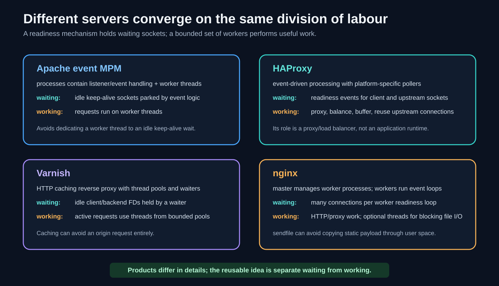

### 26.1 HAProxy

HAProxy is a TCP/HTTP proxy and load balancer. It accepts client-side connections, chooses upstream targets, and moves data between both sides. Its event-driven architecture is a natural fit because each proxied flow may involve readiness on two sockets.

It can also manage upstream connection reuse/pooling, reducing repeated connection and session setup. This must be balanced with backend limits, fairness, failure detection, and protocol semantics.

The historical timeline explains why software may contain several poller backends. Portable products support `select`, `poll`, `epoll`, `kqueue`, or other facilities depending on the operating system.

### 26.2 Varnish

Varnish is an HTTP caching reverse proxy. A **forward proxy** acts on behalf of clients going outward; a **reverse proxy** acts on behalf of origin services and receives inbound requests.

A cache hit can return a stored representation without contacting the origin. This changes scaling more dramatically than making the origin handler slightly faster because it removes origin work from that request path.

Varnish combines worker threads for active tasks with platform-specific waiters for idle connections. Again: threads for bounded work, readiness for waiting.

### 26.3 nginx

nginx commonly uses a master process to manage worker processes. Workers use event-driven connection processing, with the best method chosen/configured for the platform (`epoll` on Linux where available, `kqueue` on relevant BSD/macOS systems, and others).

nginx is both a web server and a reverse proxy. It is used for static files, TLS termination, proxying, caching, load balancing, and rate limiting.

For static files, `sendfile()` can avoid copying payload through an application buffer. Blocking file I/O or other slow tasks can still stall an event worker, so appropriate asynchronous I/O, caching, or thread-pool offload may be used.

It is inaccurate to call nginx “the first reverse proxy.” Reverse proxies existed before nginx. Its significance is the successful event-driven design and broad adoption at web edges.

## 27. The unifying production pattern

The product details differ, but the recurring split is:

| Job | Suitable mechanism |
| --- | --- |
| hold many idle sockets | readiness/event mechanism |
| accept and move bytes | non-blocking event-loop handlers |
| CPU-heavy application work | bounded worker threads/processes |
| blocking or unpredictable I/O | async API or bounded offload pool |
| isolate faults/configuration | multiple processes/containers |
| avoid repeated setup | pre-created workers and connection pools |
| protect downstream capacity | concurrency limits, bounded queues, backpressure |

An event loop is not a replacement for processes, threads, or queues. It is a good mechanism for multiplexing readiness among many FDs. Production systems compose mechanisms based on the type of work.

## 28. One complete dynamic request path

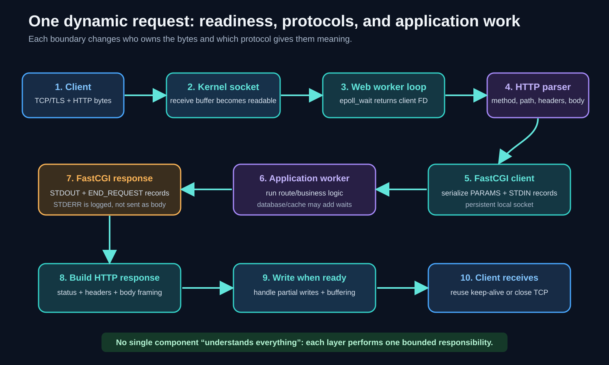

Follow one request all the way through:

### 28.1 Client and TCP setup

1. A user runs `curl https://example.test/profile`.
2. DNS resolves the host to an IP address.
3. The client creates a socket; the kernel selects a local address and ephemeral port.
4. TCP performs its handshake with the server.
5. For HTTPS, TLS authenticates the server and establishes encrypted record keys.
6. The client serializes an HTTP request and writes those bytes to its connection.

### 28.2 Kernel readiness and the web-server worker

7. Packets arrive, TCP validates/orders them, and payload bytes enter the server socket's receive buffer.
8. The listening or connected FD becomes readable. `epoll_wait()` returns an event to one worker.
9. The worker calls non-blocking `accept()` for pending connections and/or `read()` for a connected client.
10. TLS code decrypts records if HTTPS is used.
11. The HTTP parser accumulates bytes until it has complete headers and enough body according to HTTP framing.
12. Routing decides whether the request maps to a static file, cache, proxy upstream, or FastCGI application.

Readiness does not understand HTTP. `epoll` reports that an FD can make I/O progress; the TLS and HTTP libraries give the bytes protocol meaning in user space.

### 28.3 FastCGI application work

13. For a dynamic FastCGI route, the server selects/reuses an internal connection to the application pool.
14. It serializes method, path/script, query, headers, and body as `FCGI_BEGIN_REQUEST`, `FCGI_PARAMS`, and `FCGI_STDIN` records.
15. The FastCGI worker parses those records into request values.
16. Application code runs. It may access a cache or database; those waits need their own deadlines and concurrency limits.
17. The worker creates CGI-style response headers/body and sends `FCGI_STDOUT`, optional `FCGI_STDERR`, and `FCGI_END_REQUEST`.
18. The worker stays alive for later requests.

### 28.4 Returning the HTTP response

19. The web server parses FastCGI output and constructs the client-facing HTTP response.
20. It may add headers, compress, buffer, or choose transfer framing.
21. If the client socket cannot accept all output, the server stores the remainder and registers interest in writability.
22. Later readiness events let it continue partial writes.
23. TCP reliably delivers the byte stream; TLS encrypts records on the wire for HTTPS.
24. The connection is either kept alive for another request or closed according to protocol/policy.

### 28.5 What is amortized and what remains per request

Paid once or infrequently:

- web-server and application-process startup;
- worker/thread creation;
- loaded runtime and libraries;
- readiness registration structures;
- pooled upstream connections where safe.

Still paid per request:

- protocol parsing and serialization;
- routing and application work;
- required network, cache, and database operations;
- buffers/state for the request's lifetime;
- security and authorization checks;
- queueing delay under load.

## 29. Safe hands-on exercises

The slide homework is useful, but run load experiments only on a machine/service you own and can safely exhaust. A test that opens 100,000 sockets can hit system-wide limits and disturb other programs.

### 29.1 Observe your limits before changing them

```sh
ulimit -n
```

Treat the printed value as the current shell's soft open-file limit, not a universal default. A service launched by another manager may have a different limit.

Useful observations during a local experiment include:

```sh
lsof -p <server-pid>
netstat -an
```

Linux users commonly also use `ss`; macOS uses other `netstat`/`lsof` views. Count listening sockets separately from established connections and other open resources.

### 29.2 Break a teaching `select()` server safely

Use a disposable local environment and increase connection count gradually: 10, 100, 500, then near the relevant limit. Observe:

- the highest FD number, not only the number of clients;
- process open-file limits;
- `FD_SETSIZE` constraints;
- array capacity in the program;
- memory per connection;
- whether the client generator runs out of ports or FDs first.

Do not blindly create 100,000 connections on your everyday machine. The load generator also needs resources and may be the first component to fail.

### 29.3 Observe CGI lifecycle

Run a local CGI program under a deliberately isolated web-server configuration, send requests slowly, and observe child process creation. Then compare with a persistent FastCGI-style worker.

What to measure:

- processes created per request;
- request latency when the runtime is cold versus warm;
- resident memory;
- CPU time;
- behavior when the program sleeps beyond the server timeout.

### 29.4 Capture FastCGI only in your own environment

Use a local Unix/TCP test socket and capture only data you are authorized to inspect. FastCGI parameters and bodies can contain cookies, credentials, personal data, and application secrets.

In a capture, look for record headers, types, request IDs, non-zero content lengths, and zero-content stream terminators. Binary record names do not appear as readable strings on the wire; tools or manual decoding identify numeric type fields.

### 29.5 Measure Little's Law carefully

Choose one explicit boundary, for example “from HTTP request accepted to response completed.” Measure:

- average completed requests/second over an interval;
- average time in that same boundary;
- average number of requests in that boundary.

Then compare \(L\) with \(\lambda W\). Do not substitute p50 for the mean without labeling the result as an approximation, and do not compare request count directly with total TCP connections when keep-alive/multiplexing changes the mapping.

## 30. A small-step study path

If the session feels dense, revise in this order:

1. Explain process, thread, concurrency, parallelism, and blocking without mentioning networks.
2. Revisit why an FD is a process-local reference to a kernel object.
3. Explain readable/writable readiness and why it is not message completion.
4. Trace one `select()` iteration with one listening FD and three client FDs.
5. Explain the two `select()` costs: descriptor representation and repeated scanning.
6. Explain how `epoll_ctl()` and `epoll_wait()` divide registration from waiting.
7. Explain why an event handler must not block.
8. Trace how `fork()`, pipes, `dup2()`, environment variables, and `exec()` form CGI.
9. Compare CGI with FastCGI using “startup per request” versus “reuse workers.”
10. Decode the FastCGI record sequence and its empty stream terminators.
11. List the four resource walls and give one measurement for each.
12. Apply \(L = \lambda W\) with seconds and average values.
13. Trace the complete dynamic HTTP → FastCGI → HTTP path.
14. Only then compare Apache, HAProxy, Varnish, nginx, and Go.

## 31. Comprehensive revision quiz

Try to answer aloud without looking at the solutions. A correct answer should explain **why**, not merely expand an acronym.

### Questions

#### A. Concurrency, processes, and threads

1. What is the difference between concurrency and parallelism?
2. How can one CPU core make progress on several network conversations?
3. What resources are private to a process, and what do threads in one process share?
4. Why is a thread cheaper than a process but not free?
5. What is a context switch, and why can too many runnable threads hurt throughput?
6. Distinguish waiting concurrency from working concurrency.
7. Why does a worker pool move setup cost off the request path?
8. Why is process isolation still useful in an event-driven server?

#### B. FDs, blocking, and readiness

9. What exactly is a file descriptor?
10. Why can a proxy need more than one FD per active client request?
11. What happens when a blocking `read()` has no data available?
12. What does `EAGAIN`/`EWOULDBLOCK` mean on a non-blocking socket?
13. What can “readable” mean besides “there are ordinary bytes”?
14. Why does readable not mean “one complete HTTP request is available”?
15. Why does writable not mean “the entire response reached the client”?
16. What state must an event-loop server preserve between partial reads and writes?

#### C. Fork-per-connection and the event-loop model

17. After `fork()`, how can parent and child both refer to the accepted socket?
18. Which FD copies should the parent and child close in the standard fork-per-connection design, and why?
19. What does copy-on-write change about the claim that `fork()` copies an entire process?
20. Why must a parent process reap child processes?
21. List three costs of creating a process per accepted connection.
22. Why do idle connections fit an event loop better than a thread-per-connection design?
23. What kind of operation can stall every client on one event-loop worker?
24. How does bounded offload preserve loop responsiveness?

#### D. `select()`

25. What problem does `select()` solve?
26. What do `readfds`, `writefds`, and `exceptfds` actually represent?
27. Why is `exceptfds` not a list of normally closed connections?
28. What does a `NULL` timeout mean? What does a zero timeout mean?
29. What does `nfds` contain, and why is it not the client count?
30. Why must descriptor sets normally be rebuilt before each `select()` call?
31. Explain the O(1) unordered-array deletion `clients[i] = clients[--nclients]; i--;`.
32. Name four production concerns omitted from the lecture's short `select()` server.

#### E. `select()` limits and `epoll`

33. On Linux/glibc, what is the `FD_SETSIZE` limitation?
34. Why is `FD_SETSIZE` different from a process's open-file limit?
35. Why can `select()` do substantial work when only a few of many clients are active?
36. What do `epoll_create1()`, `epoll_ctl()`, and `epoll_wait()` do?
37. Why is “epoll is O(ready)” useful but incomplete?
38. What resources does an idle epoll-watched connection still consume?
39. Compare level-triggered and edge-triggered readiness.
40. Why are `io_uring`/IOCP not simply alternate spellings of `select()`?

#### F. Timeouts and production composition

41. Distinguish a timeout from a deadline.
42. Why is one end-to-end deadline often better than unrelated stage timeouts?
43. Why can retries make overload worse?
44. What are backoff and jitter for?
45. What does cancellation prevent after a client disconnects?
46. How do worker processes and event loops complement each other?
47. Compare `SO_REUSEADDR` and `SO_REUSEPORT` at a high level.
48. How can Go present blocking-looking network code without using one OS thread per connection?

#### G. CGI

49. What problem does CGI solve?
50. What are FDs 0, 1, and 2 conventionally used for?
51. What is a pipe, and why is it useful between a web server and CGI child?
52. What different jobs do `fork()` and `exec()` perform?
53. What does `dup2()` help the child arrange before `exec()`?
54. Which request information travels through CGI environment variables, and which through `stdin`?
55. What separates CGI response headers from the response body?
56. Why must CGI diagnostics go to `stderr` rather than `stdout`?

#### H. FastCGI and application runtimes

57. What main per-request cost does FastCGI remove relative to CGI?
58. What responsibilities remain with the public web server in a FastCGI architecture?
59. What do `FCGI_PARAMS` and `FCGI_STDIN` carry?
60. What does an empty `FCGI_PARAMS` or `FCGI_STDIN` record mean?
61. Distinguish CGI `CONTENT_LENGTH` from a FastCGI record's `contentLength`.
62. Why does a FastCGI request ID exist?
63. What are `FCGI_STDOUT`, `FCGI_STDERR`, and `FCGI_END_REQUEST` for?
64. How are servlet containers another form of setup amortization?

#### I. Protocol and state

65. Why is every server not a web server?
66. Give two protocol properties that change an appropriate scaling design.
67. What does it mean to call HTTP stateless?
68. Why can an HTTP application still be stateful?
69. What must be true for any equivalent application replica to handle the next request?
70. Why can sticky sessions help, and what limitation do they introduce?
71. Why are database connection pools both an optimization and a protection mechanism?
72. Why can multiplying pool size by replica count overload a database?

#### J. Limits, Little's Law, and real servers

73. Name the four resource walls emphasized in the lecture.
74. Why is 10,000 connections not necessarily 10,000 open descriptors for a proxy?
75. Why is an 8 MiB thread stack figure not automatically 8 MiB of resident RAM per new thread?
76. What copy does `sendfile()` commonly avoid, and what work does it not eliminate?
77. State Little's Law and define each term.
78. At 10,000 requests/second and 100 ms mean time, what is average in-flight work?
79. Why might the number from Little's Law differ from the number of TCP connections?
80. What unifying design is visible in Apache event MPM, HAProxy, Varnish, nginx, and Go's network runtime?

### Solutions

#### A. Concurrency, processes, and threads

1. **Concurrency** means multiple jobs overlap in progress; **parallelism** means instructions from different jobs execute at the same instant. One core can be concurrent by interleaving jobs, while multiple cores can run them in parallel.
2. When one conversation waits for network or other I/O, the scheduler or runtime runs work for another. A readiness loop makes the waiting explicit and returns only conversations that may progress.
3. A process has its own virtual address space and process-local FD table. Threads in that process share the address space, heap, code, and open resources, but each has its own registers, stack, and execution/scheduler state.
4. A thread avoids a separate address space, but still needs a stack, registers, scheduler metadata, creation/cleanup, and synchronization for shared memory.
5. A context switch saves one execution context and restores another. Excess runnable threads add scheduling, cache disruption, and synchronization overhead, so CPU time is spent coordinating rather than completing useful work.
6. Waiting concurrency counts conversations/operations being held while they await events. Working concurrency counts handlers actively consuming scarce compute or downstream capacity. They can differ by orders of magnitude.
7. The pool creates workers once and reuses them, so process/thread initialization is not repeated while each user request waits.
8. Separate workers limit the impact of crashes, leaks, blocking bugs, and configuration reloads. An event loop improves I/O scaling inside each isolated worker.

#### B. FDs, blocking, and readiness

9. An FD is a small integer indexing one process's descriptor table. The table entry refers to a kernel-managed open resource such as a socket, pipe, or file.
10. It may hold a client connection and a separate upstream connection simultaneously, plus logs, files, pipes, and readiness resources.
11. The calling thread may sleep until data/EOF/error/interrupt becomes available, preventing that thread from doing other work meanwhile.
12. The requested operation would block now, so the non-blocking call returned control. Wait for relevant readiness and retry while correctly preserving state.
13. It can mean ordinary data is buffered, orderly EOF can be read as zero, a listening socket can accept, or an error can be observed.
14. TCP has no application message boundaries. A request can be split across reads or several requests can appear in one read; the HTTP parser decides completeness.
15. It means the kernel can presently accept some outgoing bytes. A write can be partial, and acceptance into a local buffer does not prove network delivery or peer processing.
16. It must retain input bytes not yet forming a complete frame, parser state, application state, output bytes not yet written, and relevant timeouts/cancellation state.

#### C. Fork-per-connection and the event-loop model

17. `fork()` duplicates the parent's descriptor-table entries as references to the same underlying open socket descriptions/kernel objects. The FD numbers may match in parent and child.
18. The child closes its listening-FD copy because it handles only the accepted connection. The parent closes its accepted-FD copy because the child handles that client; otherwise references remain unnecessarily open and can delay final close.
19. Parent and child initially share physical memory pages. A page is copied when one process writes to it. Process metadata and page tables still need creation, so `fork()` is not free.
20. An exited child leaves termination status for its parent. Until the parent waits/reaps it, a zombie process-table entry remains.
21. Examples: process and page-table creation, descriptor duplication/reference management, scheduling, runtime/program initialization, and teardown/reaping.
22. The event loop represents many socket waits with one/few threads, whereas the simple thread-per-connection model allocates a thread stack and scheduler context to every idle connection.
23. A blocking disk read, synchronous DNS call, long lock wait, slow upstream call, or CPU-heavy handler can stall the loop.
24. The loop submits bounded work to a limited pool and returns to polling. A completion event later resumes that connection, while the pool limit prevents uncontrolled resource use.

#### D. `select()`

25. It waits until at least one of several FDs is ready for an indicated I/O category, a timeout expires, a signal interrupts the call, or an error occurs.
26. They are interest/result sets for read-related readiness, write-related readiness, and exceptional conditions. They are not application-message queues.
27. Normal TCP close is usually observed through read readiness followed by `read()` returning zero. `exceptfds` is for exceptional conditions such as urgent data, not normal lifecycle events.
28. `NULL` means wait indefinitely for an event/signal/error. A zero `timeval` means return immediately after checking readiness.
29. It is the highest-numbered FD in any set plus one. FD numbers can be sparse, so this is unrelated to the count of clients.
30. `select()` modifies the sets to contain returned-ready entries. The program must reconstruct its interests before the next call.
31. Decrement the count, copy the old final element into the removed slot, then decrement the loop index so the moved element is examined. It is constant time but does not preserve order.
32. Any four: capacity checks, FD-range checks, non-blocking mode, partial writes, per-connection parser buffers, error handling, fairness, deadlines, signal handling, and cleanup.

#### E. `select()` limits and `epoll`

33. The glibc `fd_set` representation and macros support descriptor numbers only below 1024. Using a larger FD with the macros is unsafe.
34. `FD_SETSIZE` limits what that interface can represent. `RLIMIT_NOFILE`/`ulimit -n` limits how many FDs the process may open; its configured value can be larger or smaller for different processes/environments.
35. Sets are rebuilt and copied, the kernel checks the watched range, and user code scans returned data even when very few FDs are ready.
36. `epoll_create1()` creates an epoll instance. `epoll_ctl()` changes its persistent interest set. `epoll_wait()` blocks and returns a batch of ready events.
37. It captures the benefit of returning ready events rather than scanning every watched FD, but ignores registration, kernel bookkeeping, wakeups, copies, memory/cache effects, and application work.
38. FD-table entry, kernel socket/TCP state, buffers, timers, event registration, and application/TLS metadata.
39. Level-triggered mode continues reporting while readiness remains. Edge-triggered mode reports transitions, so non-blocking code must usually drain until `EAGAIN` or risk missing further notification.
40. They can represent submitted asynchronous operations and later completions rather than only readiness of an FD. Their APIs, guarantees, and lifecycle differ.

#### F. Timeouts and production composition

41. A timeout is a duration allowed for an operation. A deadline is an absolute latest completion time.
42. It prevents each stage from consuming a fresh full timeout. Every stage receives only the time remaining in the user's total budget.
43. A failing/slow service receives extra attempts precisely when it is least able to handle them, increasing queueing and resource demand.
44. Backoff spaces attempts farther apart; jitter randomizes timing so many clients do not retry simultaneously.
45. It prevents abandoned downstream queries, jobs, and responses from continuing to consume resources after their result is useless.
46. Processes provide isolation and use multiple cores; the event loop inside each process holds many network waits without one thread per socket.
47. `SO_REUSEADDR` commonly supports legitimate rebinding/address-reuse cases such as restart, subject to OS rules. `SO_REUSEPORT` permits multiple compatible sockets to bind the same endpoint and can distribute flows. Both are set before `bind()`.
48. The Go runtime places network FDs in non-blocking mode, parks waiting goroutines on a network poller, runs other goroutines on fewer OS threads, and wakes them on readiness.

#### G. CGI

49. It defines how a web server can translate one HTTP request into an external program's environment and standard streams, then translate the program's output back into an HTTP response.
50. FD 0 is standard input, FD 1 standard output, and FD 2 standard error.
51. A pipe is a kernel byte stream with read/write ends. By connecting server and child pipe ends, they exchange bytes without sharing application memory or exposing the public client socket to CGI code.
52. `fork()` creates the child process. `exec()` replaces that child process image with the target CGI program.
53. It remaps selected pipe ends to conventional descriptor numbers 0, 1, and 2.
54. Method, query, selected headers, lengths, and server metadata become environment variables. Request body bytes are read from `stdin`.
55. A blank line after the CGI response headers separates them from the response body.
56. The server treats `stdout` as response data. Debug text there can corrupt headers or content; `stderr` is separately routed to logs.

#### H. FastCGI and application runtimes

57. It avoids starting, executing, initializing, and destroying an application process for every request by reusing long-lived workers.
58. Public connection acceptance, TLS, HTTP parsing, slow-client timeouts/buffering, routing, static files/caching as configured, FastCGI translation, and final HTTP response handling.
59. `FCGI_PARAMS` carries CGI-style name-value metadata. `FCGI_STDIN` carries request-body bytes.
60. It is a structural end-of-stream indication for that logical FastCGI stream, not a zero byte in content.
61. CGI `CONTENT_LENGTH` is the total request-body length. FastCGI `contentLength` is the content size of one record; a body can span records.
62. It associates interleaved records with a logical request and supports protocol-level multiplexing when both sides implement it.
63. `FCGI_STDOUT` carries response output, `FCGI_STDERR` diagnostic output, and `FCGI_END_REQUEST` reports completion/status.
64. The JVM/container and application are initialized once, then pre-created/reusable execution resources call servlet code for many requests instead of starting a program each time.

#### I. Protocol and state

65. “Web” specifically means the client-facing service speaks HTTP. Redis, MySQL, MQTT, and native Kafka offer services using different application protocols.
66. Examples: request/response versus streaming, message boundaries, persistent session state, server push, authentication/session setup, ordering, and reconnect behavior.
67. HTTP requests are not required to depend on a hidden protocol session from prior requests; each request expresses its method, target, headers, and body framing.
68. Application semantics can add cookies, login sessions, carts, databases, subscriptions, streams, and in-memory ownership even though HTTP's message model is stateless.
69. The replica must have the code/config and access to all necessary state, or the request must carry/reference enough information to obtain that state consistently.
70. Sticky routing keeps requests near process-local state or warm caches, but couples the client to one instance and complicates failover/rebalancing.
71. Reuse avoids repeated TCP/TLS/auth/session setup. A bounded pool also limits simultaneous database demand.
72. Total possible connections are roughly pool-per-replica multiplied by replicas. Autoscaling the stateless tier can therefore exceed the fixed database capacity.

#### J. Limits, Little's Law, and real servers

73. File descriptors; memory; CPU/system-call/scheduling work; and queued/in-flight work.
74. A proxy may simultaneously use client and upstream sockets and also needs listeners, logs, files, pipes, and internal descriptors.
75. It is often virtual address reservation, with physical memory committed/used as pages are touched. Actual behavior is platform-specific, though high thread counts still cost memory and scheduling.
76. It commonly avoids copying file payload into and back out of an application buffer. It does not remove disk/cache work, kernel networking, packetization, device transfer, TLS/compression constraints, or all possible copies.
77. \(L = \lambda W\): average items in the boundary equals average item rate multiplied by average time each spends there, for a stable representative system.
78. Convert 100 ms to 0.1 s: \(10{,}000 \times 0.1 = 1{,}000\) average requests in flight.
79. Connections can be idle; one connection may carry several concurrent HTTP/2 or HTTP/3 streams; requests may queue without an upstream socket; one request can fan out. The counted boundary/unit differs.
80. Separate waiting from working: event/readiness mechanisms hold many idle sockets, while a bounded number of processes, threads, or goroutines perform active work and expensive setup is amortized.

## 32. Essential vocabulary

### 32.1 Execution and concurrency

- **Program:** executable instructions and data stored on disk.
- **Process:** a running program with an address space and process-local resource table.
- **Thread:** an execution path within a process; shares process memory/resources but has its own stack/registers.
- **Concurrency:** multiple jobs overlap in progress.
- **Parallelism:** multiple jobs execute at the same instant.
- **Asynchronous operation:** begins now and completes/gets observed later without requiring the initiator to block in place.
- **Scheduler:** operating-system/runtime component deciding which runnable work executes.
- **Context switch:** change from one execution context to another.
- **Stack:** per-thread/goroutine memory holding call frames and local state.
- **Virtual memory:** process-visible address space mapped to physical memory/files by the OS.
- **Copy-on-write:** share memory pages after `fork()` until a process writes and needs a private copy.
- **Worker:** process/thread/execution unit that performs tasks.
- **Worker pool:** pre-created bounded group reused across tasks.
- **Pre-forking:** create worker processes before requests arrive.
- **Pre-threading:** create worker threads before requests arrive.
- **Amortization:** pay a setup cost once and spread it across many operations.
- **Fault isolation:** limiting how far one crash or corruption propagates.
- **Zombie process:** exited child whose parent has not yet collected status.

### 32.2 Descriptors and I/O behavior

- **File descriptor (FD):** process-local integer index referring to an open kernel-managed resource.
- **Listening FD:** socket descriptor used to accept new connections.
- **Connected FD:** socket descriptor for one established communication flow.
- **Blocking I/O:** operation may suspend its calling thread until progress is possible.
- **Non-blocking I/O:** returns instead of sleeping when progress is unavailable.
- **`EAGAIN` / `EWOULDBLOCK`:** retryable result meaning a non-blocking operation cannot proceed now.
- **Read readiness:** a read-related operation can proceed without waiting, possibly returning bytes, EOF, or error.
- **Write readiness:** the system can presently accept at least some outgoing data.
- **Partial read/write:** call transfers fewer bytes than the application ultimately wants.
- **EOF:** end-of-stream; TCP `read()` returning 0 after queued data is consumed.
- **Input buffer:** retained bytes awaiting parsing/processing.
- **Output buffer:** bytes awaiting successful transmission.
- **Backpressure:** downstream capacity limits slow, block, or reject upstream production.
- **Fairness:** preventing one client/job from monopolizing shared processing.

### 32.3 Multiplexing APIs

- **I/O multiplexing:** wait for readiness/completion among multiple I/O sources.
- **Event loop:** repeated wait, dispatch, bounded work, state update cycle.
- **`select()`:** portable readiness call using read/write/exception FD sets.
- **`fd_set`:** descriptor-set data structure used by `select()`.
- **`FD_ZERO`:** clear an FD set.
- **`FD_SET`:** add an FD number to a set.
- **`FD_ISSET`:** test whether an FD's bit remains set after `select()`.
- **`FD_CLR`:** remove an FD number from a set.
- **`nfds`:** highest FD number in the `select()` sets plus one.
- **`FD_SETSIZE`:** implementation limit on FD numbers representable by an `fd_set`; 1024 in Linux/glibc.
- **`poll()`:** readiness API using an array of descriptor/event structures.
- **`epoll`:** Linux facility maintaining an interest set and returning ready-event records.
- **Interest set:** FDs/events registered with an epoll instance.
- **Ready list/event batch:** readiness records returned to the application.
- **`epoll_create1()`:** create an epoll instance.
- **`epoll_ctl()`:** add, modify, or remove an epoll interest.
- **`epoll_wait()`:** wait for and obtain ready events.
- **Level-triggered:** readiness remains reported while the condition remains true.
- **Edge-triggered:** notification emphasizes transitions into readiness.
- **`kqueue`:** BSD/macOS event-notification facility.
- **IOCP:** Windows I/O completion mechanism.
- **`io_uring`:** Linux shared-ring interface for asynchronous operation submission/completion.
- **Netpoller:** language-runtime component mapping logical tasks/goroutines onto OS readiness mechanisms.

### 32.4 Time and overload control

- **Timeout:** maximum duration allowed for one wait/operation.
- **Deadline:** absolute latest completion time.
- **Retry:** another attempt after failure/timeout.
- **Backoff:** increasing or scheduled delay between retries.
- **Jitter:** randomness added to retry timing.
- **Cancellation:** signal to stop work whose result is no longer needed.
- **Queue:** ordered or prioritized collection of work waiting for service.
- **Bounded queue:** queue with an explicit maximum size.
- **Load shedding:** deliberately reject/drop work to keep the service healthy.
- **Capacity:** sustainable amount/rate of work within resource and latency goals.
- **Throughput:** work completed per unit time.
- **Latency:** time one operation spends from start to finish for a chosen boundary.
- **Concurrency/in-flight work:** operations currently inside the chosen boundary.
- **Steady state:** observation period in which long-run arrival and completion rates are balanced.
- **Little's Law:** \(L = \lambda W\), relating average in-flight items, average rate, and average time.
- **p50/median:** value below which half of observations fall; not the arithmetic mean.
- **C10K:** challenge of about ten thousand simultaneous connections on one host.
- **C10M:** discussion/challenge of roughly ten million simultaneous connections.
- **`ulimit -n`:** shell view/control of the current process's soft open-file limit on Unix-like systems.
- **`RLIMIT_NOFILE`:** per-process open-file-descriptor resource limit.

### 32.5 CGI and process plumbing

- **CGI:** Common Gateway Interface; convention translating HTTP requests to a program's environment/standard streams.
- **`stdin` / FD 0:** standard input byte stream.
- **`stdout` / FD 1:** standard output byte stream.
- **`stderr` / FD 2:** separate diagnostic byte stream.
- **Pipe:** kernel-managed byte stream connecting a writer to a reader.
- **Environment variable:** name-value string supplied as part of a process environment.
- **`envp`:** conventional C representation of an environment passed to a new program.
- **`fork()`:** create a child process from the caller.
- **`exec()`:** replace the current process image with a new program.
- **`dup2()`:** make a specified FD number refer to an existing open descriptor, commonly for redirection.
- **`REQUEST_METHOD`:** CGI variable containing HTTP method.
- **`QUERY_STRING`:** CGI variable containing the target's query portion.
- **`CONTENT_TYPE`:** CGI variable describing request-body media type.
- **`CONTENT_LENGTH`:** CGI variable declaring request-body byte length.
- **`HTTP_*` CGI variable:** conventional representation of many incoming HTTP headers.
- **CGI response header block:** metadata written to stdout before a blank line and body.

### 32.6 FastCGI and application runtimes

- **FastCGI:** persistent web-server/application interface using typed records over a socket.
- **Upstream:** service to which a proxy/web server forwards work.
- **Unix-domain socket:** local inter-process socket addressed by a filesystem name or abstract namespace rather than IP/port.
- **Application worker:** long-lived process that executes application requests.
- **`FCGI_BEGIN_REQUEST`:** begins one logical FastCGI request.
- **`FCGI_PARAMS`:** stream of CGI-style name-value pairs.
- **`FCGI_STDIN`:** stream carrying request-body bytes.
- **`FCGI_STDOUT`:** stream carrying response output.
- **`FCGI_STDERR`:** stream carrying diagnostic output.
- **`FCGI_END_REQUEST`:** record declaring application request completion/status.
- **Request ID:** field associating FastCGI records with one logical request.
- **Record type:** field identifying a record's semantics.
- **Record content length:** number of content bytes in one FastCGI record.
- **Zero-content stream record:** structural FastCGI end-of-stream marker.
- **Multiplexing:** interleaving several logical conversations over one mechanism/connection with identifiers.
- **Servlet:** Java server-side component invoked by a servlet container.
- **Servlet container:** long-lived JVM server/runtime managing requests, application components, threads, and lifecycle.
- **PHP-FPM:** common manager/pool for long-lived PHP FastCGI workers.

### 32.7 Server architecture and protocol state

- **Web server:** server speaking HTTP on an interface.
- **Application server:** executes application/business logic, sometimes behind a web server.
- **Forward proxy:** acts on behalf of clients toward destinations.
- **Reverse proxy:** acts on behalf of origin/backend services toward clients.
- **Load balancer:** selects among service instances/upstreams.
- **Connection pool:** reusable bounded collection of established connections.
- **Keep-alive:** reuse of a connection across more than one request/interaction.
- **Stateless protocol:** requests do not require hidden mandatory protocol-session memory from prior requests.
- **Application state:** user/session/domain information retained beyond one computation.
- **Sticky session:** repeated routing of a client/session to the same server.
- **Session store:** shared service holding session state.
- **Horizontal scaling:** add more service instances.
- **Vertical scaling:** give one instance more CPU, memory, or other resources.
- **MPM:** Apache Multi-Processing Module controlling process/thread/network handling model.
- **prefork MPM:** Apache model based on pre-created processes.
- **worker MPM:** Apache hybrid of processes and worker threads.
- **event MPM:** Apache model that separates more connection waiting from worker-thread request processing.
- **HAProxy:** event-driven TCP/HTTP proxy and load balancer.
- **Varnish:** HTTP caching reverse proxy.
- **nginx:** event-driven web server and reverse proxy.
- **Cache hit:** requested response/representation served from cache.
- **Cache miss:** request requires fetching/computing from an origin/upstream.
- **TLS termination:** endpoint decrypts incoming TLS and processes or forwards the plaintext protocol.
- **Rate limiting:** policy restricting request/byte/event rate.

### 32.8 Kernel and data-path optimization

- **System call:** controlled request from user-space code for kernel work.
- **User/kernel boundary:** protection boundary between application and privileged kernel execution.
- **`sendfile()`:** kernel interface for transferring file data toward another FD without a user-space payload bounce.
- **Zero copy:** context-dependent reduction/elimination of specified memory copies, not a promise that no copy happens anywhere.
- **Page cache:** kernel cache of file contents in memory.
- **Kernel bypass:** packet/I/O processing outside the normal general-purpose kernel network path.
- **DPDK:** user-space packet-processing framework using polled NIC access and huge pages in common designs.
- **netmap:** framework/API for high-speed user-space packet I/O.
- **mTCP:** user-space TCP stack designed for multicore packet processing.
- **Seastar:** asynchronous C++ framework designed for sharded, high-performance server applications.
- **NIC:** network interface controller.
- **CPU core:** hardware execution unit capable of running an instruction stream.

## 33. Corrections to tempting oversimplifications

The slides deliberately compress complex implementation details. Keep these corrections beside the memorable slogans:

- **Concurrency is not necessarily parallelism.** One readiness loop can keep many operations in progress on one thread.
- **`fork()` does not eagerly copy every physical memory page.** Copy-on-write reduces immediate data copying, though process creation still costs metadata and lifecycle work.
- **A thread's configured stack size is not automatically resident physical RAM.** Reservation, commitment, and growth vary by system.
- **`FD_SETSIZE = 1024` is not every server's open-file limit.** It is the Linux/glibc `fd_set` representable-FD limit; `RLIMIT_NOFILE` is separate and configurable.
- **The `K` in C10K does not come from 1024 descriptors.** It is simply shorthand for ten thousand connections.
- **`exceptfds` does not normally report connects and closes.** It represents exceptional conditions; close is generally observed via read readiness and EOF/error.
- **`select(NULL timeout)` does not let one idle client freeze all other ready clients.** It waits for any monitored readiness. A blocking handler or missing resource/idle policy causes the more important stall/exhaustion risk.
- **`epoll` is not literally free for idle sockets or perfectly O(ready).** It avoids repeated full-set scanning in the application, but state, memory, registrations, wakeups, and event processing remain.
- **Readiness is not completion and not an application message.** Always perform I/O, handle partial progress, and run the protocol parser.
- **`SO_REUSEADDR` and `SO_REUSEPORT` are different options.** `SO_REUSEPORT` can support multiple listeners on one endpoint under platform rules.
- **FastCGI is not simply “modified HTTP.”** It is a distinct binary record protocol carrying CGI-like request metadata and streams.
- **FastCGI multiplexing is not guaranteed in every deployment.** The protocol can identify concurrent logical requests, but implementations/configurations differ.
- **HTTP statelessness does not make applications stateless or horizontal scaling free.** State still needs placement, consistency, and failure handling.
- **`sendfile()` does not mean no bytes are copied anywhere.** It avoids the application-buffer bounce on supported data paths.
- **nginx was not the first reverse proxy.** Its notable contribution is a widely adopted event-driven architecture and versatile edge-server role.
- **Little's Law uses averages and a defined stable boundary.** p50 latency and TCP connection count are not automatic substitutes for mean request time and in-flight requests.
- **Moving work to a queue does not remove it.** The queue needs capacity, durability where required, backpressure, retry policy, and monitoring.

## 34. What to remember from Session 3

1. **Separate waiting from working.** A readiness mechanism can hold many socket waits; a bounded number of workers should perform expensive work.
2. **Readiness is not message completion.** `select()`/`epoll` report possible I/O progress; protocol parsers decide whether HTTP/FastCGI messages are complete.
3. **Event loops require non-blocking discipline.** Handle partial I/O, keep per-connection state, enforce fairness, and offload unpredictable work.
4. **`select()` rebuilds/scans sets; `epoll` retains interests and returns ready events.** Both are I/O mechanisms, not application servers.
5. **Amortize setup.** Pre-forking, pre-threading, FastCGI workers, servlet containers, goroutines, and connection pools all reuse initialized resources.
6. **CGI is protocol adaptation through OS primitives.** HTTP becomes environment variables and standard streams; the child prints headers/body and exits.
7. **FastCGI keeps the process and changes the transport.** Typed records carry params, body, output, errors, and completion over a persistent socket.
8. **Every connection has a resource cost.** Budget descriptors, buffers/state, scheduling/CPU, and queued work together.
9. **Latency determines in-flight work.** In steady state, \(L = \lambda W\); use averages, consistent units, and an explicit boundary.
10. **Real servers compose models.** Processes isolate, event loops wait, pools bound work, proxies absorb clients, and backpressure protects downstream capacity.

## Further reading used to clarify the slide shorthand

- [Linux `select(2)` manual](https://man7.org/linux/man-pages/man2/select.2.html): readiness sets, timeout behavior, and the Linux/glibc `FD_SETSIZE` limitation.
- [FastCGI Specification](https://fastcgi-archives.github.io/FastCGI_Specification.html): record headers, request IDs, streams, zero-content terminators, and Responder flow.
- [nginx connection processing methods](https://nginx.org/en/docs/events.html): platform event facilities.
- [nginx core documentation](https://nginx.org/en/docs/ngx_core_module.html): worker processes, connection limits, and related configuration.
- [nginx HTTP core documentation](https://nginx.org/en/docs/http/ngx_http_core_module.html): `SO_REUSEPORT`, sendfile/AIO interaction, and thread offload.
